# C4 Architecture Model - Deployment View

## Enterprise Project Management Platform - Deployment Architecture

This diagram shows how the Enterprise Project Management Platform is deployed across different environments and the infrastructure components that support the system.

```mermaid
C4Deployment
    title Enterprise Project Management Platform - Deployment View

    Deployment_Node(dev, "Development Environment", "Local Development") {
        Deployment_Node(devMachine, "Developer Machine", "macOS/Windows/Linux") {
            Container(devWeb, "Web Application", "React Dev Server", "Vite development server with hot reload")
            Container(devAPI, "API Server", "Node.js Express", "Development server with file watching")
            ContainerDb(devDB, "PostgreSQL", "Local Database", "Development database instance")
        }

        Deployment_Node(replit, "Replit Cloud IDE", "Cloud Development Platform") {
            Container(replitWeb, "Web Application", "React SPA", "Built application served statically")
            Container(replitAPI, "API Server", "Node.js Express", "Production-like API server")
            ContainerDb(neonDB, "Neon PostgreSQL", "Cloud Database", "Serverless PostgreSQL database")
        }
    }

    Deployment_Node(prod, "Production Environment", "Cloud Infrastructure") {
        Deployment_Node(webServer, "Web Server", "CDN/Static Hosting") {
            Container(prodWeb, "Web Application", "React SPA", "Optimized production build with CDN delivery")
        }

        Deployment_Node(appServer, "Application Server", "Cloud Platform") {
            Container(prodAPI, "API Server", "Node.js Express", "Production API server with clustering")
            Container(wsServer, "WebSocket Server", "Node.js ws", "Real-time communication server")
            Container(integrationSvc, "Integration Services", "Node.js", "Third-party integration processing")
            Container(emailSvc, "Email Service", "Node.js Nodemailer", "Email delivery service")
        }

        Deployment_Node(database, "Database Server", "Managed Database Service") {
            ContainerDb(prodDB, "PostgreSQL", "Managed Database", "Production database with backup and replication")
        }

        Deployment_Node(storage, "File Storage", "Cloud Storage") {
            Container(fileStore, "File Storage", "Cloud Storage", "Document and file storage with CDN")
        }
    }

    Deployment_Node(external, "External Services", "Third-Party APIs") {
        System_Ext(slack, "Slack API", "Team communication")
        System_Ext(teams, "Microsoft Teams", "Enterprise collaboration")
        System_Ext(github, "GitHub API", "Code repository integration")
        System_Ext(stripe, "Stripe API", "Payment processing")
        System_Ext(smtp, "SMTP Service", "Email delivery")
        System_Ext(oauth, "OAuth Providers", "Authentication services")
    }

    Rel(devWeb, devAPI, "API Calls", "HTTP/WebSocket")
    Rel(devAPI, devDB, "Database", "PostgreSQL Protocol")

    Rel(replitWeb, replitAPI, "API Calls", "HTTPS/WSS")
    Rel(replitAPI, neonDB, "Database", "PostgreSQL over TLS")

    Rel(prodWeb, prodAPI, "API Calls", "HTTPS")
    Rel(prodWeb, wsServer, "WebSocket", "WSS")
    Rel(prodAPI, prodDB, "Database", "PostgreSQL over TLS")
    Rel(wsServer, prodDB, "Database", "PostgreSQL over TLS")
    Rel(integrationSvc, prodDB, "Database", "PostgreSQL over TLS")
    Rel(emailSvc, prodDB, "Database", "PostgreSQL over TLS")

    Rel(prodAPI, fileStore, "File Operations", "HTTPS")

    Rel(integrationSvc, slack, "API Calls", "HTTPS")
    Rel(integrationSvc, teams, "API Calls", "HTTPS")
    Rel(integrationSvc, github, "API Calls", "HTTPS")
    Rel(prodAPI, stripe, "API Calls", "HTTPS")
    Rel(emailSvc, smtp, "Email", "SMTP/TLS")
    Rel(prodAPI, oauth, "Authentication", "HTTPS")

    UpdateLayoutConfig($c4ShapeInRow="2", $c4BoundaryInRow="1")
```

## Deployment Environment Details

### **Development Environment**

#### **Local Development Setup**
- **Developer Machine**: macOS, Windows, or Linux workstation
- **Web Application**:
  - Vite development server on port 3001
  - Hot module replacement for instant updates
  - Source maps for debugging
  - Development-optimized builds
- **API Server**:
  - Express.js with nodemon for auto-restart
  - Development middleware and logging
  - CORS enabled for cross-origin requests
  - Environment-specific configuration
- **Database**:
  - Local PostgreSQL instance
  - Development seed data
  - Migration scripts for schema updates
  - Connection pooling for development

#### **Replit Cloud Development**
- **Platform**: Replit cloud-based IDE
- **Configuration**:
  - Port 5000 enforced for Replit compatibility
  - Environment variables for cloud deployment
  - Neon PostgreSQL for serverless database
  - OAuth integration with Replit authentication
- **Features**:
  - Collaborative development environment
  - Instant deployment and sharing
  - Production-like environment for testing
  - Cloud-based development workflow

### **Production Environment**

#### **Web Server Tier**
- **Technology**: CDN + Static Hosting (Vercel, Netlify, or similar)
- **Features**:
  - Global CDN distribution for fast loading
  - Automatic HTTPS with SSL certificates
  - Gzip compression and optimization
  - Caching strategies for static assets
  - Progressive Web App (PWA) support
- **Build Process**:
  - Vite production build with optimization
  - Code splitting and tree shaking
  - Asset minification and compression
  - Source map generation for debugging

#### **Application Server Tier**
- **Technology**: Node.js on cloud platform (Railway, Heroku, AWS, etc.)
- **Configuration**:
  - Clustered Node.js instances for scalability
  - Load balancing across multiple processes
  - Health checks and monitoring
  - Auto-scaling based on demand
- **Services**:
  - **API Server**: Core business logic and REST endpoints
  - **WebSocket Server**: Real-time communication handling
  - **Integration Services**: Third-party API coordination
  - **Email Service**: SMTP email delivery management

#### **Database Tier**
- **Technology**: Managed PostgreSQL (Neon, AWS RDS, Google Cloud SQL)
- **Features**:
  - Automated backups and point-in-time recovery
  - Read replicas for performance optimization
  - Connection pooling and optimization
  - SSL/TLS encryption for data in transit
  - Performance monitoring and query optimization
- **Schema Management**:
  - Drizzle ORM for type-safe database operations
  - Migration scripts for schema evolution
  - Seed data for initial system setup
  - Database health monitoring

#### **File Storage Tier**
- **Technology**: Cloud storage service (AWS S3, Google Cloud Storage)
- **Features**:
  - Scalable file storage with CDN integration
  - Access control and security policies
  - Automated backup and versioning
  - File type validation and virus scanning
  - Direct upload capabilities for large files

### **External Service Integration**

#### **Communication Platforms**
- **Slack Integration**:
  - Webhook endpoints for real-time notifications
  - OAuth tokens for secure API access
  - Rate limiting compliance
  - Error handling and retry logic
- **Microsoft Teams**:
  - Adaptive Cards for rich notifications
  - Webhook connectors for message delivery
  - Enterprise security compliance
  - Cross-platform message formatting

#### **Development Platforms**
- **GitHub Integration**:
  - Personal access tokens for API access
  - Webhook endpoints for repository events
  - Issue synchronization with tasks
  - Commit activity tracking
- **Repository Management**:
  - Automated issue creation from tasks
  - Pull request notifications
  - Branch and deployment tracking

#### **Payment and Financial**
- **Stripe Integration**:
  - Secure API keys for payment processing
  - Webhook endpoints for payment events
  - PCI compliance for card data handling
  - Subscription and invoice management

#### **Authentication Services**
- **OAuth Providers**:
  - Replit OAuth for seamless integration
  - Google OAuth for enterprise accounts
  - GitHub OAuth for developer accounts
  - Multi-provider authentication support

#### **Communication Infrastructure**
- **SMTP Services**:
  - Transactional email delivery (SendGrid, Mailgun)
  - Email template management
  - Delivery tracking and analytics
  - Bounce and spam handling

## Deployment Strategies

### **Single-Instance Enforcement**
- **Lock File System**: Atomic lock file creation prevents port conflicts
- **Process Management**: PID tracking and cleanup on exit
- **Graceful Shutdown**: Proper cleanup of resources and connections
- **Development Safety**: Prevents multiple server instances

### **Environment Configuration**
- **Port Management**:
  - Development: PORT=3001 (configurable)
  - Replit: PORT=5000 (enforced)
  - Production: PORT from environment variable
- **Database Configuration**:
  - Environment-specific connection strings
  - SSL enforcement in production
  - Connection pooling optimization
- **Security Configuration**:
  - Environment-specific CORS settings
  - Production security middleware
  - Rate limiting configuration

### **Monitoring and Logging**
- **Application Monitoring**:
  - API response time tracking
  - Error rate monitoring
  - Resource utilization metrics
  - Real-time performance dashboards
- **Database Monitoring**:
  - Query performance analysis
  - Connection pool monitoring
  - Slow query identification
  - Database health metrics
- **Integration Monitoring**:
  - Third-party API health checks
  - Webhook delivery success rates
  - Error tracking and alerting
  - Service dependency monitoring

### **Security Considerations**
- **Network Security**:
  - HTTPS enforcement for all traffic
  - WebSocket Secure (WSS) for real-time communication
  - API rate limiting and DDoS protection
  - CORS configuration for cross-origin requests
- **Data Security**:
  - Database encryption at rest and in transit
  - Secure session management
  - Password hashing with bcrypt
  - API key and token security
- **Infrastructure Security**:
  - Environment variable management
  - Secure deployment pipelines
  - Access control and permissions
  - Regular security updates

### **Scalability Architecture**
- **Horizontal Scaling**:
  - Stateless application design
  - Load balancing across multiple instances
  - Database read replicas for scaling reads
  - CDN for global content delivery
- **Vertical Scaling**:
  - Resource optimization and monitoring
  - Auto-scaling based on demand
  - Performance tuning and optimization
  - Capacity planning and forecasting

This deployment architecture provides a robust, scalable, and secure foundation for the Enterprise Project Management Platform across all environments, from local development to production deployment.