# C4 Architecture Model - Level 1: System Context Diagram

## Enterprise Project Management Platform - System Context (Phase 7: Enhanced Security)

This diagram shows the high-level system context for the Enterprise Project Management Platform with Phase 7 Enhanced Security & Access Control, illustrating how the system fits into the broader business environment with enterprise-grade security, comprehensive audit logging, and regulatory compliance capabilities.

```mermaid
C4Context
    title Enterprise Project Management Platform - System Context (Phase 7: Enhanced Security)

    Person(employee, "Employee", "Internal team members with department-based RBAC access")
    Person(projectManager, "Project Manager", "Manages projects with enhanced permissions and audit trails")
    Person(executive, "Executive", "Views analytics with highest security clearance")
    Person(client, "Client", "External clients with restricted portal access")
    Person(supportAgent, "Support Agent", "Handles tickets with compliance audit logging")
    Person(admin, "System Admin", "Manages RBAC, MFA, and security monitoring")
    Person(securityOfficer, "Security Officer", "Monitors security events, manages incidents, reviews audit trails")
    Person(complianceOfficer, "Compliance Officer", "Reviews audit logs, manages data access, ensures regulatory compliance")

    System(enterprisePlatform, "Enterprise Project Management Platform", "Comprehensive business platform with enterprise RBAC, MFA, advanced session management, and comprehensive audit logging")

    System_Ext(slackSystem, "Slack", "Team communication with security event notifications")
    System_Ext(teamsSystem, "Microsoft Teams", "Microsoft collaboration with secure adaptive cards")
    System_Ext(githubSystem, "GitHub", "Code repository with security integration")
    System_Ext(emailSystem, "Email Service", "SMTP for authentication, MFA, and security alerts")
    System_Ext(replitAuth, "Replit Authentication", "OAuth with MFA integration")
    System_Ext(stripeSystem, "Stripe", "PCI-compliant payment processing")
    System_Ext(twilioSystem, "Twilio SMS", "SMS delivery for MFA verification")
    System_Ext(totpApps, "TOTP Apps", "Google Authenticator, Authy for MFA")
    System_Ext(sentrySystem, "Sentry Monitoring", "Error tracking and security incident monitoring")
    System_Ext(complianceSystem, "Compliance Systems", "GDPR, SOX, regulatory reporting")

    Rel(employee, enterprisePlatform, "Uses with RBAC", "Department-based access, MFA authentication")
    Rel(projectManager, enterprisePlatform, "Uses with elevated permissions", "Manages projects with audit trails")
    Rel(executive, enterprisePlatform, "Uses with highest clearance", "Strategic analytics with security monitoring")
    Rel(client, enterprisePlatform, "Uses restricted portal", "Limited project access with audit logging")
    Rel(supportAgent, enterprisePlatform, "Uses with compliance logging", "Ticket management with data access controls")
    Rel(admin, enterprisePlatform, "Administers security", "RBAC management, MFA setup, security configuration")
    Rel(securityOfficer, enterprisePlatform, "Monitors security", "Security events, incident response, risk assessment")
    Rel(complianceOfficer, enterprisePlatform, "Reviews compliance", "Audit trails, data access logs, regulatory reporting")

    Rel(enterprisePlatform, slackSystem, "Sends secure notifications", "Project updates with security context")
    Rel(enterprisePlatform, teamsSystem, "Sends secure notifications", "Adaptive cards with compliance data")
    Rel(enterprisePlatform, githubSystem, "Integrates securely", "Issues with security audit trails")
    Rel(enterprisePlatform, emailSystem, "Sends secure emails", "MFA codes, security alerts, compliance notices")
    Rel(enterprisePlatform, replitAuth, "Authenticates with MFA", "OAuth with multi-factor verification")
    Rel(enterprisePlatform, stripeSystem, "Processes secure payments", "PCI-compliant transactions with audit logs")
    Rel(enterprisePlatform, twilioSystem, "Sends MFA codes", "SMS verification for authentication")
    Rel(enterprisePlatform, totpApps, "Verifies TOTP", "Time-based authentication codes")
    Rel(enterprisePlatform, sentrySystem, "Reports security incidents", "Error tracking with security context")
    Rel(enterprisePlatform, complianceSystem, "Exports compliance data", "Regulatory reports and audit trails")

    UpdateLayoutConfig($c4ShapeInRow="4", $c4BoundaryInRow="3")
```

## System Context Overview

### Core System
**Enterprise Project Management Platform** - A comprehensive business management system that provides:

- **Project Management**: Advanced project planning with Gantt charts, task dependencies, and critical path analysis
- **CRM & Sales**: Customer relationship management with sales pipeline and opportunity tracking
- **Financial Management**: Budget tracking, time billing, expense management, and automated invoicing
- **Real-time Collaboration**: WebSocket-powered notifications and live updates
- **AI-Powered Analytics**: Predictive insights, performance analytics, and business intelligence
- **Support System**: Comprehensive ticket management with SLA monitoring and escalation
- **Mobile-First Design**: Responsive interface optimized for all devices
- **🆕 Enterprise RBAC**: Department-based role management with 9 departments and 70+ granular permissions
- **🆕 Multi-Factor Authentication**: TOTP and SMS-based authentication with backup codes
- **🆕 Advanced Session Management**: Concurrent session limits with device fingerprinting
- **🆕 Comprehensive Audit Logging**: Security event tracking with risk scoring and compliance reporting
- **🆕 Zero-Trust Security**: Defense-in-depth with continuous monitoring and threat detection

### User Types

1. **Employees** - Core team members who execute project work
   - Track time and manage personal tasks
   - Collaborate on projects and communicate with team
   - Submit expenses and view personal analytics

2. **Project Managers** - Responsible for project delivery
   - Create and manage projects using templates
   - Assign tasks and manage dependencies
   - Monitor progress and resource allocation
   - Generate reports and communicate with stakeholders

3. **Executives** - Senior leadership making strategic decisions
   - View high-level KPIs and business intelligence
   - Access predictive analytics and trend analysis
   - Monitor financial performance and profitability
   - Set company goals and track achievement

4. **Clients** - External customers receiving services
   - View project progress and status updates
   - Access client portal for project information
   - Communicate with project teams
   - Review deliverables and provide feedback

5. **Support Agents** - Handle customer service and support
   - Manage support tickets with SLA tracking
   - Handle escalations and priority management
   - Monitor customer satisfaction metrics
   - Coordinate with technical teams for resolution

6. **System Administrators** - Manage platform configuration
   - Configure integrations and system settings
   - Manage RBAC roles and department permissions
   - Monitor system health and performance
   - Oversee security configuration and MFA policies

7. **🆕 Security Officers** - Monitor and respond to security incidents
   - Monitor security events and risk scores
   - Investigate security incidents and breaches
   - Manage threat response and escalation
   - Configure security policies and controls

8. **🆕 Compliance Officers** - Ensure regulatory compliance
   - Review audit trails and data access logs
   - Generate compliance reports for regulators
   - Manage data retention and privacy policies
   - Oversee regulatory requirement implementation

### External Systems Integration

1. **Slack Integration**
   - Real-time project notifications
   - Task assignment alerts
   - Daily digest messages
   - Custom webhook support

2. **Microsoft Teams Integration**
   - Adaptive card notifications
   - Rich project update formatting
   - Cross-platform messaging
   - Enterprise integration support

3. **GitHub Integration**
   - Automatic issue creation from tasks
   - Repository synchronization
   - Commit activity tracking
   - Webhook event processing

4. **Email Service (SMTP)**
   - User authentication emails
   - Password reset functionality
   - Offline notification delivery
   - System alerts and reports

5. **Replit Authentication**
   - OAuth-based user authentication
   - Seamless integration with Replit ecosystem
   - Secure session management
   - Multi-provider authentication support

6. **Stripe Payment Processing**
   - Automated invoice payment collection
   - Subscription management
   - Financial transaction processing
   - PCI-compliant payment handling

7. **🆕 Twilio SMS Service**
   - SMS delivery for MFA verification
   - Multi-factor authentication support
   - Global SMS delivery with fallback
   - Rate limiting and fraud prevention

8. **🆕 TOTP Authentication Apps**
   - Google Authenticator integration
   - Authy and Microsoft Authenticator support
   - Time-based one-time password generation
   - QR code setup and backup codes

9. **🆕 Sentry Security Monitoring**
   - Real-time error tracking with security context
   - Security incident reporting and alerting
   - Performance monitoring with threat detection
   - Automated incident escalation

10. **🆕 Compliance and Regulatory Systems**
    - GDPR compliance reporting and management
    - SOX audit trail export and validation
    - Regulatory requirement tracking
    - Data retention and privacy controls

### Key System Characteristics

- **Scalability**: Designed to handle growing teams and increasing project complexity
- **🆕 Zero-Trust Security**: Multi-layered authentication with comprehensive RBAC and MFA
- **🆕 Enterprise-Grade RBAC**: Department-based permissions with 70+ granular resources
- **🆕 Advanced Session Security**: Device fingerprinting with concurrent session management
- **🆕 Comprehensive Audit Trails**: Complete activity logging with risk scoring and compliance
- **Real-time**: WebSocket integration for live updates and collaboration
- **Mobile-First**: Responsive design optimized for mobile and desktop use
- **Integration-Ready**: Extensive API for third-party service integration
- **AI-Enhanced**: Machine learning for predictive analytics and insights
- **🆕 Compliance-Ready**: GDPR, SOX, and regulatory compliance with automated reporting
- **🆕 Threat Detection**: Automated security monitoring with incident response
- **🆕 Data Protection**: End-to-end encryption with secure data access controls

### 🆕 Phase 7 Security Enhancements

**Enhanced Security Architecture** includes:

- **Multi-Factor Authentication**: TOTP and SMS-based verification with backup codes
- **Enterprise RBAC**: 9 departments (executive, sales, finance, operations, support, marketing, hr, it, admin) with role-based permissions
- **Advanced Session Management**: Concurrent session limits, device fingerprinting, and IP monitoring
- **Comprehensive Audit Logging**: Security events, data access logs, and compliance reporting
- **Risk Scoring System**: Automated threat assessment with incident response
- **Permission Exceptions**: Temporary elevated access with approval workflows
- **Zero-Trust Architecture**: Continuous verification and monitoring

This system context establishes the foundation for the detailed container and component diagrams that follow, with security as a first-class architectural concern.