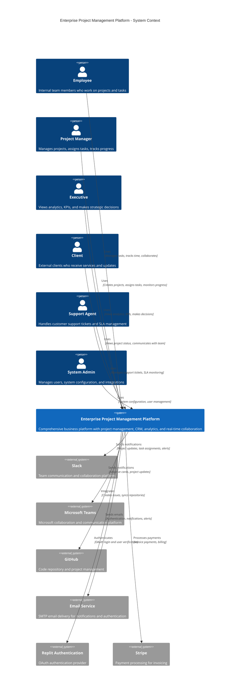

# C4 Architecture Model - Level 1: System Context Diagram

## Enterprise Project Management Platform - System Context

This diagram shows the high-level system context for the Enterprise Project Management Platform, illustrating how the system fits into the broader business environment and its relationships with users and external systems.

## System Context Overview

### Core System
**Enterprise Project Management Platform** - A comprehensive business management system that provides:

- **Project Management**: Advanced project planning with Gantt charts, task dependencies, and critical path analysis
- **CRM & Sales**: Customer relationship management with sales pipeline and opportunity tracking
- **Financial Management**: Budget tracking, time billing, expense management, and automated invoicing
- **Real-time Collaboration**: WebSocket-powered notifications and live updates
- **AI-Powered Analytics**: Predictive insights, performance analytics, and business intelligence
- **Support System**: Comprehensive ticket management with SLA monitoring and escalation
- **Mobile-First Design**: Responsive interface optimized for all devices

### User Types

1. **Employees** - Core team members who execute project work
   - Track time and manage personal tasks
   - Collaborate on projects and communicate with team
   - Submit expenses and view personal analytics

2. **Project Managers** - Responsible for project delivery
   - Create and manage projects using templates
   - Assign tasks and manage dependencies
   - Monitor progress and resource allocation
   - Generate reports and communicate with stakeholders

3. **Executives** - Senior leadership making strategic decisions
   - View high-level KPIs and business intelligence
   - Access predictive analytics and trend analysis
   - Monitor financial performance and profitability
   - Set company goals and track achievement

4. **Clients** - External customers receiving services
   - View project progress and status updates
   - Access client portal for project information
   - Communicate with project teams
   - Review deliverables and provide feedback

5. **Support Agents** - Handle customer service and support
   - Manage support tickets with SLA tracking
   - Handle escalations and priority management
   - Monitor customer satisfaction metrics
   - Coordinate with technical teams for resolution

6. **System Administrators** - Manage platform configuration
   - Configure integrations and system settings
   - Manage user roles and permissions
   - Monitor system health and performance
   - Oversee security and compliance

### External Systems Integration

1. **Slack Integration**
   - Real-time project notifications
   - Task assignment alerts
   - Daily digest messages
   - Custom webhook support

2. **Microsoft Teams Integration**
   - Adaptive card notifications
   - Rich project update formatting
   - Cross-platform messaging
   - Enterprise integration support

3. **GitHub Integration**
   - Automatic issue creation from tasks
   - Repository synchronization
   - Commit activity tracking
   - Webhook event processing

4. **Email Service (SMTP)**
   - User authentication emails
   - Password reset functionality
   - Offline notification delivery
   - System alerts and reports

5. **Replit Authentication**
   - OAuth-based user authentication
   - Seamless integration with Replit ecosystem
   - Secure session management
   - Multi-provider authentication support

6. **Stripe Payment Processing**
   - Automated invoice payment collection
   - Subscription management
   - Financial transaction processing
   - PCI-compliant payment handling

### Key System Characteristics

- **Scalability**: Designed to handle growing teams and increasing project complexity
- **Security**: Multi-layered authentication with role-based access control
- **Real-time**: WebSocket integration for live updates and collaboration
- **Mobile-First**: Responsive design optimized for mobile and desktop use
- **Integration-Ready**: Extensive API for third-party service integration
- **AI-Enhanced**: Machine learning for predictive analytics and insights
- **Enterprise-Grade**: Comprehensive audit trails, SLA management, and compliance features

This system context establishes the foundation for the detailed container and component diagrams that follow.