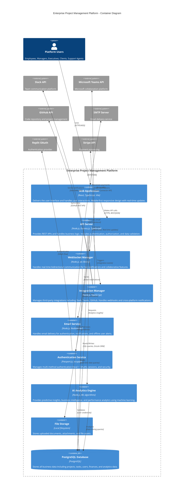

# C4 Architecture Model - Level 2: Container Diagram

## Enterprise Project Management Platform - Container Architecture

This diagram shows the high-level technology choices and how responsibilities are distributed across the containers that make up the Enterprise Project Management Platform.

## Container Details

### Frontend Containers

#### **Web Application**
- **Technology**: React 18, TypeScript, Vite, TailwindCSS
- **Purpose**: Single-page application delivering the user interface
- **Key Features**:
  - Mobile-first responsive design with touch optimization
  - Real-time WebSocket integration for live updates
  - Advanced UI components (Gantt charts, analytics dashboards)
  - Progressive Web App capabilities
  - Optimistic UI updates with React Query
- **Security**: Client-side authentication state management, HTTPS enforcement
- **Performance**: Code splitting, lazy loading, caching strategies

### Backend Containers

#### **API Server**
- **Technology**: Node.js, Express.js, TypeScript
- **Purpose**: Core business logic and REST API endpoints
- **Key Features**:
  - 50+ REST endpoints for all business operations
  - Comprehensive input validation with Zod schemas
  - Role-based access control and authorization
  - Rate limiting and security middleware
  - Request/response logging and monitoring
- **Data Access**: Drizzle ORM for type-safe database operations
- **Performance**: Connection pooling, query optimization

#### **WebSocket Manager**
- **Technology**: Node.js, ws library
- **Purpose**: Real-time bidirectional communication
- **Key Features**:
  - Live project and task updates
  - Real-time notifications and alerts
  - Collaborative editing support
  - Connection management with authentication
  - Broadcast messaging for team updates
- **Scalability**: Connection pooling, room-based messaging

#### **Integration Manager**
- **Technology**: Node.js, TypeScript
- **Purpose**: Third-party service integrations
- **Key Features**:
  - Slack integration with 340+ lines of functionality
  - Microsoft Teams with Adaptive Cards (680+ lines)
  - GitHub integration with issue sync (330+ lines)
  - Webhook processing and retry logic
  - Cross-platform notification broadcasting
- **Reliability**: Error handling, rate limiting, health monitoring

#### **Email Service**
- **Technology**: Node.js, Nodemailer
- **Purpose**: Email delivery and templates
- **Key Features**:
  - HTML email templates for authentication
  - Notification emails for offline users
  - System alerts and reports
  - Password reset functionality
  - Email verification workflows
- **Configuration**: SMTP integration, template management

#### **Authentication Service**
- **Technology**: Passport.js, bcryptjs, express-session
- **Purpose**: User authentication and session management
- **Key Features**:
  - Multi-method authentication (local + OAuth)
  - Secure password hashing with bcrypt
  - Session management with PostgreSQL store
  - Rate limiting for security
  - Password reset and email verification
- **Security**: CSRF protection, secure session cookies

#### **AI Analytics Engine**
- **Technology**: Node.js, Machine Learning algorithms
- **Purpose**: Predictive insights and business intelligence
- **Key Features**:
  - 5-module analytics dashboard
  - Revenue forecasting and risk assessment
  - Team performance analysis
  - Predictive project completion estimates
  - Automated business insights generation
- **Data Processing**: Complex analytical queries, trend analysis

#### **File Storage**
- **Technology**: Local filesystem with Multer
- **Purpose**: Document and file management
- **Key Features**:
  - Document upload and versioning
  - File type validation and security
  - Organized storage structure
  - File metadata tracking
  - Access control and permissions
- **Security**: File type validation, virus scanning capabilities

### Data Containers

#### **PostgreSQL Database**
- **Technology**: PostgreSQL with Drizzle ORM
- **Purpose**: Primary data persistence layer
- **Schema Complexity**:
  - 25+ business tables
  - Complex relationships and foreign keys
  - JSON/JSONB fields for flexible data
  - Indexes for performance optimization
  - Audit trails and timestamps
- **Key Data Domains**:
  - User management and authentication
  - Project and task management
  - CRM and sales opportunities
  - Financial and budget tracking
  - Support tickets and SLA management
  - Analytics and performance metrics
  - Integration configurations

## Container Interactions

### **Authentication Flow**
1. User accesses Web Application
2. Web App redirects to Authentication Service
3. Auth Service validates with database or external OAuth
4. Session established and stored in database
5. API calls include session validation

### **Real-time Updates**
1. User action triggers API call to API Server
2. API Server processes business logic and updates database
3. API Server notifies WebSocket Manager of changes
4. WebSocket Manager broadcasts updates to connected clients
5. Web Application receives and applies updates

### **Integration Workflow**
1. Business event occurs (project update, task assignment)
2. API Server triggers Integration Manager
3. Integration Manager formats notifications for each platform
4. Parallel delivery to Slack, Teams, GitHub as configured
5. Error handling and retry logic for failed deliveries

### **Analytics Processing**
1. AI Analytics Engine periodically queries database
2. Complex analytical processing and ML algorithms applied
3. Insights and predictions generated
4. Results cached and made available via API Server
5. Web Application displays insights in dashboards

## Technology Stack Summary

- **Frontend**: React, TypeScript, Vite, TailwindCSS, React Query
- **Backend**: Node.js, Express.js, TypeScript, Passport.js
- **Database**: PostgreSQL, Drizzle ORM
- **Real-time**: WebSocket (ws library)
- **Authentication**: Passport.js, bcryptjs, OAuth
- **Integrations**: Slack Web API, Teams Connector, GitHub API
- **Email**: Nodemailer, SMTP
- **Payments**: Stripe API
- **Build Tools**: Vite, esbuild, TypeScript
- **Testing**: Vitest, Playwright
- **Development**: Hot reload, TypeScript compilation, ESLint

## Security Architecture

- **Authentication**: Multi-factor with OAuth and local credentials
- **Authorization**: Role-based access control (RBAC)
- **Data Protection**: Encrypted passwords, secure sessions
- **API Security**: Rate limiting, input validation, CSRF protection
- **Communication**: HTTPS/WSS encryption for all traffic
- **Integration Security**: Webhook verification, API key management

This container architecture provides a solid foundation for the detailed component diagrams that will follow, showing how each container is internally structured and how components interact within and across container boundaries.