# C4 Architecture Model - Level 3: Backend Component Diagram

## API Server - Backend Components

This diagram shows the detailed component structure of the Node.js/Express API Server, illustrating how the backend services are organized and how they interact with each other and external systems.

```mermaid
C4Component
    title API Server - Backend Components

    Container_Boundary(apiServer, "API Server - Node.js/Express") {

        Component(authController, "Authentication Controller", "Express, Passport.js", "Handles login, registration, password reset, and OAuth flows")
        Component(projectController, "Project Controller", "Express, TypeScript", "CRUD operations for projects, templates, and project management")
        Component(taskController, "Task Controller", "Express, TypeScript", "Task management, dependencies, time tracking, and analytics")
        Component(crmController, "CRM Controller", "Express, TypeScript", "Client management, sales opportunities, and communication tracking")
        Component(financeController, "Finance Controller", "Express, TypeScript", "Budget management, expenses, invoicing, and financial analytics")
        Component(supportController, "Support Controller", "Express, TypeScript", "Ticket management, SLA tracking, and escalation handling")
        Component(analyticsController, "Analytics Controller", "Express, ML", "AI-powered analytics, KPIs, and predictive insights")
        Component(integrationController, "Integration Controller", "Express, TypeScript", "Third-party integration management and configuration")

        Component(authService, "Authentication Service", "Passport.js, bcryptjs", "Multi-method authentication and session management")
        Component(projectService, "Project Service", "TypeScript, Business Logic", "Project lifecycle management and template processing")
        Component(taskService, "Task Service", "TypeScript, Business Logic", "Task operations, dependency management, and progress tracking")
        Component(crmService, "CRM Service", "TypeScript, Business Logic", "Customer relationship management and sales pipeline")
        Component(financeService, "Finance Service", "TypeScript, Calculations", "Financial calculations, budget tracking, and billing automation")
        Component(supportService, "Support Service", "TypeScript, SLA Logic", "Support ticket processing and SLA management")
        Component(aiAnalyticsService, "AI Analytics Service", "TypeScript, ML", "Machine learning algorithms and predictive analytics")
        Component(integrationService, "Integration Service", "TypeScript, APIs", "Third-party service coordination and webhook handling")

        Component(dataAccess, "Data Access Layer", "Drizzle ORM, TypeScript", "Type-safe database operations and query optimization")
        Component(notificationEngine, "Notification Engine", "TypeScript, Events", "Cross-platform notification processing and delivery")
        Component(emailService, "Email Service", "Nodemailer, Templates", "Email delivery and template management")
        Component(fileManager, "File Manager", "Multer, TypeScript", "File upload, storage, and retrieval operations")
        Component(securityMiddleware, "Security Middleware", "Express, Validation", "Authentication, authorization, and request validation")
        Component(escalationEngine, "Escalation Engine", "TypeScript, Scheduling", "Automated ticket escalation and SLA monitoring")
        Component(progressCalculator, "Progress Calculator", "TypeScript, Algorithms", "Project progress automation and completion estimation")
        Component(resourceCalculator, "Resource Calculator", "TypeScript, Analytics", "Resource allocation and workload optimization")
    }

    ContainerDb_Ext(database, "PostgreSQL Database", "Primary data store")
    Container_Ext(wsManager, "WebSocket Manager", "Real-time communication")
    Container_Ext(integrationManager, "Integration Manager", "Third-party services")
    Container_Ext(emailServer, "SMTP Server", "Email delivery")

    Rel(authController, authService, "Uses", "Authentication logic")
    Rel(projectController, projectService, "Uses", "Project business logic")
    Rel(taskController, taskService, "Uses", "Task business logic")
    Rel(crmController, crmService, "Uses", "CRM business logic")
    Rel(financeController, financeService, "Uses", "Finance business logic")
    Rel(supportController, supportService, "Uses", "Support business logic")
    Rel(analyticsController, aiAnalyticsService, "Uses", "Analytics business logic")
    Rel(integrationController, integrationService, "Uses", "Integration business logic")

    Rel(authService, dataAccess, "Uses", "User data operations")
    Rel(projectService, dataAccess, "Uses", "Project data operations")
    Rel(taskService, dataAccess, "Uses", "Task data operations")
    Rel(crmService, dataAccess, "Uses", "CRM data operations")
    Rel(financeService, dataAccess, "Uses", "Finance data operations")
    Rel(supportService, dataAccess, "Uses", "Support data operations")
    Rel(aiAnalyticsService, dataAccess, "Uses", "Analytics data operations")
    Rel(integrationService, dataAccess, "Uses", "Integration data operations")

    Rel(authService, securityMiddleware, "Integrates", "Security validation")
    Rel(projectService, notificationEngine, "Triggers", "Project notifications")
    Rel(taskService, notificationEngine, "Triggers", "Task notifications")
    Rel(supportService, escalationEngine, "Uses", "Escalation logic")
    Rel(taskService, progressCalculator, "Uses", "Progress automation")
    Rel(projectService, resourceCalculator, "Uses", "Resource optimization")

    Rel(dataAccess, database, "Queries", "SQL operations")
    Rel(notificationEngine, wsManager, "Sends", "Real-time updates")
    Rel(notificationEngine, emailService, "Triggers", "Email notifications")
    Rel(integrationService, integrationManager, "Coordinates", "Third-party calls")
    Rel(emailService, emailServer, "Delivers", "SMTP email")

    UpdateLayoutConfig($c4ShapeInRow="3", $c4BoundaryInRow="1")
```

## Backend Component Details

### **Controller Layer**

#### **Authentication Controller**
- **Location**: `/server/routes.ts` (auth endpoints)
- **Key Endpoints**:
  - `POST /api/auth/register` - User registration with validation
  - `POST /api/auth/login` - Local email/password authentication
  - `POST /api/auth/verify-email` - Email verification confirmation
  - `POST /api/auth/forgot-password` - Password reset requests
  - `POST /api/auth/reset-password` - Password reset confirmation
  - `POST /api/auth/change-password` - Password updates
- **Features**:
  - Input validation with Zod schemas
  - Rate limiting for security
  - Session management
  - OAuth integration support

#### **Project Controller**
- **Location**: `/server/routes.ts` (project endpoints)
- **Key Endpoints**:
  - `GET/POST/PUT/DELETE /api/projects` - CRUD operations
  - `GET /api/project-templates` - Template management
  - `POST /api/projects/:id/progress` - Smart progress analytics
  - `POST /api/projects/:id/recalculate-progress` - Manual progress recalculation
  - `GET /api/projects/:id/comments` - Project communication
  - `GET /api/projects/:id/activity` - Activity logging
- **Features**:
  - Template-based project creation
  - Progress automation with ML
  - Real-time collaboration support
  - Advanced dependency management

#### **Task Controller**
- **Location**: `/server/routes.ts` (task endpoints)
- **Key Endpoints**:
  - `GET/POST/PUT/DELETE /api/tasks` - CRUD operations
  - `POST /api/task-dependencies` - Dependency management
  - `POST /api/time-entries/start` - Timer functionality
  - `GET /api/tasks/budget-impact` - Budget impact calculations
  - `GET /api/analytics/productivity` - AI-powered productivity metrics
- **Features**:
  - Advanced task management with dependencies
  - Real-time time tracking
  - Budget impact calculations
  - AI-powered productivity analytics

#### **CRM Controller**
- **Location**: `/server/routes.ts` (CRM endpoints)
- **Key Endpoints**:
  - `GET/POST/PUT/DELETE /api/clients` - Client management
  - `GET/POST/PUT/DELETE /api/companies` - Company management
  - `GET/POST/PUT/DELETE /api/sales-opportunities` - Sales pipeline
  - `POST /api/opportunities/:id/communications` - Communication tracking
- **Features**:
  - Complete CRM functionality
  - Sales pipeline management
  - Client interaction tracking
  - Opportunity management

#### **Finance Controller**
- **Location**: `/server/routes.ts` (finance endpoints)
- **Key Endpoints**:
  - `GET/POST/PUT/DELETE /api/expenses` - Expense management
  - `GET/POST/PUT/DELETE /api/invoices` - Invoice management
  - `GET /api/time-entries` - Time tracking
  - `GET /api/dashboard/revenue-trends` - Financial analytics
- **Features**:
  - Budget management and tracking
  - Automated invoice generation
  - Financial analytics and reporting
  - Time tracking with billing integration

#### **Support Controller**
- **Location**: `/server/routes.ts` (support endpoints)
- **Key Endpoints**:
  - `GET/POST/PUT/DELETE /api/support-tickets` - Ticket management
  - `POST /api/support-tickets/:id/comments` - Ticket comments
  - `POST /api/support-tickets/:id/escalate` - Manual escalation
  - `GET /api/sla-configurations` - SLA management
- **Features**:
  - Comprehensive ticket management
  - SLA tracking and monitoring
  - Escalation automation
  - Performance analytics

### **Service Layer**

#### **Authentication Service**
- **Location**: `/server/utils/authUtils.ts` and `/server/replitAuth.ts`
- **Key Classes**:
  - `PasswordUtils` - Password hashing and validation
  - `AuthRateLimiter` - Rate limiting for security
- **Features**:
  - bcrypt password hashing
  - Multi-method authentication (local + OAuth)
  - Session management with PostgreSQL store
  - Security middleware integration

#### **Project Service**
- **Location**: `/server/utils/projectProgressCalculations.ts`
- **Key Functions**:
  - `updateProjectProgress()` - Intelligent progress calculation
  - `calculateProjectProgress()` - ML-powered progress analysis
  - `estimateProjectCompletion()` - Predictive completion estimates
- **Features**:
  - Template-based project creation
  - Smart progress automation
  - Critical path analysis
  - Resource optimization

#### **Task Service**
- **Location**: Distributed across multiple route handlers
- **Features**:
  - Advanced dependency management
  - Real-time time tracking
  - Budget impact calculations
  - Performance analytics
  - Template-driven task creation

#### **AI Analytics Service**
- **Location**: `/server/routes.ts` (analytics endpoints)
- **Key Features**:
  - 5-module analytics dashboard
  - ML-powered predictive insights
  - Business intelligence generation
  - Performance optimization recommendations
  - Strategic decision support

#### **Integration Service**
- **Location**: `/server/integrations/index.ts`
- **Key Classes**:
  - `IntegrationManager` (480+ lines) - Coordinates all integrations
  - `SlackIntegration` (340+ lines) - Slack API integration
  - `TeamsIntegration` (680+ lines) - Microsoft Teams integration
  - `GitHubIntegration` (330+ lines) - GitHub API integration
- **Features**:
  - Cross-platform notification broadcasting
  - Webhook processing and retry logic
  - Health monitoring and error handling
  - Configuration management

### **Core Service Components**

#### **Data Access Layer**
- **Technology**: Drizzle ORM, TypeScript
- **Location**: `/server/db.ts` and schema definitions
- **Features**:
  - Type-safe database operations
  - Complex query optimization
  - Transaction management
  - Connection pooling
  - Migration support

#### **Notification Engine**
- **Location**: `/server/websocketManager.ts`
- **Features**:
  - Real-time WebSocket broadcasting
  - Event-driven notification system
  - User-specific notification delivery
  - Cross-platform integration
  - Notification preferences management

#### **Email Service**
- **Location**: `/server/emailService.ts`
- **Features**:
  - HTML email template management
  - SMTP delivery with retry logic
  - Authentication email workflows
  - System alerts and notifications
  - Bulk email capabilities

#### **File Manager**
- **Technology**: Multer, Node.js filesystem
- **Features**:
  - Secure file upload handling
  - File type validation
  - Storage organization
  - Access control
  - Metadata tracking

#### **Security Middleware**
- **Location**: Various middleware functions in routes
- **Features**:
  - Authentication verification
  - Role-based authorization
  - Input validation with Zod
  - Rate limiting
  - CSRF protection

#### **Escalation Engine**
- **Location**: `/server/escalationService.ts`
- **Features**:
  - Automated ticket escalation
  - SLA monitoring and alerts
  - Escalation level management
  - Performance tracking
  - Integration with notification system

#### **Progress Calculator**
- **Location**: `/server/utils/projectProgressCalculations.ts`
- **Features**:
  - Intelligent progress calculation from task completion
  - ML-powered status suggestions
  - Predictive completion estimates
  - Real-time progress updates
  - Risk assessment indicators

#### **Resource Calculator**
- **Location**: `/server/utils/resourceCalculations.ts`
- **Key Functions**:
  - `calculateUserWorkload()` - Workload analysis
  - `calculateTeamUtilization()` - Team performance metrics
  - `findOptimalResourceAllocations()` - Resource optimization
  - `generateTeamWorkloadSnapshots()` - Performance snapshots
- **Features**:
  - Advanced resource allocation algorithms
  - Workload optimization
  - Team performance analysis
  - Capacity planning

## Backend Architecture Patterns

### **Layered Architecture**
- **Controller Layer**: HTTP request handling and response formatting
- **Service Layer**: Business logic and domain operations
- **Data Access Layer**: Database operations and query optimization
- **Integration Layer**: External service communication

### **Dependency Injection**
- Service dependencies injected through constructor parameters
- Modular design enabling easy testing and mocking
- Clear separation of concerns between layers

### **Event-Driven Architecture**
- Event-based notifications for real-time updates
- Loosely coupled components communicating via events
- Scalable notification system with WebSocket integration

### **Security Architecture**
- **Authentication**: Multi-factor with session management
- **Authorization**: Role-based access control (RBAC)
- **Validation**: Input validation with TypeScript and Zod
- **Rate Limiting**: API protection against abuse
- **Data Protection**: Encrypted passwords and secure sessions

### **Performance Optimizations**
- **Database**: Connection pooling and query optimization
- **Caching**: Intelligent data caching strategies
- **Async Processing**: Non-blocking operations for scalability
- **Resource Management**: Efficient memory and CPU usage

### **Integration Patterns**
- **Webhook Processing**: Reliable webhook handling with retry logic
- **API Gateway**: Centralized external service communication
- **Circuit Breaker**: Fault tolerance for external dependencies
- **Health Monitoring**: Service health checks and monitoring

This backend component architecture provides a robust, scalable, and maintainable foundation for the enterprise project management platform, with clear separation of concerns, comprehensive security, and modern Node.js development patterns.