# C4 Architecture Model - Level 3: Frontend Component Diagram

## Web Application - Frontend Components

This diagram shows the detailed component structure of the React-based Web Application, illustrating how the frontend is organized and how components interact with each other and backend services.

```mermaid
C4Component
    title Web Application - Frontend Components

    Container_Boundary(webApp, "Web Application - React SPA") {

        Component(authComponents, "Authentication Components", "React, TypeScript", "Handles user login, registration, and OAuth flows")
        Component(layoutComponents, "Layout Components", "React, Responsive Design", "Provides consistent layout structure and navigation")
        Component(projectComponents, "Project Management Components", "React, Gantt, Real-time", "Advanced project management with Gantt charts and templates")
        Component(taskComponents, "Task Management Components", "React, Time Tracking", "Task creation, assignment, and time tracking functionality")
        Component(crmComponents, "CRM & Sales Components", "React, Pipeline UI", "Customer relationship management and sales pipeline")
        Component(analyticsComponents, "Analytics Components", "React, Charts, AI", "Business intelligence dashboards and predictive analytics")
        Component(budgetComponents, "Budget Management Components", "React, Financial", "Financial tracking, budget management, and billing")
        Component(supportComponents, "Support System Components", "React, SLA Tracking", "Customer support, ticket management, and SLA monitoring")
        Component(mobileComponents, "Mobile UI Components", "React, Touch Optimized", "Mobile-first responsive components with touch interactions")
        Component(integrationComponents, "Integration Management", "React, Config UI", "Third-party integration configuration and monitoring")

        Component(realTimeManager, "Real-time Manager", "WebSocket, React Context", "Manages WebSocket connections and real-time state")
        Component(stateManager, "State Management", "React Query, Context", "Global state management and data caching")
        Component(apiClient, "API Client", "Axios, TypeScript", "HTTP client for backend API communication")
        Component(authManager, "Auth Manager", "React Context, Storage", "Frontend authentication state and session management")
        Component(notificationManager, "Notification Manager", "React, WebSocket", "Handles real-time notifications and toasts")
        Component(routeManager, "Route Manager", "Wouter Router", "Client-side routing and navigation")
        Component(themeProvider, "Theme Provider", "React Context, CSS", "Dark/light theme management and styling")
    }

    Container_Ext(apiServer, "API Server", "Express.js REST API")
    Container_Ext(wsManager, "WebSocket Manager", "Real-time communication")

    Rel(authComponents, authManager, "Uses", "Authentication state")
    Rel(authComponents, apiClient, "Calls", "Auth API endpoints")

    Rel(layoutComponents, authManager, "Checks", "User session")
    Rel(layoutComponents, themeProvider, "Uses", "Theme context")
    Rel(layoutComponents, routeManager, "Navigates", "Route changes")

    Rel(projectComponents, apiClient, "Calls", "Project APIs")
    Rel(projectComponents, realTimeManager, "Subscribes", "Project updates")
    Rel(projectComponents, stateManager, "Uses", "Project state")

    Rel(taskComponents, apiClient, "Calls", "Task APIs")
    Rel(taskComponents, realTimeManager, "Subscribes", "Task updates")
    Rel(taskComponents, notificationManager, "Triggers", "Task notifications")

    Rel(crmComponents, apiClient, "Calls", "CRM APIs")
    Rel(crmComponents, stateManager, "Uses", "CRM state")

    Rel(analyticsComponents, apiClient, "Calls", "Analytics APIs")
    Rel(analyticsComponents, stateManager, "Caches", "Analytics data")

    Rel(budgetComponents, apiClient, "Calls", "Budget APIs")
    Rel(budgetComponents, stateManager, "Uses", "Financial state")

    Rel(supportComponents, apiClient, "Calls", "Support APIs")
    Rel(supportComponents, realTimeManager, "Subscribes", "Ticket updates")

    Rel(mobileComponents, layoutComponents, "Extends", "Mobile layouts")
    Rel(mobileComponents, themeProvider, "Uses", "Mobile themes")

    Rel(integrationComponents, apiClient, "Calls", "Integration APIs")
    Rel(integrationComponents, stateManager, "Uses", "Integration state")

    Rel(realTimeManager, wsManager, "Connects", "WebSocket")
    Rel(apiClient, apiServer, "HTTP Calls", "REST API")
    Rel(stateManager, apiClient, "Uses", "Data fetching")
    Rel(authManager, apiClient, "Uses", "Auth endpoints")
    Rel(notificationManager, realTimeManager, "Listens", "Real-time events")

    UpdateLayoutConfig($c4ShapeInRow="3", $c4BoundaryInRow="1")
```

## Frontend Component Details

### **Core UI Components**

#### **Authentication Components**
- **Location**: `/client/src/components/auth/`
- **Key Files**:
  - `LoginForm.tsx` (150+ lines) - Professional login with validation
  - `RegisterForm.tsx` (200+ lines) - Registration with password strength
  - `ForgotPasswordForm.tsx` (100+ lines) - Password reset flow
  - `AuthContainer.tsx` (150+ lines) - Authentication orchestration
- **Features**:
  - Multi-method authentication (local + OAuth)
  - Real-time form validation
  - Password strength indicators
  - Secure session management
  - Loading states and error handling

#### **Layout Components**
- **Location**: `/client/src/components/`
- **Key Files**:
  - `Layout.tsx` - Main application layout
  - `Header.tsx` - Application header with navigation
  - `Sidebar.tsx` - Responsive sidebar navigation
- **Features**:
  - Responsive design for all screen sizes
  - Mobile-first navigation patterns
  - Consistent UI patterns across pages
  - Theme integration and user preferences

#### **Project Management Components**
- **Location**: `/client/src/components/` and `/client/src/pages/`
- **Key Files**:
  - `GanttChart.tsx` (300+ lines) - Professional Gantt with SVG connectors
  - `ProjectTemplateSelector.tsx` (450+ lines) - Template-based project creation
  - `ProjectProgressIndicator.tsx` (300+ lines) - Smart progress visualization
  - `ProjectCommunication.tsx` (300+ lines) - Comments and activity interface
  - `DependencyVisualization.tsx` (550+ lines) - Dependency management
- **Features**:
  - Advanced Gantt chart with drag & drop scheduling
  - Critical path analysis and visualization
  - Template-based project creation
  - Real-time collaboration and comments
  - Progress tracking with ML-powered estimates

#### **Task Management Components**
- **Location**: `/client/src/components/`
- **Key Files**:
  - `TaskTimeTracker.tsx` (650+ lines) - Comprehensive time tracking
  - `TaskNotifications.tsx` (450+ lines) - Granular notification preferences
  - `TaskAnalytics.tsx` (750+ lines) - AI-powered productivity analytics
  - `QuickTaskActions.tsx` (700+ lines) - Template-based task creation
- **Features**:
  - Real-time timer functionality
  - Budget impact calculations
  - Task-specific notification management
  - Productivity analytics with AI insights
  - 16+ categorized task templates

#### **CRM & Sales Components**
- **Location**: `/client/src/components/` and `/client/src/pages/`
- **Key Files**:
  - `SalesPipeline.tsx` - Visual sales pipeline management
  - `OpportunityDetail.tsx` - Detailed opportunity management
  - `Company.tsx` - Company and client management
- **Features**:
  - Interactive sales pipeline visualization
  - Opportunity tracking and management
  - Client relationship management
  - Communication history tracking

#### **Analytics Components**
- **Location**: `/client/src/components/` and `/client/src/pages/`
- **Key Files**:
  - `Analytics.tsx` (950+ lines) - Comprehensive analytics dashboard
  - `DashboardKPIs.tsx` - Executive KPI display
- **Features**:
  - 5-module analytics dashboard
  - Predictive insights and ML-powered recommendations
  - Executive KPI tracking with drill-down
  - Multi-dimensional business analysis
  - Real-time performance metrics

#### **Budget Management Components**
- **Location**: `/client/src/pages/`
- **Key Files**:
  - `BudgetManagement.tsx` (850+ lines) - Complete budget management
  - `TimeTracking.tsx` - Enhanced time tracking with budget integration
- **Features**:
  - Real-time budget impact calculations
  - Variance analysis and reporting
  - Automated billing integration
  - Profitability analysis by project
  - Cost tracking and expense management

#### **Support System Components**
- **Location**: `/client/src/components/`
- **Key Files**:
  - `SupportAnalytics.tsx` - Support metrics and SLA monitoring
- **Features**:
  - Ticket management with SLA tracking
  - Escalation management and automation
  - Customer satisfaction metrics
  - Response time analytics

#### **Mobile UI Components**
- **Location**: `/client/src/components/mobile/`
- **Key Files**:
  - `MobileGantt.tsx` (200+ lines) - Touch-optimized Gantt visualization
- **Features**:
  - Touch-optimized interfaces
  - Mobile-specific navigation patterns
  - Responsive layouts for small screens
  - Gesture-based interactions
  - Adaptive component behavior

### **Core Service Components**

#### **Real-time Manager**
- **Technology**: WebSocket, React Context
- **Purpose**: Manages WebSocket connections and real-time state
- **Features**:
  - Connection lifecycle management
  - Event subscription and broadcasting
  - Automatic reconnection logic
  - Room-based messaging
  - Real-time collaboration features

#### **State Management**
- **Technology**: React Query, React Context
- **Purpose**: Global state management and data caching
- **Features**:
  - Optimistic updates for better UX
  - Intelligent data caching and invalidation
  - Background data synchronization
  - Error handling and retry logic
  - Offline support capabilities

#### **API Client**
- **Technology**: Axios, TypeScript
- **Purpose**: HTTP client for backend API communication
- **Features**:
  - Type-safe API calls with TypeScript
  - Request/response interceptors
  - Authentication token management
  - Error handling and retry logic
  - Request/response logging

#### **Auth Manager**
- **Technology**: React Context, Local Storage
- **Purpose**: Frontend authentication state management
- **Features**:
  - Session state persistence
  - Token refresh handling
  - Role-based access control
  - Logout and cleanup logic
  - Security-focused implementation

#### **Notification Manager**
- **Technology**: React, WebSocket, Toast UI
- **Purpose**: Handles real-time notifications and user alerts
- **Features**:
  - Real-time notification display
  - Toast message management
  - Notification preferences
  - Sound and visual alerts
  - Notification history

#### **Route Manager**
- **Technology**: Wouter Router
- **Purpose**: Client-side routing and navigation
- **Features**:
  - Dynamic route loading
  - Authentication guards
  - Route-based code splitting
  - Browser history management
  - SEO-friendly routing

#### **Theme Provider**
- **Technology**: React Context, CSS Variables
- **Purpose**: Dark/light theme management
- **Features**:
  - Dynamic theme switching
  - User preference persistence
  - CSS variable management
  - Responsive theme adaptation
  - Accessibility compliance

## Frontend Architecture Patterns

### **Component Composition**
- Hierarchical component structure with clear separation of concerns
- Reusable UI components with consistent design system
- Smart/dumb component pattern for data management
- Higher-order components for cross-cutting concerns

### **State Management Strategy**
- React Query for server state management
- React Context for UI state
- Local component state for temporary UI state
- Optimistic updates for improved perceived performance

### **Performance Optimizations**
- Code splitting with React.lazy()
- Memoization with React.memo and useMemo
- Virtual scrolling for large datasets
- Image lazy loading and optimization
- Bundle size optimization with tree shaking

### **Mobile-First Design**
- Responsive breakpoints for all screen sizes
- Touch-optimized interaction patterns
- Progressive Web App features
- Offline capability with service workers
- Performance optimization for mobile networks

### **Real-time Features**
- WebSocket integration for live updates
- Collaborative editing capabilities
- Real-time notification system
- Live data synchronization
- Conflict resolution for concurrent edits

This frontend component architecture provides a robust, scalable, and maintainable foundation for the enterprise project management platform, with clear separation of concerns and modern React development patterns.