# Data Flow Architecture

## Enterprise Business Management Platform Data Flows

This document details the comprehensive data flow architecture for the enterprise platform, covering system architecture, data movement patterns, and integration flows.

---

## 1. System Architecture Overview

### High-Level Architecture

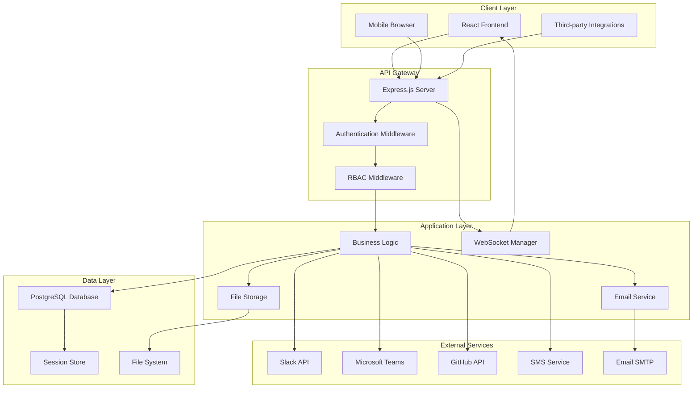
```mermaid
graph TB
    subgraph "Client Layer"
        A[React Frontend]
        B[Mobile Browser]
        C[Third-party Integrations]
    end

    subgraph "API Gateway"
        D[Express.js Server]
        E[Authentication Middleware]
        F[RBAC Middleware]
    end

    subgraph "Application Layer"
        G[Business Logic]
        H[WebSocket Manager]
        I[Email Service]
        J[File Storage]
    end

    subgraph "Data Layer"
        K[PostgreSQL Database]
        L[Session Store]
        M[File System]
    end

    subgraph "External Services"
        N[Slack API]
        O[Microsoft Teams]
        P[GitHub API]
        Q[SMS Service]
        R[Email SMTP]
    end

    A --> D
    B --> D
    C --> D
    D --> E
    E --> F
    F --> G
    G --> K
    D --> H
    H --> A
    G --> I
    I --> R
    G --> J
    J --> M
    G --> N
    G --> O
    G --> P
    G --> Q
    K --> L
```

### Data Flow Patterns

#### Request-Response Flow
```
Client Request → Auth Middleware → RBAC Check → Business Logic → Database Query → Response
```

#### Real-time Data Flow
```
Database Change → Event Trigger → WebSocket Manager → Client Update
```

#### Integration Data Flow
```
Internal Event → Integration Manager → Third-party API → Response Processing
```

---

## 2. Database Data Flows

### Entity Relationship Data Flow

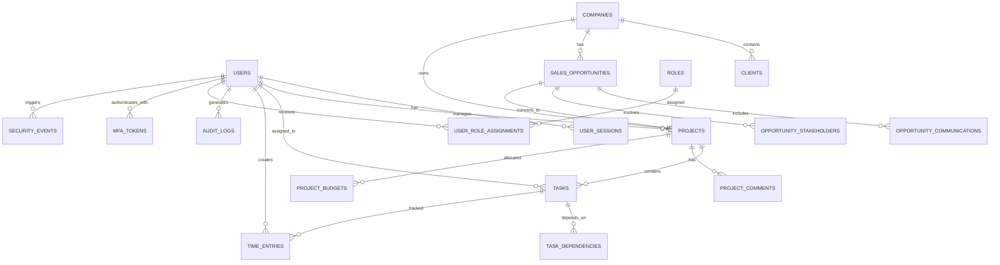
```mermaid
erDiagram
    USERS ||--o{ USER_SESSIONS : has
    USERS ||--o{ PROJECTS : manages
    USERS ||--o{ TASKS : assigned_to
    USERS ||--o{ TIME_ENTRIES : creates
    USERS ||--o{ AUDIT_LOGS : generates

    COMPANIES ||--o{ CLIENTS : contains
    COMPANIES ||--o{ SALES_OPPORTUNITIES : has
    COMPANIES ||--o{ PROJECTS : owns

    SALES_OPPORTUNITIES ||--o{ OPPORTUNITY_COMMUNICATIONS : includes
    SALES_OPPORTUNITIES ||--o{ OPPORTUNITY_STAKEHOLDERS : involves
    SALES_OPPORTUNITIES ||--|| PROJECTS : converts_to

    PROJECTS ||--o{ TASKS : contains
    PROJECTS ||--o{ PROJECT_COMMENTS : has
    PROJECTS ||--o{ PROJECT_BUDGETS : allocated

    TASKS ||--o{ TASK_DEPENDENCIES : depends_on
    TASKS ||--o{ TIME_ENTRIES : tracked

    ROLES ||--o{ USER_ROLE_ASSIGNMENTS : assigned
    USERS ||--o{ USER_ROLE_ASSIGNMENTS : receives

    USERS ||--o{ MFA_TOKENS : authenticates_with
    USERS ||--o{ SECURITY_EVENTS : triggers
```

### Data Consistency Patterns

#### ACID Transaction Flow
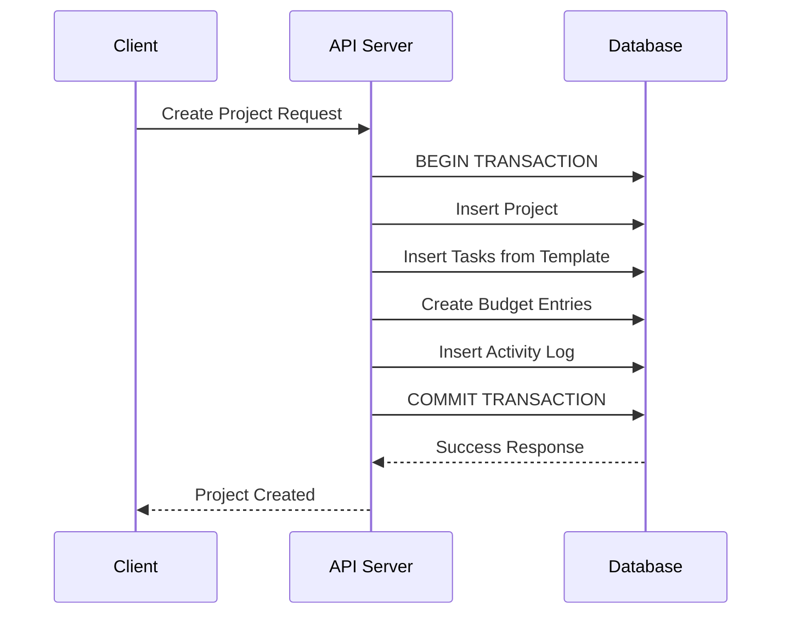
```mermaid
sequenceDiagram
    participant C as Client
    participant API as API Server
    participant DB as Database

    C->>API: Create Project Request
    API->>DB: BEGIN TRANSACTION
    API->>DB: Insert Project
    API->>DB: Insert Tasks from Template
    API->>DB: Create Budget Entries
    API->>DB: Insert Activity Log
    API->>DB: COMMIT TRANSACTION
    DB-->>API: Success Response
    API-->>C: Project Created
```

#### Eventual Consistency Flow
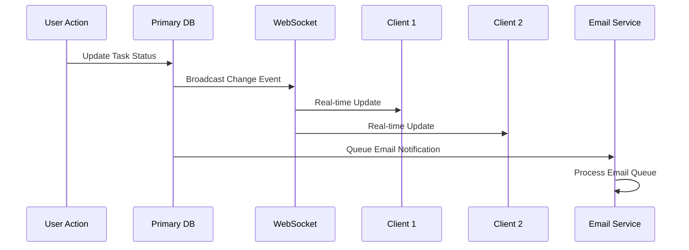
```mermaid
sequenceDiagram
    participant U as User Action
    participant DB as Primary DB
    participant WS as WebSocket
    participant C1 as Client 1
    participant C2 as Client 2
    participant ES as Email Service

    U->>DB: Update Task Status
    DB->>WS: Broadcast Change Event
    WS->>C1: Real-time Update
    WS->>C2: Real-time Update
    DB->>ES: Queue Email Notification
    ES->>ES: Process Email Queue
```

---

## 3. Authentication and Security Data Flow

### Multi-Factor Authentication Data Flow

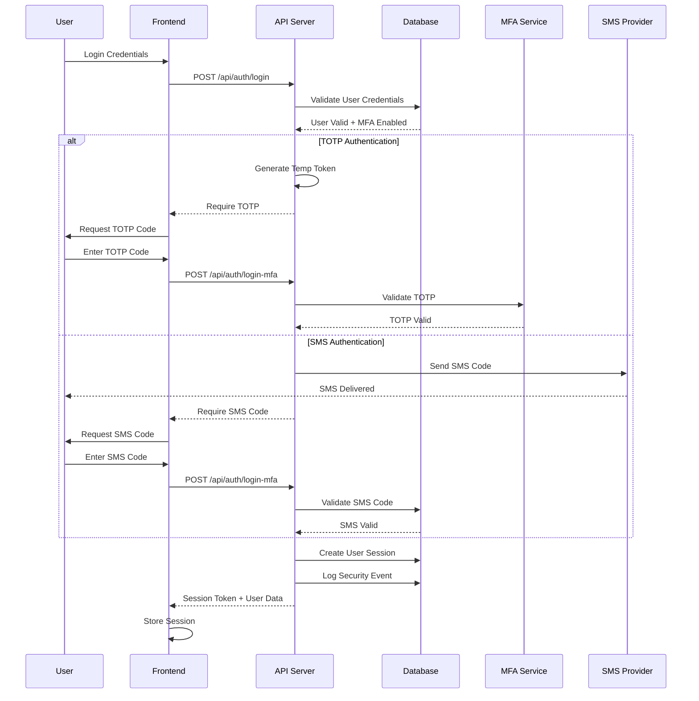
```mermaid
sequenceDiagram
    participant U as User
    participant F as Frontend
    participant API as API Server
    participant DB as Database
    participant MFA as MFA Service
    participant SMS as SMS Provider

    U->>F: Login Credentials
    F->>API: POST /api/auth/login
    API->>DB: Validate User Credentials
    DB-->>API: User Valid + MFA Enabled

    alt TOTP Authentication
        API->>API: Generate Temp Token
        API-->>F: Require TOTP
        F->>U: Request TOTP Code
        U->>F: Enter TOTP Code
        F->>API: POST /api/auth/login-mfa
        API->>MFA: Validate TOTP
        MFA-->>API: TOTP Valid
    else SMS Authentication
        API->>SMS: Send SMS Code
        SMS-->>U: SMS Delivered
        API-->>F: Require SMS Code
        F->>U: Request SMS Code
        U->>F: Enter SMS Code
        F->>API: POST /api/auth/login-mfa
        API->>DB: Validate SMS Code
        DB-->>API: SMS Valid
    end

    API->>DB: Create User Session
    API->>DB: Log Security Event
    API-->>F: Session Token + User Data
    F->>F: Store Session
```

### RBAC Permission Check Data Flow

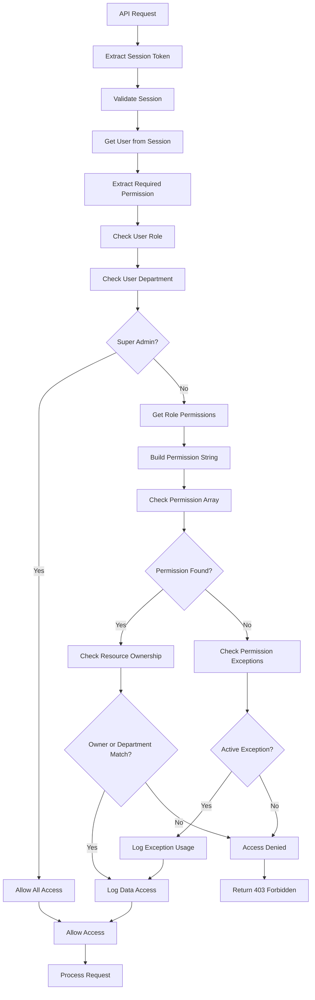
```mermaid
graph TD
    A[API Request] --> B[Extract Session Token]
    B --> C[Validate Session]
    C --> D[Get User from Session]
    D --> E[Extract Required Permission]
    E --> F[Check User Role]
    F --> G[Check User Department]
    G --> H{Super Admin?}

    H -->|Yes| I[Allow All Access]
    H -->|No| J[Get Role Permissions]

    J --> K[Build Permission String]
    K --> L[Check Permission Array]
    L --> M{Permission Found?}

    M -->|Yes| N[Check Resource Ownership]
    M -->|No| O[Check Permission Exceptions]

    O --> P{Active Exception?}
    P -->|Yes| Q[Log Exception Usage]
    P -->|No| R[Access Denied]

    N --> S{Owner or Department Match?}
    S -->|Yes| T[Log Data Access]
    S -->|No| R

    Q --> T
    T --> U[Allow Access]
    I --> U
    U --> V[Process Request]
    R --> W[Return 403 Forbidden]
```

---

## 4. Real-time Communication Data Flow

### WebSocket Event Broadcasting

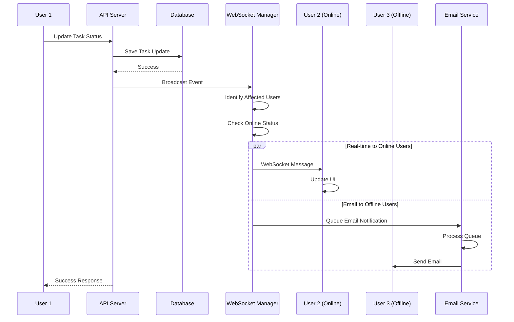
```mermaid
sequenceDiagram
    participant U1 as User 1
    participant API as API Server
    participant DB as Database
    participant WS as WebSocket Manager
    participant U2 as User 2 (Online)
    participant U3 as User 3 (Offline)
    participant EMAIL as Email Service

    U1->>API: Update Task Status
    API->>DB: Save Task Update
    DB-->>API: Success
    API->>WS: Broadcast Event

    WS->>WS: Identify Affected Users
    WS->>WS: Check Online Status

    par Real-time to Online Users
        WS->>U2: WebSocket Message
        U2->>U2: Update UI
    and Email to Offline Users
        WS->>EMAIL: Queue Email Notification
        EMAIL->>EMAIL: Process Queue
        EMAIL->>U3: Send Email
    end

    API-->>U1: Success Response
```

### Project Communication Hub Data Flow

```mermaid
graph LR
    subgraph "Input Sources"
        A[User Comment]
        B[File Upload]
        C[Status Update]
        D[@Mention]
    end

    subgraph "Processing Layer"
        E[Validation]
        F[Permission Check]
        G[Content Processing]
        H[File Security Scan]
    end

    subgraph "Storage Layer"
        I[Comments Table]
        J[Files Table]
        K[Activity Log]
        L[Notifications Table]
    end

    subgraph "Distribution Layer"
        M[WebSocket Broadcast]
        N[Email Queue]
        O[Push Notifications]
        P[Integration Webhooks]
    end

    A --> E
    B --> H
    C --> G
    D --> F

    E --> I
    H --> J
    G --> K
    F --> L

    I --> M
    J --> N
    K --> O
    L --> P

    M --> Q[Real-time UI Updates]
    N --> R[Offline Notifications]
    O --> S[Mobile Alerts]
    P --> T[Third-party Systems]
```

---

## 5. Third-Party Integration Data Flows

### Slack Integration Data Flow

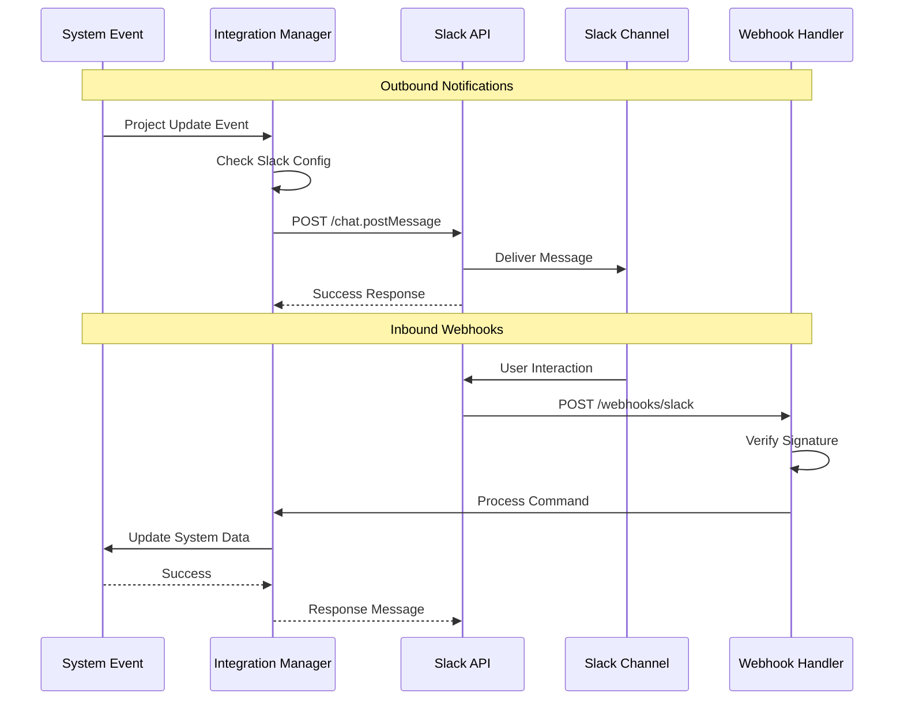
```mermaid
sequenceDiagram
    participant SYS as System Event
    participant INT as Integration Manager
    participant SLACK as Slack API
    participant CH as Slack Channel
    participant WH as Webhook Handler

    Note over SYS,WH: Outbound Notifications
    SYS->>INT: Project Update Event
    INT->>INT: Check Slack Config
    INT->>SLACK: POST /chat.postMessage
    SLACK->>CH: Deliver Message
    SLACK-->>INT: Success Response

    Note over SYS,WH: Inbound Webhooks
    CH->>SLACK: User Interaction
    SLACK->>WH: POST /webhooks/slack
    WH->>WH: Verify Signature
    WH->>INT: Process Command
    INT->>SYS: Update System Data
    SYS-->>INT: Success
    INT-->>SLACK: Response Message
```

### Microsoft Teams Integration Data Flow

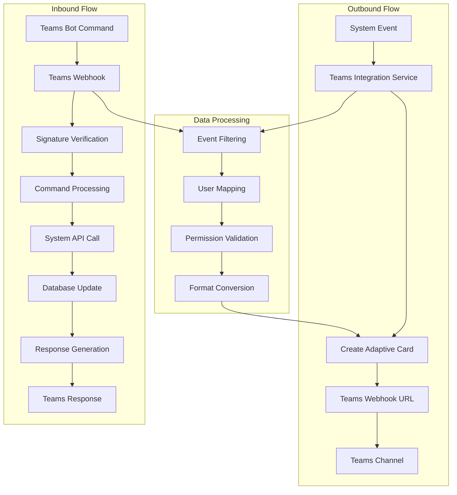
```mermaid
graph TD
    subgraph "Outbound Flow"
        A[System Event] --> B[Teams Integration Service]
        B --> C[Create Adaptive Card]
        C --> D[Teams Webhook URL]
        D --> E[Teams Channel]
    end

    subgraph "Inbound Flow"
        F[Teams Bot Command] --> G[Teams Webhook]
        G --> H[Signature Verification]
        H --> I[Command Processing]
        I --> J[System API Call]
        J --> K[Database Update]
        K --> L[Response Generation]
        L --> M[Teams Response]
    end

    subgraph "Data Processing"
        N[Event Filtering]
        O[User Mapping]
        P[Permission Validation]
        Q[Format Conversion]
    end

    B --> N
    N --> O
    O --> P
    P --> Q
    Q --> C

    G --> N
```

### GitHub Integration Data Flow

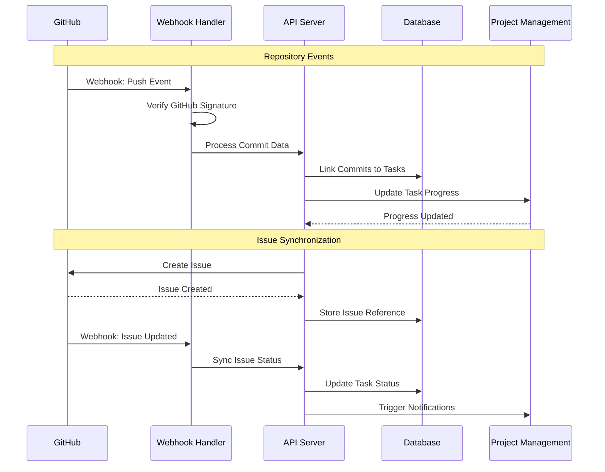
```mermaid
sequenceDiagram
    participant GH as GitHub
    participant WH as Webhook Handler
    participant API as API Server
    participant DB as Database
    participant PROJ as Project Management

    Note over GH,PROJ: Repository Events
    GH->>WH: Webhook: Push Event
    WH->>WH: Verify GitHub Signature
    WH->>API: Process Commit Data
    API->>DB: Link Commits to Tasks
    API->>PROJ: Update Task Progress
    PROJ-->>API: Progress Updated

    Note over GH,PROJ: Issue Synchronization
    API->>GH: Create Issue
    GH-->>API: Issue Created
    API->>DB: Store Issue Reference

    GH->>WH: Webhook: Issue Updated
    WH->>API: Sync Issue Status
    API->>DB: Update Task Status
    API->>PROJ: Trigger Notifications
```

---

## 6. Analytics and Reporting Data Flow

### Real-time Analytics Pipeline

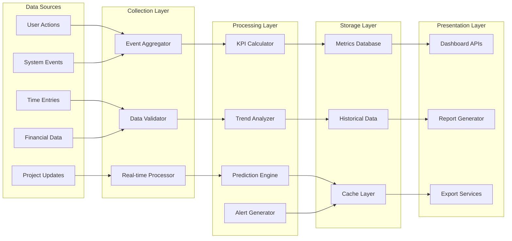
```mermaid
graph LR
    subgraph "Data Sources"
        A[User Actions]
        B[System Events]
        C[Time Entries]
        D[Financial Data]
        E[Project Updates]
    end

    subgraph "Collection Layer"
        F[Event Aggregator]
        G[Data Validator]
        H[Real-time Processor]
    end

    subgraph "Processing Layer"
        I[KPI Calculator]
        J[Trend Analyzer]
        K[Prediction Engine]
        L[Alert Generator]
    end

    subgraph "Storage Layer"
        M[Metrics Database]
        N[Historical Data]
        O[Cache Layer]
    end

    subgraph "Presentation Layer"
        P[Dashboard APIs]
        Q[Report Generator]
        R[Export Services]
    end

    A --> F
    B --> F
    C --> G
    D --> G
    E --> H

    F --> I
    G --> J
    H --> K

    I --> M
    J --> N
    K --> O
    L --> O

    M --> P
    N --> Q
    O --> R
```

### Business Intelligence Data Flow

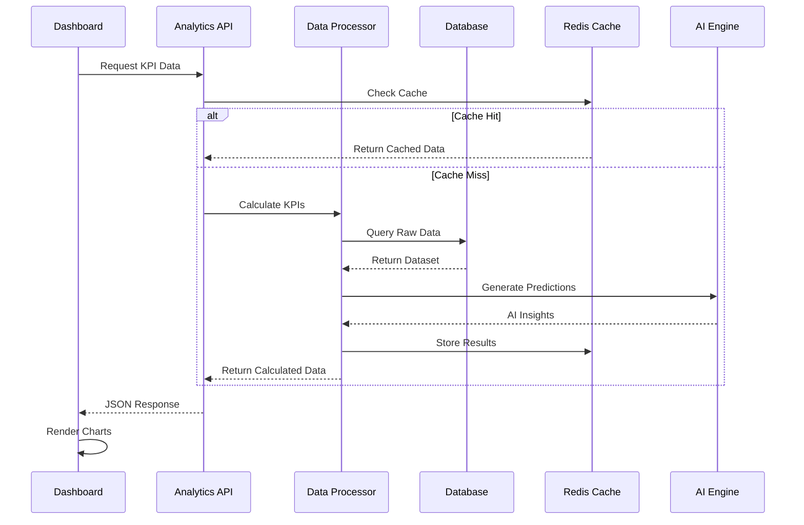
```mermaid
sequenceDiagram
    participant DASH as Dashboard
    participant API as Analytics API
    participant PROC as Data Processor
    participant DB as Database
    participant CACHE as Redis Cache
    participant AI as AI Engine

    DASH->>API: Request KPI Data
    API->>CACHE: Check Cache

    alt Cache Hit
        CACHE-->>API: Return Cached Data
    else Cache Miss
        API->>PROC: Calculate KPIs
        PROC->>DB: Query Raw Data
        DB-->>PROC: Return Dataset
        PROC->>AI: Generate Predictions
        AI-->>PROC: AI Insights
        PROC->>CACHE: Store Results
        PROC-->>API: Return Calculated Data
    end

    API-->>DASH: JSON Response
    DASH->>DASH: Render Charts
```

---

## 7. File Storage and Document Management Data Flow

### File Upload and Security Flow

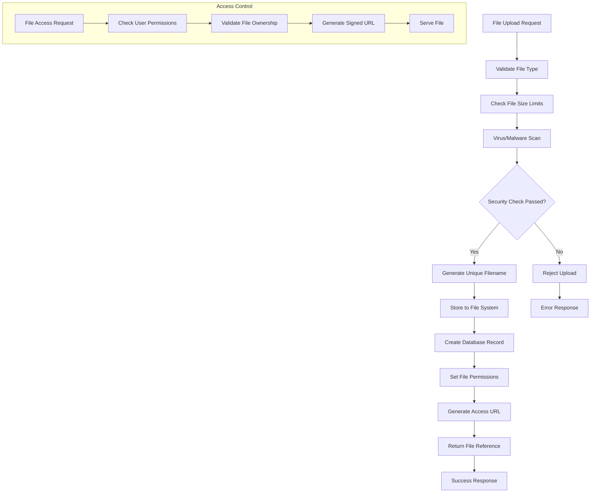
```mermaid
graph TD
    A[File Upload Request] --> B[Validate File Type]
    B --> C[Check File Size Limits]
    C --> D[Virus/Malware Scan]
    D --> E{Security Check Passed?}

    E -->|No| F[Reject Upload]
    E -->|Yes| G[Generate Unique Filename]

    G --> H[Store to File System]
    H --> I[Create Database Record]
    I --> J[Set File Permissions]
    J --> K[Generate Access URL]
    K --> L[Return File Reference]

    subgraph "Access Control"
        M[File Access Request]
        N[Check User Permissions]
        O[Validate File Ownership]
        P[Generate Signed URL]
        Q[Serve File]
    end

    M --> N
    N --> O
    O --> P
    P --> Q

    F --> R[Error Response]
    L --> S[Success Response]
```

### Document Versioning Data Flow

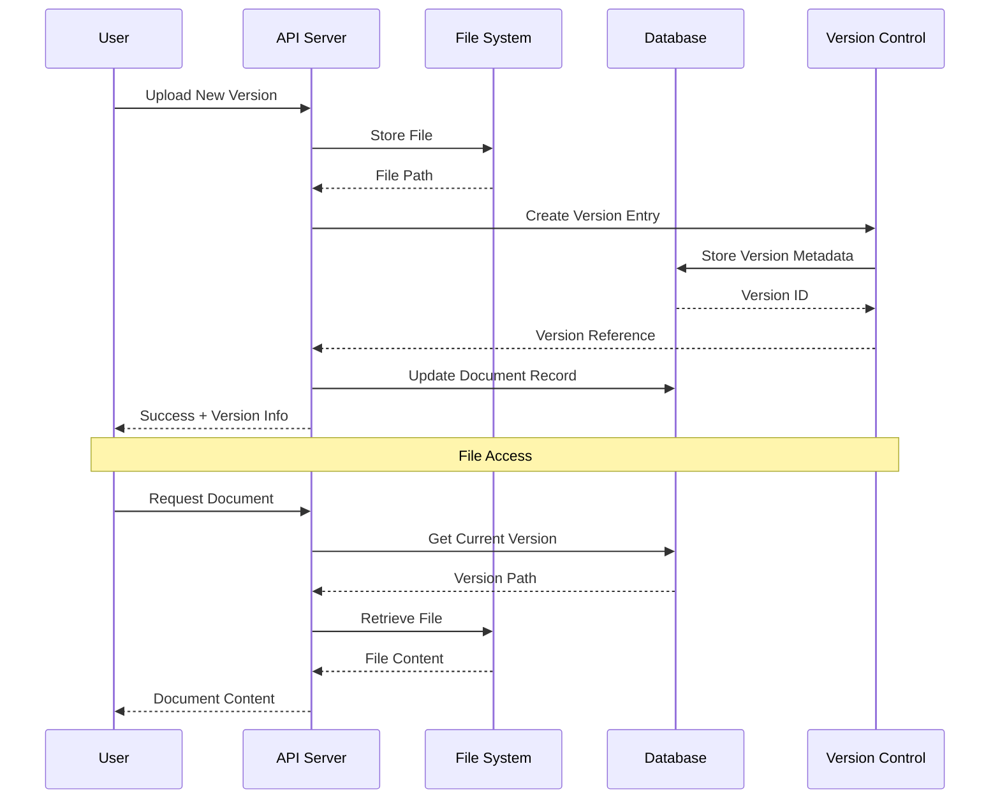
```mermaid
sequenceDiagram
    participant U as User
    participant API as API Server
    participant FS as File System
    participant DB as Database
    participant VER as Version Control

    U->>API: Upload New Version
    API->>FS: Store File
    FS-->>API: File Path
    API->>VER: Create Version Entry
    VER->>DB: Store Version Metadata
    DB-->>VER: Version ID
    VER-->>API: Version Reference
    API->>DB: Update Document Record
    API-->>U: Success + Version Info

    Note over U,VER: File Access
    U->>API: Request Document
    API->>DB: Get Current Version
    DB-->>API: Version Path
    API->>FS: Retrieve File
    FS-->>API: File Content
    API-->>U: Document Content
```

---

## 8. Backup and Data Recovery Flow

### Automated Backup Data Flow

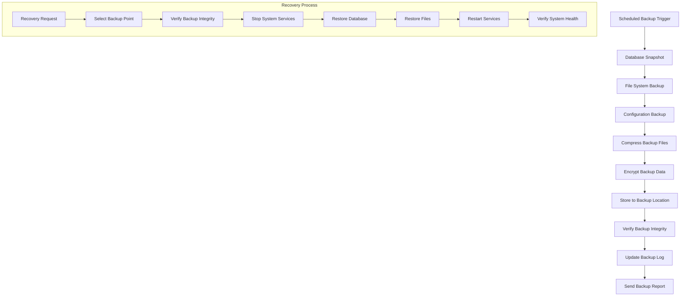
```mermaid
graph TD
    A[Scheduled Backup Trigger] --> B[Database Snapshot]
    B --> C[File System Backup]
    C --> D[Configuration Backup]
    D --> E[Compress Backup Files]
    E --> F[Encrypt Backup Data]
    F --> G[Store to Backup Location]
    G --> H[Verify Backup Integrity]
    H --> I[Update Backup Log]
    I --> J[Send Backup Report]

    subgraph "Recovery Process"
        K[Recovery Request]
        L[Select Backup Point]
        M[Verify Backup Integrity]
        N[Stop System Services]
        O[Restore Database]
        P[Restore Files]
        Q[Restart Services]
        R[Verify System Health]
    end

    K --> L
    L --> M
    M --> N
    N --> O
    O --> P
    P --> Q
    Q --> R
```

### Data Synchronization Flow

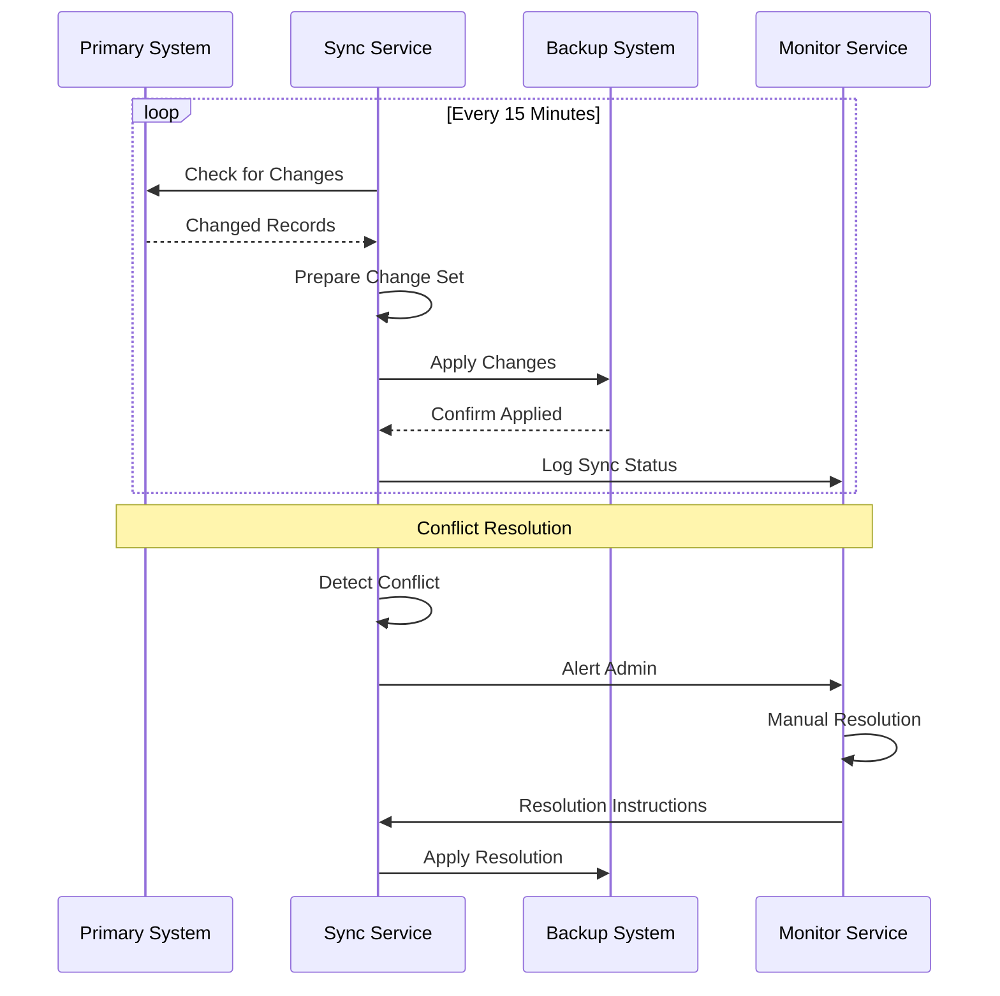
```mermaid
sequenceDiagram
    participant PRIMARY as Primary System
    participant SYNC as Sync Service
    participant BACKUP as Backup System
    participant MONITOR as Monitor Service

    loop Every 15 Minutes
        SYNC->>PRIMARY: Check for Changes
        PRIMARY-->>SYNC: Changed Records
        SYNC->>SYNC: Prepare Change Set
        SYNC->>BACKUP: Apply Changes
        BACKUP-->>SYNC: Confirm Applied
        SYNC->>MONITOR: Log Sync Status
    end

    Note over PRIMARY,MONITOR: Conflict Resolution
    SYNC->>SYNC: Detect Conflict
    SYNC->>MONITOR: Alert Admin
    MONITOR->>MONITOR: Manual Resolution
    MONITOR->>SYNC: Resolution Instructions
    SYNC->>BACKUP: Apply Resolution
```

---

## 9. Performance Optimization Data Flows

### Caching Strategy Data Flow

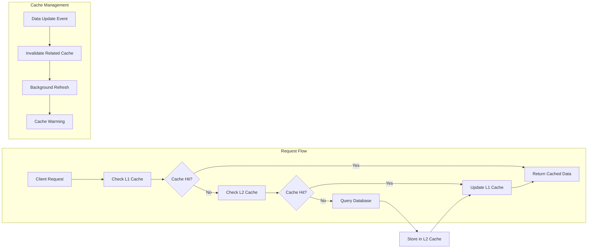
```mermaid
graph LR
    subgraph "Request Flow"
        A[Client Request] --> B[Check L1 Cache]
        B --> C{Cache Hit?}
        C -->|Yes| D[Return Cached Data]
        C -->|No| E[Check L2 Cache]
        E --> F{Cache Hit?}
        F -->|Yes| G[Update L1 Cache]
        F -->|No| H[Query Database]
    end

    subgraph "Cache Management"
        I[Data Update Event]
        J[Invalidate Related Cache]
        K[Background Refresh]
        L[Cache Warming]
    end

    H --> M[Store in L2 Cache]
    M --> G
    G --> D

    I --> J
    J --> K
    K --> L
```

### Database Query Optimization Flow

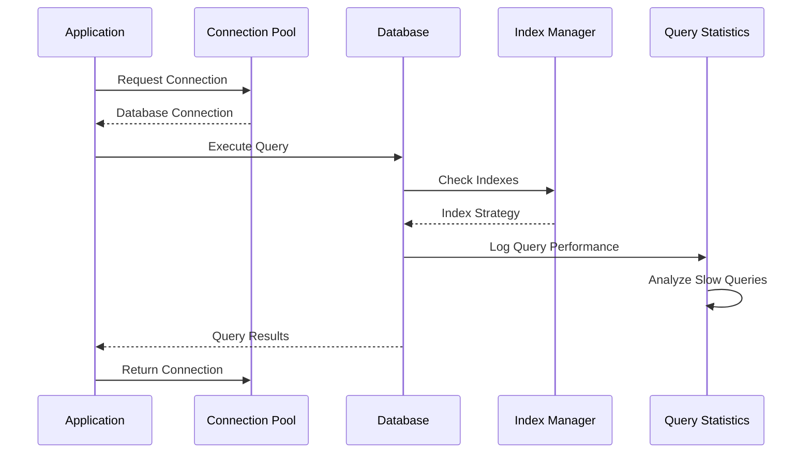
```mermaid
sequenceDiagram
    participant APP as Application
    participant CONN as Connection Pool
    participant DB as Database
    participant IDX as Index Manager
    participant STATS as Query Statistics

    APP->>CONN: Request Connection
    CONN-->>APP: Database Connection
    APP->>DB: Execute Query
    DB->>IDX: Check Indexes
    IDX-->>DB: Index Strategy
    DB->>STATS: Log Query Performance
    STATS->>STATS: Analyze Slow Queries
    DB-->>APP: Query Results
    APP->>CONN: Return Connection
```

---

## 10. Data Flow Monitoring and Observability

### System Health Monitoring

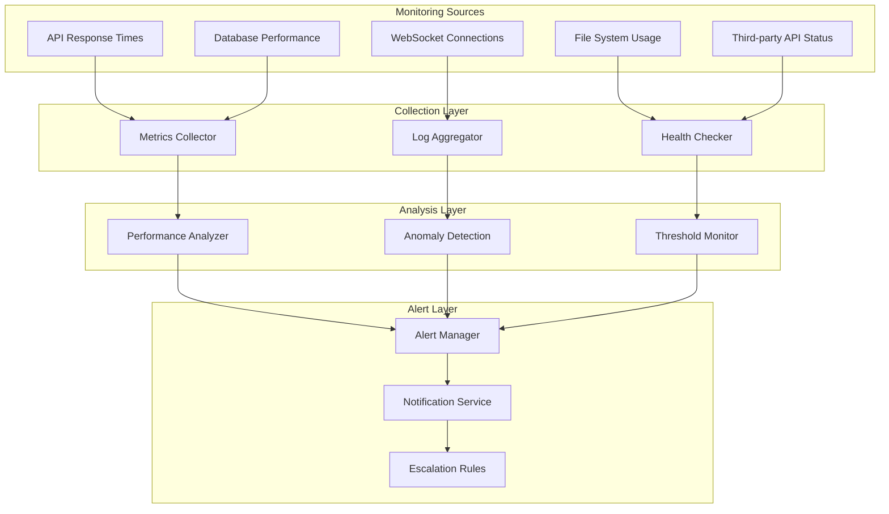
```mermaid
graph TD
    subgraph "Monitoring Sources"
        A[API Response Times]
        B[Database Performance]
        C[WebSocket Connections]
        D[File System Usage]
        E[Third-party API Status]
    end

    subgraph "Collection Layer"
        F[Metrics Collector]
        G[Log Aggregator]
        H[Health Checker]
    end

    subgraph "Analysis Layer"
        I[Performance Analyzer]
        J[Anomaly Detection]
        K[Threshold Monitor]
    end

    subgraph "Alert Layer"
        L[Alert Manager]
        M[Notification Service]
        N[Escalation Rules]
    end

    A --> F
    B --> F
    C --> G
    D --> H
    E --> H

    F --> I
    G --> J
    H --> K

    I --> L
    J --> L
    K --> L

    L --> M
    M --> N
```

### Audit Trail Data Flow

```mermaid
sequenceDiagram
    participant U as User Action
    participant MW as RBAC Middleware
    participant API as API Handler
    participant AUDIT as Audit Service
    participant DB as Audit Database
    participant ALERT as Alert System

    U->>MW: API Request
    MW->>MW: Capture Request Context
    MW->>API: Authorized Request
    API->>AUDIT: Log Action Start
    API->>API: Process Request

    alt Sensitive Operation
        API->>AUDIT: Log Detailed Changes
        AUDIT->>DB: Store Audit Record
        AUDIT->>ALERT: Check Alert Rules
        ALERT->>ALERT: Generate Alerts if Needed
    else Standard Operation
        API->>AUDIT: Log Standard Action
        AUDIT->>DB: Store Basic Record
    end

    API-->>MW: Response
    MW-->>U: Final Response
    AUDIT->>AUDIT: Background Processing
```

---

## Data Flow Performance Metrics

### Key Performance Indicators

#### Response Time Metrics
- **API Response Time**: 95th percentile < 200ms
- **Database Query Time**: 95th percentile < 50ms
- **WebSocket Message Delivery**: < 100ms
- **File Upload Speed**: 10MB/minute minimum
- **Cache Hit Ratio**: > 85% for frequently accessed data

#### Throughput Metrics
- **Concurrent Users**: 500+ simultaneous connections
- **API Requests**: 10,000+ requests per minute peak
- **Database Connections**: 100+ concurrent connections
- **WebSocket Connections**: 1,000+ concurrent connections
- **File Storage**: 1GB+ daily upload capacity

#### Reliability Metrics
- **System Uptime**: 99.9% availability target
- **Data Consistency**: 100% ACID compliance
- **Backup Success Rate**: 100% automated backups
- **Error Rate**: < 0.1% system errors
- **Integration Uptime**: 99.5% third-party connectivity

---

## Data Flow Security Considerations

### Security Controls
1. **Encryption in Transit**: All API communications use HTTPS/WSS
2. **Encryption at Rest**: Database and file storage encryption
3. **Access Control**: RBAC at every data access point
4. **Audit Logging**: Complete audit trail for sensitive operations
5. **Data Validation**: Input sanitization and validation at all layers

### Privacy Protection
1. **Data Minimization**: Only collect necessary data
2. **Retention Policies**: Automated data purging based on policies
3. **Access Logging**: All data access logged for compliance
4. **Anonymization**: PII data anonymized in analytics
5. **Consent Management**: User consent tracking for data processing

---

## Future Data Flow Enhancements

### Planned Improvements
1. **Event Sourcing**: Implement event-driven architecture
2. **Data Lake**: Advanced analytics data repository
3. **Real-time Analytics**: Stream processing for instant insights
4. **API Gateway**: Centralized API management and routing
5. **Microservices**: Decompose monolith into specialized services
6. **Edge Computing**: Distribute processing closer to users
7. **Machine Learning Pipeline**: Automated data processing for AI features