# Data Models Documentation

## Overview
This document provides comprehensive data model documentation for the enterprise business platform, including entity-relationship diagrams, table schemas, and data flow patterns.

---

## Table of Contents
1. [Complete Entity-Relationship Diagram](#1-complete-entity-relationship-diagram)
2. [Core Business Entities](#2-core-business-entities)
3. [CRM & Sales Entities](#3-crm--sales-entities)
4. [Project Management Entities](#4-project-management-entities)
5. [Task Management Entities](#5-task-management-entities)
6. [Financial Management Entities](#6-financial-management-entities)
7. [Resource Management Entities](#7-resource-management-entities)
8. [Support & Ticketing Entities](#8-support--ticketing-entities)
9. [Communication & Activity Entities](#9-communication--activity-entities)
10. [Security & Access Control Entities](#10-security--access-control-entities)
11. [Data Flow Diagrams](#11-data-flow-diagrams)
12. [Database Constraints & Indexes](#12-database-constraints--indexes)

---

## 1. Complete Entity-Relationship Diagram

### High-Level System Architecture


---

## 2. Core Business Entities

### 2.1 Users Table

**Purpose:** Central user authentication and profile management

```sql
CREATE TABLE users (
  id VARCHAR PRIMARY KEY DEFAULT gen_random_uuid(),
  email VARCHAR UNIQUE,
  firstName VARCHAR,
  lastName VARCHAR,
  profileImageUrl VARCHAR,

  -- Authentication
  passwordHash VARCHAR,
  authProvider VARCHAR DEFAULT 'local',  -- local, replit, google, github
  providerUserId VARCHAR,
  emailVerified BOOLEAN DEFAULT false,
  emailVerificationToken VARCHAR,
  passwordResetToken VARCHAR,
  passwordResetExpires TIMESTAMP,
  lastLoginAt TIMESTAMP,

  -- Authorization
  role VARCHAR DEFAULT 'employee',  -- admin, manager, employee, client
  enhancedRole VARCHAR DEFAULT 'employee',  -- super_admin, admin, manager, employee, contractor, viewer, client
  department VARCHAR,  -- projects, finance, support, marketing, sales, hr, it, operations, executive

  -- Profile
  position VARCHAR,
  phone VARCHAR,
  address TEXT,
  skills TEXT[],
  isActive BOOLEAN DEFAULT true,

  -- Security
  mfaEnabled BOOLEAN DEFAULT false,
  mfaSecret VARCHAR,
  mfaBackupCodes TEXT[],
  sessionLimit INTEGER DEFAULT 5,
  lastPasswordChange TIMESTAMP,
  passwordExpiresAt TIMESTAMP,
  loginAttempts INTEGER DEFAULT 0,
  lockedUntil TIMESTAMP,
  twoFactorTempToken VARCHAR,
  twoFactorTempExpires TIMESTAMP,

  createdAt TIMESTAMP DEFAULT NOW(),
  updatedAt TIMESTAMP DEFAULT NOW()
);

CREATE INDEX idx_users_email ON users(email);
CREATE INDEX idx_users_role ON users(role);
CREATE INDEX idx_users_department ON users(department);
CREATE INDEX idx_users_isActive ON users(isActive);
```

**Key Relationships:**
- One user → Many projects (as manager)
- One user → Many tasks (as assignee or creator)
- One user → Many time entries
- One user → Many role assignments
- One user → Many sessions

**Data Constraints:**
- Email must be unique when not null
- Password hash never exposed in API responses
- MFA secret encrypted at rest
- Session limit enforced by authentication middleware

---

### 2.2 Companies Table

**Purpose:** Client organization records for B2B relationships

```sql
CREATE TABLE companies (
  id VARCHAR PRIMARY KEY DEFAULT gen_random_uuid(),
  name VARCHAR NOT NULL,
  industry VARCHAR,  -- From INDUSTRIES constant (web_development, marketing, consulting, etc.)
  website VARCHAR,
  address TEXT,
  phone VARCHAR,
  email VARCHAR,
  description TEXT,
  size VARCHAR,  -- startup, small, medium, large, enterprise
  revenue DECIMAL(12, 2),
  foundedYear INTEGER,
  linkedinUrl VARCHAR,
  twitterUrl VARCHAR,
  tags TEXT[],
  assignedTo VARCHAR REFERENCES users(id),
  isActive BOOLEAN DEFAULT true,
  createdAt TIMESTAMP DEFAULT NOW(),
  updatedAt TIMESTAMP DEFAULT NOW()
);

CREATE INDEX idx_companies_name ON companies(name);
CREATE INDEX idx_companies_industry ON companies(industry);
CREATE INDEX idx_companies_assignedTo ON companies(assignedTo);
CREATE INDEX idx_companies_isActive ON companies(isActive);
```

**Key Relationships:**
- One company → Many clients (contacts)
- One company → Many sales opportunities
- One company → Many projects
- One company → Many invoices
- One user (account manager) → Many companies

**Business Rules:**
- Company name required
- Industry should match INDUSTRIES enum
- Revenue stored as decimal for precision
- Tags array allows flexible categorization

---

### 2.3 Clients Table

**Purpose:** Individual contacts within companies

```sql
CREATE TABLE clients (
  id VARCHAR PRIMARY KEY DEFAULT gen_random_uuid(),
  name VARCHAR NOT NULL,
  email VARCHAR,
  phone VARCHAR,
  companyId VARCHAR REFERENCES companies(id),
  position VARCHAR,  -- Job title
  department VARCHAR,
  isPrimaryContact BOOLEAN DEFAULT false,
  source VARCHAR,  -- referral, website, marketing, cold_outreach
  assignedTo VARCHAR REFERENCES users(id),
  lastContactDate TIMESTAMP,
  notes TEXT,
  tags TEXT[],
  isActive BOOLEAN DEFAULT true,

  -- Legacy fields (maintained for backward compatibility)
  company VARCHAR,
  industry VARCHAR,
  website VARCHAR,
  address TEXT,
  status VARCHAR,
  totalValue DECIMAL(10, 2),

  createdAt TIMESTAMP DEFAULT NOW(),
  updatedAt TIMESTAMP DEFAULT NOW()
);

CREATE INDEX idx_clients_companyId ON clients(companyId);
CREATE INDEX idx_clients_email ON clients(email);
CREATE INDEX idx_clients_assignedTo ON clients(assignedTo);
CREATE INDEX idx_clients_isPrimaryContact ON clients(isPrimaryContact, companyId);
```

**Key Relationships:**
- Many clients → One company
- One client → Many sales opportunities (as primary contact)
- One client → Many projects
- One client → Many support tickets
- One user (account manager) → Many clients

**Business Rules:**
- Multiple contacts per company allowed
- One primary contact per company (enforced by application logic)
- Email not required (some contacts may not have email)
- Legacy fields preserved during data migration

---

## 3. CRM & Sales Entities

### 3.1 Sales Opportunities Table

**Purpose:** Sales pipeline management and deal tracking

```sql
CREATE TABLE salesOpportunities (
  id VARCHAR PRIMARY KEY DEFAULT gen_random_uuid(),
  title VARCHAR NOT NULL,
  description TEXT,
  companyId VARCHAR REFERENCES companies(id),
  contactId VARCHAR REFERENCES clients(id),
  assignedTo VARCHAR REFERENCES users(id),

  -- Pipeline stage
  stage VARCHAR DEFAULT 'lead',  -- lead, qualified, proposal, negotiation, closed_won, closed_lost
  value DECIMAL(10, 2),
  probability INTEGER DEFAULT 50,  -- 0-100 percentage
  expectedCloseDate TIMESTAMP,
  actualCloseDate TIMESTAMP,

  -- Source and categorization
  source VARCHAR,  -- referral, website, marketing, cold_outreach
  priority VARCHAR DEFAULT 'medium',  -- low, medium, high
  tags TEXT[],
  notes TEXT,

  -- Discovery and qualification
  painPoints JSONB,  -- Array of client challenges
  successCriteria JSONB,  -- How success will be measured
  decisionProcess TEXT,  -- How decisions are made
  budget DECIMAL(12, 2),
  budgetStatus VARCHAR,  -- approved, estimated, unknown, no_budget
  competitorInfo JSONB,  -- Competing solutions

  lastActivityDate TIMESTAMP,
  createdAt TIMESTAMP DEFAULT NOW(),
  updatedAt TIMESTAMP DEFAULT NOW()
);

CREATE INDEX idx_opportunities_stage ON salesOpportunities(stage);
CREATE INDEX idx_opportunities_companyId ON salesOpportunities(companyId);
CREATE INDEX idx_opportunities_assignedTo ON salesOpportunities(assignedTo);
CREATE INDEX idx_opportunities_expectedCloseDate ON salesOpportunities(expectedCloseDate);
CREATE INDEX idx_opportunities_value ON salesOpportunities(value);
```

**JSONB Structure Examples:**

```json
{
  "painPoints": [
    {
      "title": "Slow website performance",
      "impact": "high",
      "priority": 1
    },
    {
      "title": "Manual data entry processes",
      "impact": "medium",
      "priority": 2
    }
  ],
  "successCriteria": [
    {
      "metric": "Page load time",
      "target": "< 2 seconds",
      "measurement": "Google PageSpeed Insights"
    },
    {
      "metric": "Process automation",
      "target": "80% reduction in manual entry",
      "measurement": "Time study comparison"
    }
  ],
  "competitorInfo": [
    {
      "name": "Competitor A",
      "strengths": ["Lower price", "Quick deployment"],
      "weaknesses": ["Limited support", "Outdated technology"],
      "notes": "Client evaluated but concerned about scalability"
    }
  ]
}
```

**Key Relationships:**
- Many opportunities → One company
- Many opportunities → One primary contact (client)
- Many opportunities → One sales owner (user)
- One opportunity → Many next steps
- One opportunity → Many communications
- One opportunity → Many stakeholders
- One opportunity → One project (on conversion)

**Business Rules:**
- Probability 0-100% validation enforced
- Stage progression tracked in activity history
- Expected close date required for qualified+ stages
- Value and probability used for weighted pipeline value
- One opportunity can only create one project (unique constraint)

---

### 3.2 Opportunity Next Steps Table

**Purpose:** Action items and follow-up tasks for opportunities

```sql
CREATE TABLE opportunityNextSteps (
  id VARCHAR PRIMARY KEY DEFAULT gen_random_uuid(),
  opportunityId VARCHAR REFERENCES salesOpportunities(id) ON DELETE CASCADE,
  title VARCHAR NOT NULL,
  description TEXT,
  assignedTo VARCHAR REFERENCES users(id),
  dueDate TIMESTAMP,
  priority VARCHAR DEFAULT 'medium',  -- low, medium, high, urgent
  status VARCHAR DEFAULT 'pending',  -- pending, in_progress, completed, cancelled
  completedAt TIMESTAMP,
  completedBy VARCHAR REFERENCES users(id),
  createdBy VARCHAR REFERENCES users(id),
  createdAt TIMESTAMP DEFAULT NOW(),
  updatedAt TIMESTAMP DEFAULT NOW()
);

CREATE INDEX idx_opportunity_next_steps_opportunityId ON opportunityNextSteps(opportunityId);
CREATE INDEX idx_opportunity_next_steps_assignedTo ON opportunityNextSteps(assignedTo);
CREATE INDEX idx_opportunity_next_steps_status ON opportunityNextSteps(status);
CREATE INDEX idx_opportunity_next_steps_dueDate ON opportunityNextSteps(dueDate);
```

**Key Relationships:**
- Many next steps → One opportunity
- Many next steps → One assignee (user)
- Many next steps → One creator (user)

**Business Rules:**
- Cascade delete when opportunity deleted
- Cannot complete without assignee
- Due date optional but recommended for high priority
- Completion timestamp auto-set on status change to completed

---

### 3.3 Opportunity Communications Table

**Purpose:** Log all client interactions and touchpoints

```sql
CREATE TABLE opportunityCommunications (
  id VARCHAR PRIMARY KEY DEFAULT gen_random_uuid(),
  opportunityId VARCHAR REFERENCES salesOpportunities(id) ON DELETE CASCADE,
  type VARCHAR NOT NULL,  -- call, email, meeting, demo, proposal, contract
  subject VARCHAR,
  summary TEXT,
  outcome VARCHAR,  -- positive, neutral, negative, no_response
  attendees TEXT[],  -- Contact names/emails
  followUpRequired BOOLEAN DEFAULT false,
  followUpDate TIMESTAMP,
  attachments JSONB,  -- File references
  recordedBy VARCHAR REFERENCES users(id),
  communicationDate TIMESTAMP,
  createdAt TIMESTAMP DEFAULT NOW(),
  updatedAt TIMESTAMP DEFAULT NOW()
);

CREATE INDEX idx_opportunity_communications_opportunityId ON opportunityCommunications(opportunityId);
CREATE INDEX idx_opportunity_communications_type ON opportunityCommunications(type);
CREATE INDEX idx_opportunity_communications_communicationDate ON opportunityCommunications(communicationDate);
```

**JSONB Structure for Attachments:**
```json
{
  "attachments": [
    {
      "name": "Proposal_v2.pdf",
      "url": "https://storage.example.com/proposals/abc123.pdf",
      "type": "application/pdf",
      "size": 2048000
    }
  ]
}
```

---

### 3.4 Opportunity Stakeholders Table

**Purpose:** Track decision-makers and influencers

```sql
CREATE TABLE opportunityStakeholders (
  id VARCHAR PRIMARY KEY DEFAULT gen_random_uuid(),
  opportunityId VARCHAR REFERENCES salesOpportunities(id) ON DELETE CASCADE,
  name VARCHAR NOT NULL,
  role VARCHAR,  -- decision_maker, influencer, user, blocker, champion
  email VARCHAR,
  phone VARCHAR,
  influence VARCHAR DEFAULT 'medium',  -- low, medium, high
  relationshipStrength VARCHAR DEFAULT 'neutral',  -- strong, neutral, weak, unknown
  notes TEXT,
  createdBy VARCHAR REFERENCES users(id),
  createdAt TIMESTAMP DEFAULT NOW(),
  updatedAt TIMESTAMP DEFAULT NOW()
);

CREATE INDEX idx_opportunity_stakeholders_opportunityId ON opportunityStakeholders(opportunityId);
CREATE INDEX idx_opportunity_stakeholders_role ON opportunityStakeholders(role);
```

**Business Rules:**
- Multiple stakeholders per opportunity
- Role classification guides engagement strategy
- Influence and relationship strength inform approach
- Champion identification critical for deal progression

---

## 4. Project Management Entities

### 4.1 Projects Table

**Purpose:** Main project records with budget, timeline, and status

```sql
CREATE TABLE projects (
  id VARCHAR PRIMARY KEY DEFAULT gen_random_uuid(),
  name VARCHAR NOT NULL,
  description TEXT,
  companyId VARCHAR REFERENCES companies(id),
  clientId VARCHAR REFERENCES clients(id),
  opportunityId VARCHAR UNIQUE REFERENCES salesOpportunities(id),  -- UNIQUE prevents duplicate conversions
  managerId VARCHAR REFERENCES users(id),

  -- Status and priority
  status VARCHAR DEFAULT 'planning',  -- planning, active, review, paused, on_hold, completed, cancelled
  priority VARCHAR DEFAULT 'medium',  -- low, medium, high, urgent

  -- Financial
  budget DECIMAL(10, 2),
  actualCost DECIMAL(10, 2) DEFAULT 0,

  -- Progress
  progress INTEGER DEFAULT 0,  -- 0-100 percentage

  -- Timeline
  startDate TIMESTAMP,
  endDate TIMESTAMP,
  completedAt TIMESTAMP,

  -- Categorization
  tags TEXT[],
  isClientPortalEnabled BOOLEAN DEFAULT true,

  -- Opportunity conversion fields
  requirements TEXT,  -- Mapped from opportunity painPoints
  successCriteria JSONB,  -- Copied from opportunity
  conversionDate TIMESTAMP,  -- When converted from opportunity
  originalValue DECIMAL(10, 2),  -- Original opportunity value

  createdAt TIMESTAMP DEFAULT NOW(),
  updatedAt TIMESTAMP DEFAULT NOW()
);

CREATE INDEX idx_projects_companyId ON projects(companyId);
CREATE INDEX idx_projects_managerId ON projects(managerId);
CREATE INDEX idx_projects_status ON projects(status);
CREATE INDEX idx_projects_opportunityId ON projects(opportunityId);
CREATE UNIQUE INDEX idx_projects_opportunityId_unique ON projects(opportunityId);
```

**Key Relationships:**
- Many projects → One company
- Many projects → One client (primary contact)
- One project → One opportunity (optional, on conversion)
- Many projects → One manager (user)
- One project → Many tasks
- One project → Many time entries
- One project → Many expenses
- One project → Many invoices
- One project → Many documents

**Business Rules:**
- End date must be >= start date (application validation)
- Progress automatically calculated from task completion
- Budget vs. actual cost tracked for variance analysis
- Status suggestions auto-generated based on progress
- Unique constraint on opportunityId prevents duplicate conversions

---

### 4.2 Project Templates Table

**Purpose:** Reusable project structures with pre-defined tasks

```sql
CREATE TABLE projectTemplates (
  id VARCHAR PRIMARY KEY DEFAULT gen_random_uuid(),
  name VARCHAR NOT NULL,
  description TEXT,
  industry VARCHAR,  -- web_development, marketing, consulting, etc.
  category VARCHAR,  -- website, mobile_app, campaign, audit, branding
  estimatedDuration INTEGER,  -- days
  defaultBudget DECIMAL(10, 2),
  defaultPriority VARCHAR DEFAULT 'medium',
  tags TEXT[],
  isActive BOOLEAN DEFAULT true,
  createdBy VARCHAR REFERENCES users(id),
  createdAt TIMESTAMP DEFAULT NOW(),
  updatedAt TIMESTAMP DEFAULT NOW()
);

CREATE INDEX idx_project_templates_industry ON projectTemplates(industry);
CREATE INDEX idx_project_templates_category ON projectTemplates(category);
CREATE INDEX idx_project_templates_isActive ON projectTemplates(isActive);
```

---

### 4.3 Task Templates Table

**Purpose:** Pre-defined tasks within project templates

```sql
CREATE TABLE taskTemplates (
  id VARCHAR PRIMARY KEY DEFAULT gen_random_uuid(),
  projectTemplateId VARCHAR REFERENCES projectTemplates(id) ON DELETE CASCADE,
  title VARCHAR NOT NULL,
  description TEXT,
  estimatedHours DECIMAL(5, 2),
  priority VARCHAR DEFAULT 'medium',
  phase VARCHAR,  -- planning, design, development, testing, launch
  orderIndex INTEGER DEFAULT 0,  -- Sequence within template
  dependsOnPhase VARCHAR,  -- Previous phase dependency
  tags TEXT[],
  createdAt TIMESTAMP DEFAULT NOW()
);

CREATE INDEX idx_task_templates_projectTemplateId ON taskTemplates(projectTemplateId);
CREATE INDEX idx_task_templates_phase ON taskTemplates(phase);
CREATE INDEX idx_task_templates_orderIndex ON taskTemplates(orderIndex);
```

**Business Rules:**
- Tasks created in orderIndex sequence
- Phase dependencies establish automatic task dependencies
- Estimated hours used for initial project timeline calculation

---

### 4.4 Project Comments Table

**Purpose:** Team communication and project updates

```sql
CREATE TABLE projectComments (
  id VARCHAR PRIMARY KEY DEFAULT gen_random_uuid(),
  projectId VARCHAR REFERENCES projects(id) ON DELETE CASCADE,
  userId VARCHAR REFERENCES users(id),
  content TEXT NOT NULL,
  type VARCHAR DEFAULT 'comment',  -- comment, status_update, milestone, file_upload
  mentionedUsers TEXT[],  -- Array of user IDs for @mentions
  attachments JSONB,
  editedAt TIMESTAMP,
  createdAt TIMESTAMP DEFAULT NOW()
);

CREATE INDEX idx_project_comments_projectId ON projectComments(projectId);
CREATE INDEX idx_project_comments_userId ON projectComments(userId);
CREATE INDEX idx_project_comments_createdAt ON projectComments(createdAt DESC);
```

**JSONB Structure for Attachments:**
```json
{
  "attachments": [
    {
      "name": "screenshot.png",
      "url": "https://storage.example.com/files/abc123.png",
      "type": "image/png",
      "size": 524288
    }
  ]
}
```

---

### 4.5 Project Activity Table

**Purpose:** Automatic audit log of all project changes

```sql
CREATE TABLE projectActivity (
  id VARCHAR PRIMARY KEY DEFAULT gen_random_uuid(),
  projectId VARCHAR REFERENCES projects(id) ON DELETE CASCADE,
  userId VARCHAR REFERENCES users(id),
  action VARCHAR NOT NULL,  -- created, updated, task_added, file_uploaded, status_changed
  entityType VARCHAR,  -- project, task, comment, file
  entityId VARCHAR,
  details JSONB,  -- Structured data about the change
  createdAt TIMESTAMP DEFAULT NOW()
);

CREATE INDEX idx_project_activity_projectId ON projectActivity(projectId);
CREATE INDEX idx_project_activity_createdAt ON projectActivity(createdAt DESC);
```

**JSONB Structure for Details:**
```json
{
  "action": "status_changed",
  "oldValue": "active",
  "newValue": "review",
  "reason": "All tasks completed, ready for client review"
}
```

---

## 5. Task Management Entities

### 5.1 Tasks Table

**Purpose:** Individual work items within projects

```sql
CREATE TABLE tasks (
  id VARCHAR PRIMARY KEY DEFAULT gen_random_uuid(),
  title VARCHAR NOT NULL,
  description TEXT,
  projectId VARCHAR REFERENCES projects(id),
  assignedTo VARCHAR REFERENCES users(id),
  createdBy VARCHAR REFERENCES users(id),

  -- Status and priority
  status VARCHAR DEFAULT 'todo',  -- todo, in_progress, review, completed
  priority VARCHAR DEFAULT 'medium',  -- low, medium, high, urgent

  -- Time tracking
  estimatedHours DECIMAL(5, 2),
  actualHours DECIMAL(5, 2) DEFAULT 0,

  -- Timeline
  startDate TIMESTAMP,  -- Planned start for Gantt chart
  dueDate TIMESTAMP,
  completedAt TIMESTAMP,

  -- Categorization
  tags TEXT[],

  createdAt TIMESTAMP DEFAULT NOW(),
  updatedAt TIMESTAMP DEFAULT NOW()
);

CREATE INDEX idx_tasks_projectId ON tasks(projectId);
CREATE INDEX idx_tasks_assignedTo ON tasks(assignedTo);
CREATE INDEX idx_tasks_status ON tasks(status);
CREATE INDEX idx_tasks_dueDate ON tasks(dueDate);
CREATE INDEX idx_tasks_priority ON tasks(priority);
```

**Key Relationships:**
- Many tasks → One project
- Many tasks → One assignee (user)
- Many tasks → One creator (user)
- One task → Many time entries
- One task → Many dependencies (via taskDependencies)

**Business Rules:**
- Due date optional but recommended
- Start date auto-calculated from dependencies in Gantt view
- Actual hours accumulated from time entries
- Status change to completed triggers project progress recalculation

---

### 5.2 Task Dependencies Table

**Purpose:** Define relationships and ordering between tasks

```sql
CREATE TABLE taskDependencies (
  id VARCHAR PRIMARY KEY DEFAULT gen_random_uuid(),
  taskId VARCHAR REFERENCES tasks(id) ON DELETE CASCADE,
  dependsOnTaskId VARCHAR REFERENCES tasks(id) ON DELETE CASCADE,
  dependencyType VARCHAR DEFAULT 'finish_to_start',  -- finish_to_start, start_to_start, finish_to_finish, start_to_finish
  lag INTEGER DEFAULT 0,  -- Lag time in days
  createdAt TIMESTAMP DEFAULT NOW(),

  CONSTRAINT no_self_dependency CHECK (taskId != dependsOnTaskId)
);

CREATE INDEX idx_task_dependencies_taskId ON taskDependencies(taskId);
CREATE INDEX idx_task_dependencies_dependsOnTaskId ON taskDependencies(dependsOnTaskId);
CREATE UNIQUE INDEX idx_task_dependencies_unique ON taskDependencies(taskId, dependsOnTaskId);
```

**Dependency Types:**
- **Finish-to-Start (FS):** Task B starts after Task A finishes (most common)
- **Start-to-Start (SS):** Task B starts when Task A starts
- **Finish-to-Finish (FF):** Task B finishes when Task A finishes
- **Start-to-Finish (SF):** Task B finishes when Task A starts (rare)

**Business Rules:**
- No self-dependencies (enforced by CHECK constraint)
- No circular dependencies (enforced by application logic)
- Unique constraint prevents duplicate dependencies
- Cascade delete when either task deleted

---

## 6. Financial Management Entities

### 6.1 Invoices Table

**Purpose:** Client billing and payment tracking

```sql
CREATE TABLE invoices (
  id VARCHAR PRIMARY KEY DEFAULT gen_random_uuid(),
  invoiceNumber VARCHAR UNIQUE NOT NULL,  -- INV-YYYY-MM-NNNNN
  companyId VARCHAR REFERENCES companies(id),
  clientId VARCHAR REFERENCES clients(id),
  projectId VARCHAR REFERENCES projects(id),

  -- Financial amounts
  amount DECIMAL(10, 2) NOT NULL,
  tax DECIMAL(10, 2) DEFAULT 0,
  total DECIMAL(10, 2) NOT NULL,

  -- Status and dates
  status VARCHAR DEFAULT 'draft',  -- draft, sent, paid, overdue, cancelled
  dueDate TIMESTAMP,
  paidAt TIMESTAMP,

  -- Additional information
  notes TEXT,
  terms TEXT,  -- Payment terms

  createdAt TIMESTAMP DEFAULT NOW(),
  updatedAt TIMESTAMP DEFAULT NOW()
);

CREATE INDEX idx_invoices_invoiceNumber ON invoices(invoiceNumber);
CREATE INDEX idx_invoices_companyId ON invoices(companyId);
CREATE INDEX idx_invoices_projectId ON invoices(projectId);
CREATE INDEX idx_invoices_status ON invoices(status);
CREATE INDEX idx_invoices_dueDate ON invoices(dueDate);
CREATE UNIQUE INDEX idx_invoices_number_unique ON invoices(invoiceNumber);
```

**Key Relationships:**
- Many invoices → One company
- Many invoices → One client (contact)
- Many invoices → One project
- One invoice → Many time entries (linked via timeEntries.invoiceId)

**Business Rules:**
- Invoice number unique and auto-generated
- Total = amount + tax (calculated)
- Status progression: draft → sent → paid
- Overdue status auto-set if dueDate passed and unpaid
- Cannot delete paid invoices (archive only)

---

### 6.2 Time Entries Table

**Purpose:** Track billable and non-billable time

```sql
CREATE TABLE timeEntries (
  id VARCHAR PRIMARY KEY DEFAULT gen_random_uuid(),
  userId VARCHAR REFERENCES users(id),
  projectId VARCHAR REFERENCES projects(id),
  taskId VARCHAR REFERENCES tasks(id),
  description TEXT,
  hours DECIMAL(5, 2) NOT NULL,
  date TIMESTAMP NOT NULL,
  billable BOOLEAN DEFAULT true,
  rate DECIMAL(8, 2),  -- Hourly rate for billing
  createdAt TIMESTAMP DEFAULT NOW()
);

CREATE INDEX idx_time_entries_userId ON timeEntries(userId);
CREATE INDEX idx_time_entries_projectId ON timeEntries(projectId);
CREATE INDEX idx_time_entries_taskId ON timeEntries(taskId);
CREATE INDEX idx_time_entries_date ON timeEntries(date);
CREATE INDEX idx_time_entries_billable ON timeEntries(billable);
```

**Key Relationships:**
- Many time entries → One user
- Many time entries → One project
- Many time entries → One task
- Many time entries → One invoice (when invoiced)

**Business Rules:**
- Hours must be positive decimal
- Date required for time entry
- Rate can be project-specific or user default rate
- Billable flag determines inclusion in invoices
- Once invoiced, entry locked from editing

---

### 6.3 Expenses Table

**Purpose:** Track project-related expenses

```sql
CREATE TABLE expenses (
  id VARCHAR PRIMARY KEY DEFAULT gen_random_uuid(),
  description TEXT NOT NULL,
  amount DECIMAL(10, 2) NOT NULL,
  category VARCHAR,  -- travel, meals, supplies, software, equipment
  projectId VARCHAR REFERENCES projects(id),
  userId VARCHAR REFERENCES users(id),
  receiptUrl VARCHAR,  -- Link to receipt image/PDF
  billable BOOLEAN DEFAULT false,
  reimbursed BOOLEAN DEFAULT false,
  date TIMESTAMP NOT NULL,
  createdAt TIMESTAMP DEFAULT NOW()
);

CREATE INDEX idx_expenses_projectId ON expenses(projectId);
CREATE INDEX idx_expenses_userId ON expenses(userId);
CREATE INDEX idx_expenses_category ON expenses(category);
CREATE INDEX idx_expenses_date ON expenses(date);
```

**Business Rules:**
- Amount must be positive
- Receipt required for amounts > $50 (enforced by approval workflow)
- Billable expenses included in client invoices
- Reimbursed flag tracks employee reimbursement status

---

### 6.4 Budget Categories Table

**Purpose:** Categorize budget allocations

```sql
CREATE TABLE budgetCategories (
  id VARCHAR PRIMARY KEY DEFAULT gen_random_uuid(),
  name VARCHAR NOT NULL,
  description TEXT,
  categoryType VARCHAR NOT NULL,  -- labor, materials, software, travel, overhead
  isActive BOOLEAN DEFAULT true,
  createdAt TIMESTAMP DEFAULT NOW()
);
```

---

### 6.5 Project Budgets Table

**Purpose:** Budget breakdown by category per project

```sql
CREATE TABLE projectBudgets (
  id VARCHAR PRIMARY KEY DEFAULT gen_random_uuid(),
  projectId VARCHAR REFERENCES projects(id),
  categoryId VARCHAR REFERENCES budgetCategories(id),
  budgetedAmount DECIMAL(10, 2) NOT NULL,
  spentAmount DECIMAL(10, 2) DEFAULT 0,
  committedAmount DECIMAL(10, 2) DEFAULT 0,  -- Purchase orders, contracts
  forecastAmount DECIMAL(10, 2) DEFAULT 0,  -- Projected final cost
  notes TEXT,
  createdAt TIMESTAMP DEFAULT NOW(),
  updatedAt TIMESTAMP DEFAULT NOW()
);

CREATE INDEX idx_project_budgets_projectId ON projectBudgets(projectId);
CREATE INDEX idx_project_budgets_categoryId ON projectBudgets(categoryId);
```

**Business Rules:**
- Spent amount auto-calculated from time entries and expenses
- Forecast updated based on remaining work and burn rate
- Variance = budgeted - forecast (positive = under budget)

---

## 7. Resource Management Entities

### 7.1 User Capacity Table

**Purpose:** Standard working hours per user

```sql
CREATE TABLE userCapacity (
  id VARCHAR PRIMARY KEY DEFAULT gen_random_uuid(),
  userId VARCHAR REFERENCES users(id),
  hoursPerDay DECIMAL(4, 2) DEFAULT 8.00,
  hoursPerWeek DECIMAL(4, 2) DEFAULT 40.00,
  overtimeMultiplier DECIMAL(3, 2) DEFAULT 1.50,
  effectiveFrom TIMESTAMP DEFAULT NOW(),
  effectiveTo TIMESTAMP,  -- NULL means current
  createdAt TIMESTAMP DEFAULT NOW(),
  updatedAt TIMESTAMP DEFAULT NOW()
);

CREATE INDEX idx_user_capacity_userId ON userCapacity(userId);
CREATE INDEX idx_user_capacity_effective ON userCapacity(effectiveFrom, effectiveTo);
```

---

### 7.2 User Availability Table

**Purpose:** Track PTO, vacation, holidays

```sql
CREATE TABLE userAvailability (
  id VARCHAR PRIMARY KEY DEFAULT gen_random_uuid(),
  userId VARCHAR REFERENCES users(id),
  type VARCHAR NOT NULL,  -- vacation, sick, holiday, training, partial_day
  status VARCHAR DEFAULT 'approved',  -- pending, approved, denied
  startDate TIMESTAMP NOT NULL,
  endDate TIMESTAMP NOT NULL,
  hoursPerDay DECIMAL(4, 2),  -- For partial days
  description TEXT,
  approvedBy VARCHAR REFERENCES users(id),
  approvedAt TIMESTAMP,
  createdAt TIMESTAMP DEFAULT NOW(),
  updatedAt TIMESTAMP DEFAULT NOW()
);

CREATE INDEX idx_user_availability_userId ON userAvailability(userId);
CREATE INDEX idx_user_availability_dates ON userAvailability(startDate, endDate);
CREATE INDEX idx_user_availability_status ON userAvailability(status);
```

---

### 7.3 User Skills Table

**Purpose:** Track competencies and expertise

```sql
CREATE TABLE userSkills (
  id VARCHAR PRIMARY KEY DEFAULT gen_random_uuid(),
  userId VARCHAR REFERENCES users(id),
  skillName VARCHAR NOT NULL,
  category VARCHAR,  -- technical, soft_skills, domain_knowledge, tools
  proficiencyLevel INTEGER DEFAULT 1,  -- 1-5 scale
  yearsExperience DECIMAL(3, 1),
  isCertified BOOLEAN DEFAULT false,
  certificationName VARCHAR,
  lastUsed TIMESTAMP,
  createdAt TIMESTAMP DEFAULT NOW(),
  updatedAt TIMESTAMP DEFAULT NOW()
);

CREATE INDEX idx_user_skills_userId ON userSkills(userId);
CREATE INDEX idx_user_skills_skillName ON userSkills(skillName);
CREATE INDEX idx_user_skills_proficiencyLevel ON userSkills(proficiencyLevel);
```

---

### 7.4 Resource Allocations Table

**Purpose:** Assign team members to projects and tasks

```sql
CREATE TABLE resourceAllocations (
  id VARCHAR PRIMARY KEY DEFAULT gen_random_uuid(),
  userId VARCHAR REFERENCES users(id),
  projectId VARCHAR REFERENCES projects(id),
  taskId VARCHAR REFERENCES tasks(id),  -- Optional
  allocationType VARCHAR DEFAULT 'project',  -- project, task, milestone
  allocatedHours DECIMAL(6, 2) NOT NULL,
  hourlyRate DECIMAL(8, 2),
  startDate TIMESTAMP NOT NULL,
  endDate TIMESTAMP NOT NULL,
  utilizationTarget INTEGER DEFAULT 100,  -- Percentage of capacity
  priority VARCHAR DEFAULT 'medium',
  status VARCHAR DEFAULT 'active',  -- active, completed, cancelled, on_hold
  notes TEXT,
  createdBy VARCHAR REFERENCES users(id),
  createdAt TIMESTAMP DEFAULT NOW(),
  updatedAt TIMESTAMP DEFAULT NOW()
);

CREATE INDEX idx_resource_allocations_userId ON resourceAllocations(userId);
CREATE INDEX idx_resource_allocations_projectId ON resourceAllocations(projectId);
CREATE INDEX idx_resource_allocations_dates ON resourceAllocations(startDate, endDate);
CREATE INDEX idx_resource_allocations_status ON resourceAllocations(status);
```

---

### 7.5 Workload Snapshots Table

**Purpose:** Historical workload tracking

```sql
CREATE TABLE workloadSnapshots (
  id VARCHAR PRIMARY KEY DEFAULT gen_random_uuid(),
  userId VARCHAR REFERENCES users(id),
  snapshotDate TIMESTAMP NOT NULL,
  totalAllocatedHours DECIMAL(6, 2) NOT NULL,
  actualWorkedHours DECIMAL(6, 2) DEFAULT 0,
  availableHours DECIMAL(6, 2) NOT NULL,
  utilizationPercentage DECIMAL(5, 2),
  overallocationHours DECIMAL(6, 2) DEFAULT 0,
  activeProjectsCount INTEGER DEFAULT 0,
  activeTasksCount INTEGER DEFAULT 0,
  createdAt TIMESTAMP DEFAULT NOW()
);

CREATE INDEX idx_workload_snapshots_userId ON workloadSnapshots(userId);
CREATE INDEX idx_workload_snapshots_date ON workloadSnapshots(snapshotDate);
```

**Business Rules:**
- Snapshots created daily by cron job
- Historical data used for capacity planning
- Utilization percentage: (allocated / available) × 100
- Over-allocation flagged when utilization > 90%

---

## 8. Support & Ticketing Entities

### 8.1 Support Tickets Table

**Purpose:** Customer support request tracking

```sql
CREATE TABLE supportTickets (
  id VARCHAR PRIMARY KEY DEFAULT gen_random_uuid(),
  ticketNumber VARCHAR UNIQUE NOT NULL,  -- TKT-YYYY-NNNNN
  title VARCHAR NOT NULL,
  description TEXT NOT NULL,
  category VARCHAR,  -- technical, billing, general
  priority VARCHAR DEFAULT 'medium',  -- low, medium, high, urgent
  status VARCHAR DEFAULT 'open',  -- open, in_progress, resolved, closed

  -- Assignment
  clientId VARCHAR REFERENCES clients(id),
  assignedTo VARCHAR REFERENCES users(id),
  createdBy VARCHAR REFERENCES users(id),

  -- Resolution
  resolution TEXT,
  satisfactionRating INTEGER,  -- 1-5
  resolvedAt TIMESTAMP,

  -- SLA tracking
  firstResponseAt TIMESTAMP,
  slaBreachAt TIMESTAMP,
  escalatedAt TIMESTAMP,
  escalationLevel INTEGER DEFAULT 0,  -- 0=agent, 1=manager, 2=senior, 3=executive
  businessImpact VARCHAR DEFAULT 'low',  -- low, medium, high, critical
  urgency VARCHAR DEFAULT 'medium',
  responseTimeHours INTEGER,
  resolutionTimeHours INTEGER,
  actualResponseMinutes INTEGER,
  actualResolutionMinutes INTEGER,
  slaStatus VARCHAR DEFAULT 'on_track',  -- on_track, at_risk, breached
  lastActivityAt TIMESTAMP DEFAULT NOW(),

  tags TEXT,
  createdAt TIMESTAMP DEFAULT NOW(),
  updatedAt TIMESTAMP DEFAULT NOW()
);

CREATE INDEX idx_support_tickets_ticketNumber ON supportTickets(ticketNumber);
CREATE INDEX idx_support_tickets_clientId ON supportTickets(clientId);
CREATE INDEX idx_support_tickets_assignedTo ON supportTickets(assignedTo);
CREATE INDEX idx_support_tickets_status ON supportTickets(status);
CREATE INDEX idx_support_tickets_priority ON supportTickets(priority);
CREATE INDEX idx_support_tickets_slaStatus ON supportTickets(slaStatus);
CREATE UNIQUE INDEX idx_support_tickets_number_unique ON supportTickets(ticketNumber);
```

---

### 8.2 SLA Configurations Table

**Purpose:** Define SLA rules by priority and category

```sql
CREATE TABLE slaConfigurations (
  id VARCHAR PRIMARY KEY DEFAULT gen_random_uuid(),
  name VARCHAR NOT NULL,
  priority VARCHAR NOT NULL,  -- low, medium, high, urgent
  category VARCHAR,
  businessImpact VARCHAR,
  responseTimeHours INTEGER NOT NULL,
  resolutionTimeHours INTEGER NOT NULL,
  escalationLevels TEXT,  -- JSON array of escalation rules
  isActive BOOLEAN DEFAULT true,
  createdBy VARCHAR REFERENCES users(id),
  createdAt TIMESTAMP DEFAULT NOW(),
  updatedAt TIMESTAMP DEFAULT NOW()
);

CREATE INDEX idx_sla_configurations_priority ON slaConfigurations(priority);
CREATE INDEX idx_sla_configurations_category ON slaConfigurations(category);
```

---

### 8.3 Ticket Escalations Table

**Purpose:** Track escalation history

```sql
CREATE TABLE ticketEscalations (
  id VARCHAR PRIMARY KEY DEFAULT gen_random_uuid(),
  ticketId VARCHAR REFERENCES supportTickets(id) ON DELETE CASCADE,
  fromUserId VARCHAR REFERENCES users(id),
  toUserId VARCHAR REFERENCES users(id) NOT NULL,
  escalationLevel INTEGER NOT NULL,
  reason TEXT NOT NULL,
  automatedRule VARCHAR,  -- Rule that triggered escalation
  createdAt TIMESTAMP DEFAULT NOW()
);

CREATE INDEX idx_ticket_escalations_ticketId ON ticketEscalations(ticketId);
CREATE INDEX idx_ticket_escalations_toUserId ON ticketEscalations(toUserId);
```

---

## 9. Communication & Activity Entities

### 9.1 Notifications Table

**Purpose:** Real-time and asynchronous user notifications

```sql
CREATE TABLE notifications (
  id VARCHAR PRIMARY KEY DEFAULT gen_random_uuid(),
  userId VARCHAR REFERENCES users(id) NOT NULL,
  type VARCHAR NOT NULL,  -- task_created, task_updated, comment_added, project_updated, dependency_changed
  title VARCHAR NOT NULL,
  message TEXT NOT NULL,
  data JSONB,  -- Additional context (task ID, project ID, etc.)
  read BOOLEAN DEFAULT false,
  createdAt TIMESTAMP DEFAULT NOW(),
  updatedAt TIMESTAMP DEFAULT NOW()
);

CREATE INDEX idx_notifications_userId ON notifications(userId);
CREATE INDEX idx_notifications_read ON notifications(read);
CREATE INDEX idx_notifications_createdAt ON notifications(createdAt DESC);
```

**JSONB Data Structure:**
```json
{
  "taskId": "task_789",
  "taskTitle": "Implement authentication",
  "projectId": "proj_123",
  "projectName": "Client Portal",
  "priority": "high",
  "dueDate": "2024-12-15T17:00:00Z",
  "assignedBy": {
    "id": "user_456",
    "name": "John Manager"
  },
  "actions": [
    {
      "label": "View Task",
      "url": "/tasks/task_789",
      "primary": true
    }
  ]
}
```

---

### 9.2 Documents Table

**Purpose:** File storage references

```sql
CREATE TABLE documents (
  id VARCHAR PRIMARY KEY DEFAULT gen_random_uuid(),
  name VARCHAR NOT NULL,
  description TEXT,
  fileUrl VARCHAR NOT NULL,
  fileSize INTEGER,
  mimeType VARCHAR,
  category VARCHAR,  -- contract, proposal, report, sop, training
  projectId VARCHAR REFERENCES projects(id),
  clientId VARCHAR REFERENCES clients(id),
  uploadedBy VARCHAR REFERENCES users(id),
  version VARCHAR DEFAULT '1.0',
  isPublic BOOLEAN DEFAULT false,
  tags TEXT[],
  createdAt TIMESTAMP DEFAULT NOW(),
  updatedAt TIMESTAMP DEFAULT NOW()
);

CREATE INDEX idx_documents_projectId ON documents(projectId);
CREATE INDEX idx_documents_clientId ON documents(clientId);
CREATE INDEX idx_documents_uploadedBy ON documents(uploadedBy);
CREATE INDEX idx_documents_category ON documents(category);
```

---

### 9.3 Knowledge Articles Table

**Purpose:** Internal knowledge base

```sql
CREATE TABLE knowledgeArticles (
  id VARCHAR PRIMARY KEY DEFAULT gen_random_uuid(),
  title VARCHAR NOT NULL,
  content TEXT NOT NULL,
  category VARCHAR,  -- sop, training, policy, faq
  tags TEXT[],
  authorId VARCHAR REFERENCES users(id),
  status VARCHAR DEFAULT 'draft',  -- draft, published, archived
  isPublic BOOLEAN DEFAULT false,
  viewCount INTEGER DEFAULT 0,
  createdAt TIMESTAMP DEFAULT NOW(),
  updatedAt TIMESTAMP DEFAULT NOW()
);

CREATE INDEX idx_knowledge_articles_authorId ON knowledgeArticles(authorId);
CREATE INDEX idx_knowledge_articles_status ON knowledgeArticles(status);
CREATE INDEX idx_knowledge_articles_category ON knowledgeArticles(category);
```

---

## 10. Security & Access Control Entities

### 10.1 Roles Table

**Purpose:** Define permission sets for user roles

```sql
CREATE TABLE roles (
  id VARCHAR PRIMARY KEY DEFAULT gen_random_uuid(),
  name VARCHAR NOT NULL UNIQUE,
  displayName VARCHAR NOT NULL,
  description TEXT,
  department VARCHAR,  -- projects, finance, support, marketing, sales, hr, it, operations, executive
  isSystemRole BOOLEAN DEFAULT false,  -- Built-in vs custom
  isActive BOOLEAN DEFAULT true,
  permissions TEXT[],  -- Array of permission strings (resource:action)
  inheritFrom VARCHAR REFERENCES roles(id),
  createdBy VARCHAR REFERENCES users(id),
  createdAt TIMESTAMP DEFAULT NOW(),
  updatedAt TIMESTAMP DEFAULT NOW()
);

CREATE INDEX idx_roles_name ON roles(name);
CREATE INDEX idx_roles_department ON roles(department);
CREATE UNIQUE INDEX idx_roles_name_unique ON roles(name);
```

**Permission String Format:**
```
projects:create
projects:read
projects:update
projects:delete
clients:read
invoices:create
analytics:read
audit_logs:read
```

---

### 10.2 User Role Assignments Table

**Purpose:** Many-to-many user-role relationships

```sql
CREATE TABLE userRoleAssignments (
  id VARCHAR PRIMARY KEY DEFAULT gen_random_uuid(),
  userId VARCHAR REFERENCES users(id) ON DELETE CASCADE NOT NULL,
  roleId VARCHAR REFERENCES roles(id) ON DELETE CASCADE NOT NULL,
  assignedBy VARCHAR REFERENCES users(id) NOT NULL,
  assignedAt TIMESTAMP DEFAULT NOW(),
  expiresAt TIMESTAMP,  -- Optional temporary role
  isActive BOOLEAN DEFAULT true,
  reason TEXT,
  createdAt TIMESTAMP DEFAULT NOW()
);

CREATE INDEX idx_user_role_assignments_userId ON userRoleAssignments(userId);
CREATE INDEX idx_user_role_assignments_roleId ON userRoleAssignments(roleId);
CREATE INDEX idx_user_role_assignments_expiresAt ON userRoleAssignments(expiresAt);
```

---

### 10.3 User Sessions Table

**Purpose:** Enhanced session tracking

```sql
CREATE TABLE userSessions (
  id VARCHAR PRIMARY KEY DEFAULT gen_random_uuid(),
  userId VARCHAR REFERENCES users(id) ON DELETE CASCADE NOT NULL,
  sessionId VARCHAR NOT NULL UNIQUE,  -- Links to sessions table
  deviceInfo JSONB,
  ipAddress VARCHAR,
  userAgent TEXT,
  location JSONB,
  isActive BOOLEAN DEFAULT true,
  lastActivity TIMESTAMP DEFAULT NOW(),
  expiresAt TIMESTAMP NOT NULL,
  createdAt TIMESTAMP DEFAULT NOW()
);

CREATE INDEX idx_user_sessions_userId ON userSessions(userId);
CREATE INDEX idx_user_sessions_sessionId ON userSessions(sessionId);
CREATE INDEX idx_user_sessions_expiresAt ON userSessions(expiresAt);
```

**JSONB Structure:**
```json
{
  "deviceInfo": {
    "browser": "Chrome",
    "browserVersion": "120.0",
    "os": "Windows",
    "osVersion": "10",
    "device": "Desktop"
  },
  "location": {
    "city": "San Francisco",
    "region": "California",
    "country": "US",
    "latitude": 37.7749,
    "longitude": -122.4194
  }
}
```

---

### 10.4 Audit Logs Table

**Purpose:** Comprehensive audit trail

```sql
CREATE TABLE auditLogs (
  id VARCHAR PRIMARY KEY DEFAULT gen_random_uuid(),
  userId VARCHAR REFERENCES users(id),
  sessionId VARCHAR,
  action VARCHAR NOT NULL,  -- create, read, update, delete, login, logout
  resource VARCHAR NOT NULL,  -- projects, tasks, clients, users, etc.
  resourceId VARCHAR,
  department VARCHAR,

  -- Change tracking
  oldValues JSONB,
  newValues JSONB,
  changes JSONB,

  -- Context
  ipAddress VARCHAR,
  userAgent TEXT,
  deviceInfo JSONB,
  location JSONB,

  -- Classification
  severity VARCHAR DEFAULT 'info',  -- info, warning, critical
  category VARCHAR,  -- security, data_change, system, user_action
  isSensitive BOOLEAN DEFAULT false,
  requiresReview BOOLEAN DEFAULT false,

  -- Metadata
  metadata JSONB,
  tags TEXT[],
  description TEXT,

  timestamp TIMESTAMP DEFAULT NOW(),
  createdAt TIMESTAMP DEFAULT NOW()
);

CREATE INDEX idx_audit_logs_userId ON auditLogs(userId);
CREATE INDEX idx_audit_logs_resource ON auditLogs(resource);
CREATE INDEX idx_audit_logs_action ON auditLogs(action);
CREATE INDEX idx_audit_logs_timestamp ON auditLogs(timestamp DESC);
CREATE INDEX idx_audit_logs_severity ON auditLogs(severity);
```

---

### 10.5 Security Events Table

**Purpose:** Security-specific event monitoring

```sql
CREATE TABLE securityEvents (
  id VARCHAR PRIMARY KEY DEFAULT gen_random_uuid(),
  userId VARCHAR REFERENCES users(id),
  eventType VARCHAR NOT NULL,  -- login_failed, login_success, mfa_enabled, password_changed
  severity VARCHAR NOT NULL DEFAULT 'info',  -- low, medium, high, critical
  source VARCHAR,  -- web, api, mobile, system

  -- Event details
  ipAddress VARCHAR,
  userAgent TEXT,
  deviceFingerprint VARCHAR,
  location JSONB,

  -- Risk assessment
  riskScore INTEGER DEFAULT 0,  -- 0-100
  isBlocked BOOLEAN DEFAULT false,
  blockReason TEXT,

  -- Investigation
  isInvestigated BOOLEAN DEFAULT false,
  investigatedBy VARCHAR REFERENCES users(id),
  investigatedAt TIMESTAMP,
  resolution TEXT,

  -- Metadata
  eventData JSONB,
  correlationId VARCHAR,

  timestamp TIMESTAMP DEFAULT NOW(),
  createdAt TIMESTAMP DEFAULT NOW()
);

CREATE INDEX idx_security_events_userId ON securityEvents(userId);
CREATE INDEX idx_security_events_eventType ON securityEvents(eventType);
CREATE INDEX idx_security_events_severity ON securityEvents(severity);
CREATE INDEX idx_security_events_timestamp ON securityEvents(timestamp DESC);
CREATE INDEX idx_security_events_riskScore ON securityEvents(riskScore);
```

---

### 10.6 MFA Tokens Table

**Purpose:** Multi-factor authentication management

```sql
CREATE TABLE mfaTokens (
  id VARCHAR PRIMARY KEY DEFAULT gen_random_uuid(),
  userId VARCHAR REFERENCES users(id) NOT NULL,
  type VARCHAR NOT NULL,  -- totp, sms
  secret TEXT NOT NULL,  -- TOTP secret or SMS code
  phoneNumber VARCHAR,  -- For SMS
  expiresAt TIMESTAMP,  -- For SMS codes
  isActive BOOLEAN DEFAULT false,
  backupCodes JSONB,  -- Array of backup codes
  lastUsedAt TIMESTAMP,
  createdAt TIMESTAMP DEFAULT NOW(),
  updatedAt TIMESTAMP DEFAULT NOW()
);

CREATE INDEX idx_mfa_tokens_userId ON mfaTokens(userId);
CREATE INDEX idx_mfa_tokens_type ON mfaTokens(type);
```

---

### 10.7 Permission Exceptions Table

**Purpose:** Temporary elevated access

```sql
CREATE TABLE permissionExceptions (
  id VARCHAR PRIMARY KEY DEFAULT gen_random_uuid(),
  userId VARCHAR REFERENCES users(id) NOT NULL,
  resource VARCHAR NOT NULL,
  action VARCHAR NOT NULL,
  reason TEXT NOT NULL,
  approvedBy VARCHAR REFERENCES users(id) NOT NULL,
  requestedBy VARCHAR REFERENCES users(id) NOT NULL,
  startsAt TIMESTAMP DEFAULT NOW(),
  expiresAt TIMESTAMP NOT NULL,
  isActive BOOLEAN DEFAULT true,
  timesUsed INTEGER DEFAULT 0,
  lastUsedAt TIMESTAMP,
  createdAt TIMESTAMP DEFAULT NOW()
);

CREATE INDEX idx_permission_exceptions_userId ON permissionExceptions(userId);
CREATE INDEX idx_permission_exceptions_expiresAt ON permissionExceptions(expiresAt);
CREATE INDEX idx_permission_exceptions_isActive ON permissionExceptions(isActive);
```

---

## 11. Data Flow Diagrams

### 11.1 Opportunity to Project Conversion Flow


---

### 11.2 Task Status Change and Progress Update Flow

```mermaid
sequenceDiagram
    participant User
    participant API as API Server
    participant DB as Database
    participant WS as WebSocket
    participant Analytics

    User->>API: PATCH /api/tasks/:id
    Note over User,API: status = 'completed'

    API->>DB: Update task status
    DB-->>API: Task updated

    API->>DB: Query all project tasks
    DB-->>API: Task list

    API->>API: Calculate weighted progress
    Note over API: completedWeight / totalWeight × 100

    API->>DB: Update project.progress
    DB-->>API: Project updated

    API->>API: Analyze completion velocity
    API->>API: Predict completion date

    alt Progress >= 90%
        API->>API: Generate status suggestion
        Note over API: Suggest: Change to 'review'
    end

    API->>DB: Query dependent tasks
    DB-->>API: Dependent tasks

    loop For each dependent
        API->>API: Check if unblocked
        alt All dependencies met
            API->>DB: Update dependent status
            API->>WS: Notify assignee
        end
    end

    API->>Analytics: Update metrics
    Analytics-->>API: Metrics updated

    par Broadcast Updates
        API->>WS: Broadcast progress update
        API->>WS: Notify project manager
    end

    API-->>User: Success response
```



---

### 11.3 Real-time Notification Delivery Flow

```mermaid
flowchart TD
    A[System Event Triggered] --> B{Event Type}

    B -->|Task| C[Build Task Notification]
    B -->|Comment| D[Build Comment Notification]
    B -->|Project| E[Build Project Notification]

    C --> F[Identify Target Users]
    D --> F
    E --> F

    F --> G[Assignee]
    F --> H[Manager]
    F --> I[@Mentions]

    G --> J[Create Notification Record]
    H --> J
    I --> J

    J --> K[Store in DB]

    K --> L{User Online?}

    L -->|Yes| M[Check WebSocket Connection]
    L -->|No| N[Queue for Email]

    M --> O{Connection Active?}
    O -->|Yes| P[Send via WebSocket]
    O -->|No| N

    P --> Q[Client Updates UI]
    Q --> R[Show Toast]
    Q --> S[Update Badge]
    Q --> T[Play Sound]

    N --> U[Generate HTML Email]
    U --> V[Send via SMTP]
    V --> W[Mark as Delivered]

    P --> X[End]
    W --> X
```

---

### 11.4 Budget Variance Tracking Flow


---

### 11.5 RBAC Permission Evaluation Flow


---

## 12. Database Constraints & Indexes

### Primary Keys
All tables use UUID primary keys generated by `gen_random_uuid()`:
- Advantages: Distributed generation, no collision risk, URL-safe
- Format: `550e8400-e29b-41d4-a716-446655440000`

### Foreign Key Constraints
**Cascade Delete:**
- `opportunityNextSteps` → `salesOpportunities` (ON DELETE CASCADE)
- `opportunityCommunications` → `salesOpportunities` (ON DELETE CASCADE)
- `taskDependencies` → `tasks` (ON DELETE CASCADE)
- `projectComments` → `projects` (ON DELETE CASCADE)
- `supportTicketComments` → `supportTickets` (ON DELETE CASCADE)

**Restrict Delete:**
- `projects` → `companies` (must delete project first)
- `tasks` → `projects` (must delete task first)
- `invoices` → `companies` (prevent deletion if invoices exist)

### Unique Constraints
- `users.email` - Unique email addresses
- `companies.name` - Unique company names (optional, depending on business rules)
- `invoices.invoiceNumber` - Unique invoice numbers
- `supportTickets.ticketNumber` - Unique ticket numbers
- `projects.opportunityId` - **Prevents duplicate project creation from same opportunity**
- `taskDependencies(taskId, dependsOnTaskId)` - Prevent duplicate dependencies
- `roles.name` - Unique role names

### Check Constraints
- `taskDependencies.taskId != dependsOnTaskId` - No self-dependencies
- `projects.endDate >= startDate` - End date after start date (application-level validation)
- `expenses.amount > 0` - Positive amounts only
- `timeEntries.hours > 0` - Positive hours only

### Performance Indexes

**High Traffic Queries:**
```sql
-- Users
CREATE INDEX idx_users_email ON users(email);
CREATE INDEX idx_users_role_department ON users(role, department);
CREATE INDEX idx_users_isActive ON users(isActive) WHERE isActive = true;

-- Projects
CREATE INDEX idx_projects_status_manager ON projects(status, managerId);
CREATE INDEX idx_projects_dates ON projects(startDate, endDate);
CREATE INDEX idx_projects_company ON projects(companyId, status);

-- Tasks
CREATE INDEX idx_tasks_project_status ON tasks(projectId, status);
CREATE INDEX idx_tasks_assignee_status ON tasks(assignedTo, status);
CREATE INDEX idx_tasks_due_priority ON tasks(dueDate, priority) WHERE status != 'completed';

-- Time Entries
CREATE INDEX idx_time_entries_unbilled ON timeEntries(projectId, billable) WHERE billable = true AND invoiceId IS NULL;
CREATE INDEX idx_time_entries_user_date ON timeEntries(userId, date);

-- Notifications
CREATE INDEX idx_notifications_user_unread ON notifications(userId, read, createdAt DESC) WHERE read = false;

-- Audit Logs
CREATE INDEX idx_audit_logs_resource_action ON auditLogs(resource, action, timestamp DESC);
CREATE INDEX idx_audit_logs_user_time ON auditLogs(userId, timestamp DESC);
```

### Composite Indexes

**Multi-column queries:**
```sql
-- Opportunities by stage and assigned user
CREATE INDEX idx_opportunities_stage_user ON salesOpportunities(stage, assignedTo);

-- Support tickets by status and priority
CREATE INDEX idx_tickets_status_priority ON supportTickets(status, priority, createdAt DESC);

-- Resource allocations by user and date range
CREATE INDEX idx_allocations_user_dates ON resourceAllocations(userId, startDate, endDate, status);
```

### Partial Indexes (PostgreSQL)

**Filtered indexes for common queries:**
```sql
-- Active users only
CREATE INDEX idx_users_active ON users(id) WHERE isActive = true;

-- Open support tickets
CREATE INDEX idx_tickets_open ON supportTickets(assignedTo, priority) WHERE status IN ('open', 'in_progress');

-- Unbilled time entries
CREATE INDEX idx_time_unbilled ON timeEntries(projectId, userId) WHERE billable = true AND invoiceId IS NULL;

-- Active projects
CREATE INDEX idx_projects_active ON projects(managerId, priority) WHERE status IN ('planning', 'active');
```

### Array Indexes (GIN)

**For array column searches:**
```sql
-- User skills search
CREATE INDEX idx_users_skills_gin ON users USING GIN (skills);

-- Project tags
CREATE INDEX idx_projects_tags_gin ON projects USING GIN (tags);

-- Client tags
CREATE INDEX idx_clients_tags_gin ON clients USING GIN (tags);
```

### JSONB Indexes (GIN)

**For JSONB column queries:**
```sql
-- Opportunity pain points
CREATE INDEX idx_opportunities_painpoints_gin ON salesOpportunities USING GIN (painPoints);

-- Audit log details
CREATE INDEX idx_audit_logs_details_gin ON auditLogs USING GIN (details);

-- Notification data
CREATE INDEX idx_notifications_data_gin ON notifications USING GIN (data);
```

---

## Summary

This comprehensive data model documentation includes:

✅ **40+ Database Tables** with complete schema definitions
✅ **Complete Entity-Relationship Diagrams** using Mermaid
✅ **10 Major Entity Categories** covering all business domains
✅ **Foreign Key Relationships** with cascade rules
✅ **Unique Constraints** for data integrity
✅ **Performance Indexes** for query optimization
✅ **JSONB Data Structures** for flexible schema
✅ **Data Flow Diagrams** showing information movement
✅ **Business Rules** and validation constraints
✅ **Security Considerations** for sensitive data

### Key Statistics:
- **Total Tables:** 42
- **Core Business Tables:** 8 (users, companies, clients, projects, tasks, opportunities, invoices, tickets)
- **Relationship Tables:** 10 (dependencies, allocations, assignments, communications, etc.)
- **Security Tables:** 8 (roles, sessions, audit logs, MFA, permissions)
- **Resource Management Tables:** 7 (capacity, availability, skills, allocations, budgets)
- **Communication Tables:** 5 (notifications, comments, documents, activity, knowledge)

### Database Technology:
- **Engine:** PostgreSQL 15+
- **ORM:** Drizzle ORM
- **UUID Generation:** `gen_random_uuid()`
- **JSON Support:** JSONB columns for flexible data
- **Array Support:** Native PostgreSQL arrays
- **Full-Text Search:** tsquery/tsvector for articles and documents
- **Triggers:** Automatic timestamp updates, audit logging

---

*Last Updated: 2025-09-29*
*Version: 1.0*
*Platform: Enterprise Business Management System*
*Database: PostgreSQL 15 with Drizzle ORM*