# Process Flow Diagrams

## Enterprise Business Management Platform Process Flows

This document provides detailed process flow diagrams for key business and technical workflows within the enterprise platform.

---

## 1. User Authentication & Security Process Flow

### Multi-Factor Authentication Flow

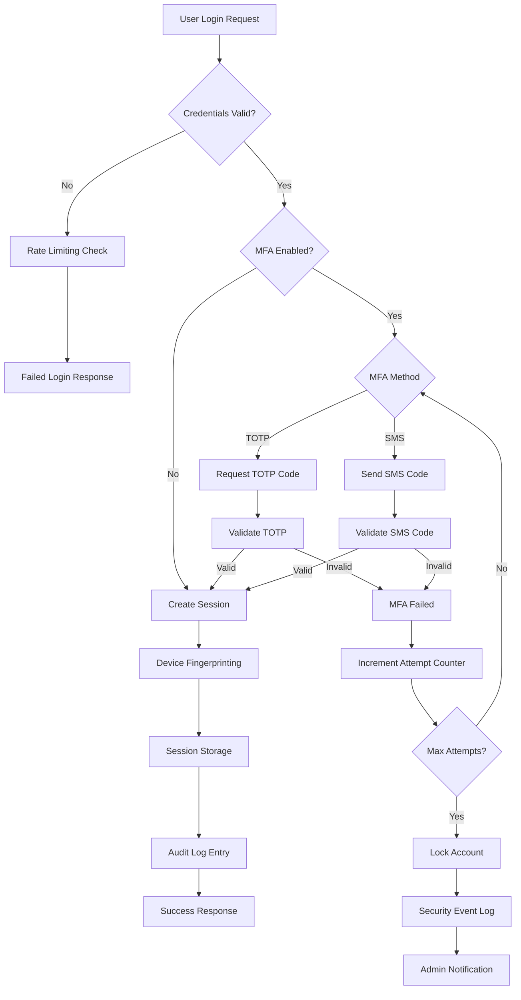

### Role-Based Access Control (RBAC) Flow

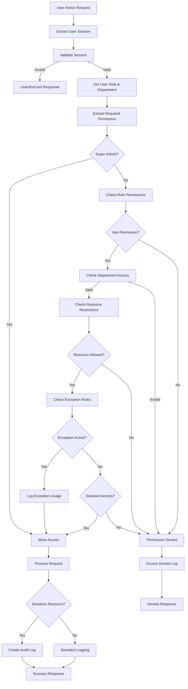

---

## 2. Sales Pipeline Management Flow

### Lead to Opportunity Conversion

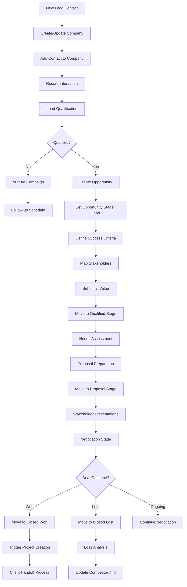

### Opportunity to Project Conversion

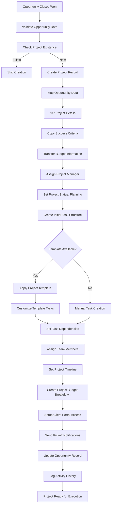

---

## 3. Project Lifecycle Management Flow

### Project Creation and Setup

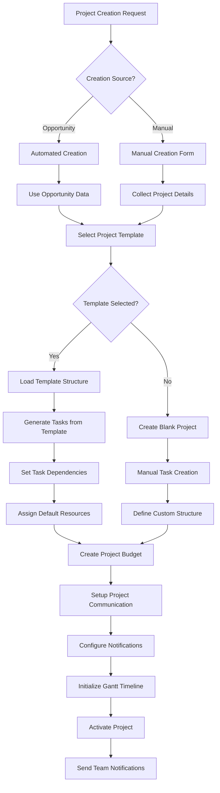

### Task Dependency and Critical Path Management

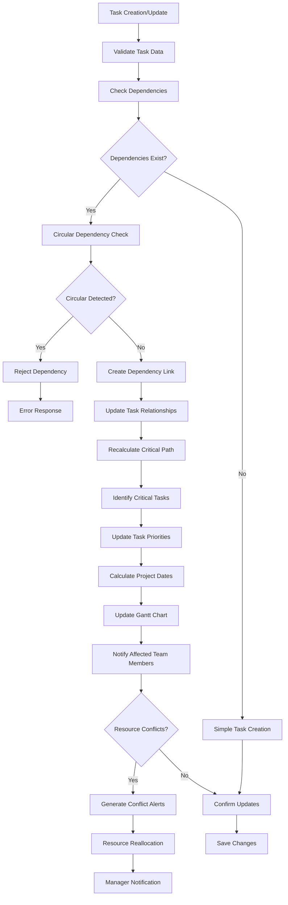

### Project Progress Automation

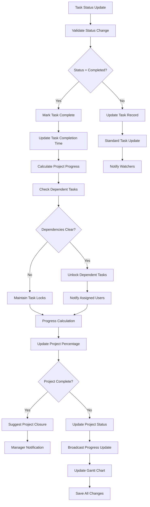

---

## 4. Budget and Financial Management Flow

### Expense Approval Workflow

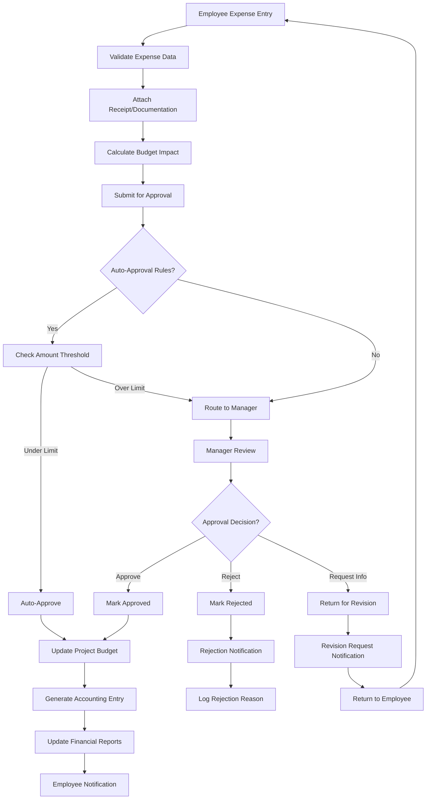

### Invoice Generation and Payment Tracking

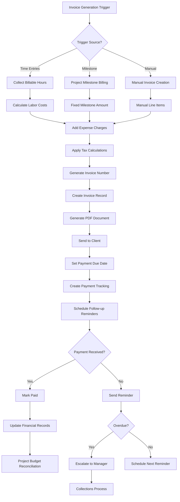

---

## 5. Support Ticket Workflow

### Ticket Lifecycle and SLA Management

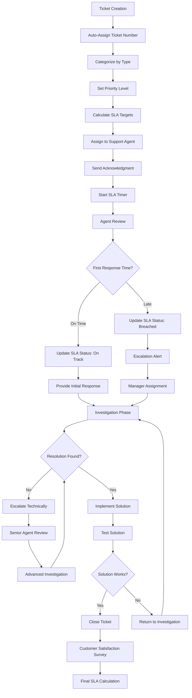

### Ticket Escalation Process

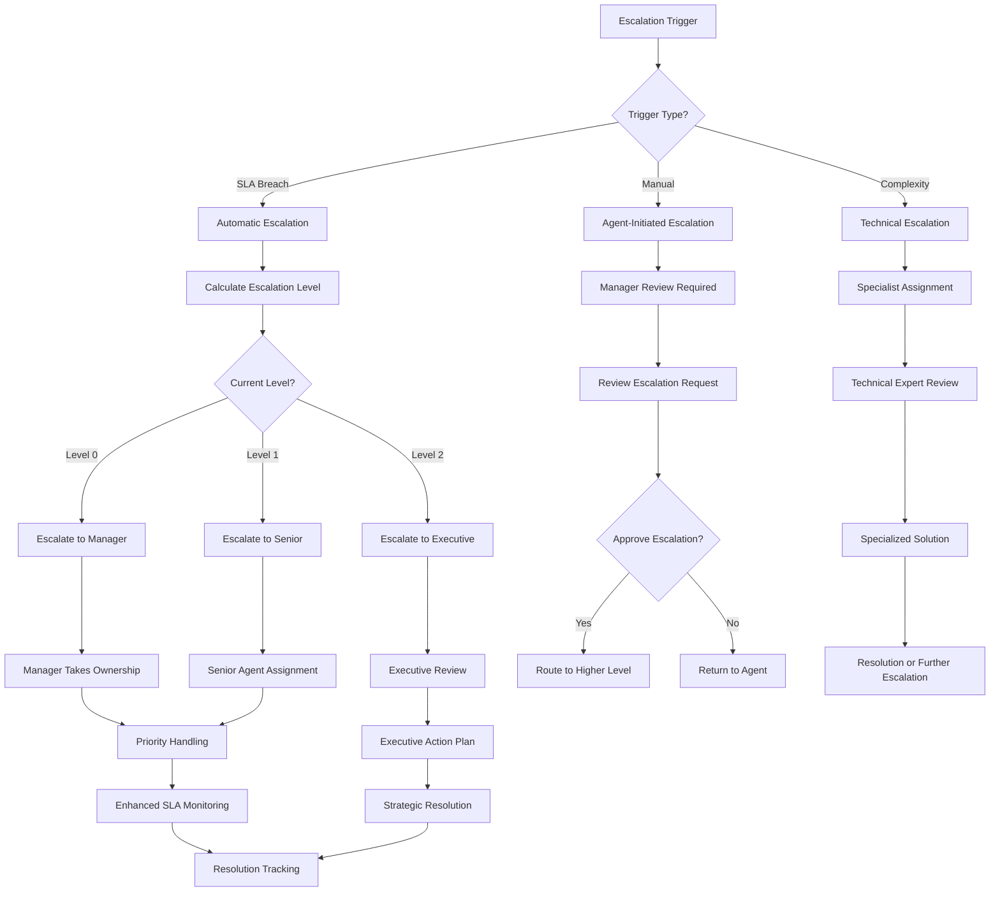

---

## 6. Resource Management and Capacity Planning

### Resource Allocation Process

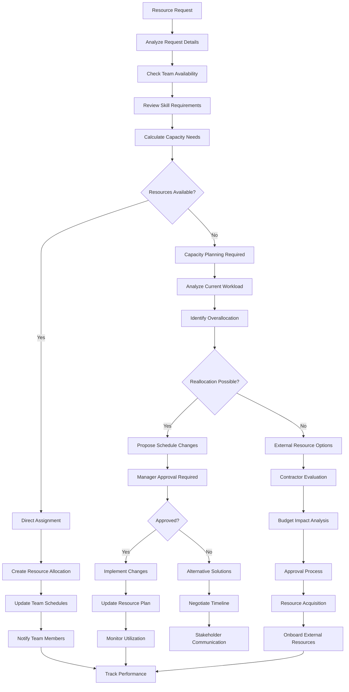

### Workload Balancing and Optimization

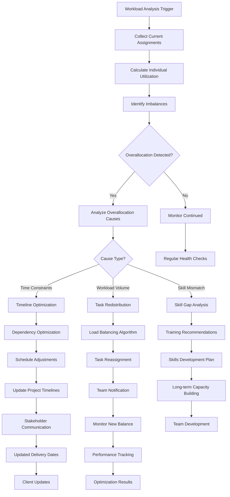

---

## 7. Real-time Notification and Communication Flow

### WebSocket Notification System

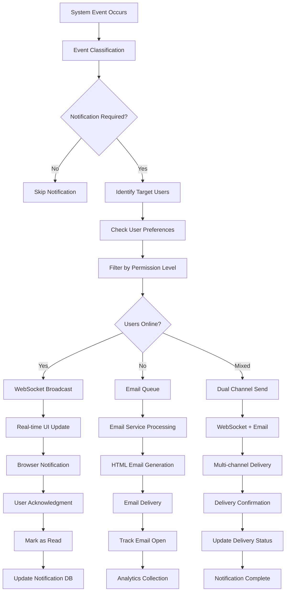

### Project Communication Hub

```mermaid
flowchart TD
    A[Communication Input] --> B{Input Type?}
    B -->|Comment| C[Process Comment]
    B -->|File Upload| D[Handle File]
    B -->|Status Update| E[Process Status]
    B -->|@Mention| F[Handle Mention]

    C --> G[Validate Content]
    D --> H[File Security Scan]
    E --> I[Validate Status Change]
    F --> J[Extract Mentioned Users]

    G --> K[Save Comment Record]
    H --> L[Store File Securely]
    I --> M[Update Project/Task Status]
    J --> N[Validate Mention Permissions]

    K --> O[Create Activity Log]
    L --> P[Create File Reference]
    M --> Q[Broadcast Status Change]
    N --> R[Send Mention Notifications]

    O --> S[Notify Project Team]
    P --> T[File Access Notifications]
    Q --> U[Update UI Elements]
    R --> V[Direct User Alerts]

    S --> W[WebSocket Broadcast]
    T --> X[File Download Links]
    U --> Y[Progress Bar Updates]
    V --> Z[Targeted Notifications]

    W --> AA[Real-time Updates]
    X --> BB[Secure File Access]
    Y --> CC[Visual Progress Feedback]
    Z --> DD[User Attention Alerts]
```

---

## Process Flow Optimization Metrics

### Performance Indicators
- **Authentication Time**: <2 seconds average login
- **Approval Cycles**: 24-hour average for expense approvals
- **Project Setup**: 15 minutes from template to active project
- **Notification Delivery**: <500ms for real-time updates
- **Resource Allocation**: 48-hour turnaround for resource requests

### Quality Metrics
- **Process Completion Rate**: 95%+ successful process execution
- **Error Rate**: <2% process failures requiring manual intervention
- **User Satisfaction**: 4.5/5 average rating for process efficiency
- **Automation Level**: 70% of routine processes automated
- **Compliance Rate**: 100% audit trail coverage for sensitive processes

---

## Future Process Enhancements

### Planned Improvements
1. **AI-Powered Routing**: Intelligent task and ticket assignment
2. **Predictive Workflows**: Anticipate process bottlenecks
3. **Enhanced Automation**: More trigger-based process execution
4. **Integration Expansion**: Deeper third-party workflow integration
5. **Mobile Process Optimization**: Native mobile workflow support