```mermaid
graph TD
    A[Sales Rep Updates Opportunity] --> B{Stage = closed_won?}
    B -->|No| Z[End]
    B -->|Yes| C[Set Actual Close Date]
    C --> D[Confirm Final Deal Value]
    D --> E{Project Already Exists?}
    E -->|Yes| F[Return Existing Project]
    E -->|No| G[Create New Project]

    G --> H[Copy Opportunity Data]
    H --> I[value → budget]
    H --> J[painPoints → requirements]
    H --> K[successCriteria → goals]
    H --> L[Set conversionDate]

    L --> M[Calculate Project Timeline]
    M --> N{Deal Value?}
    N -->|>$100k| O[12+ weeks]
    N -->|$50k-$100k| P[8 weeks]
    N -->|$10k-$50k| Q[6 weeks]
    N -->|<$10k| R[4 weeks]

    O --> S[Apply Complexity Multiplier]
    P --> S
    Q --> S
    R --> S

    S --> T[Select Project Template]
    T --> U{Industry Match?}
    U -->|Yes| V[Use Industry Template]
    U -->|No| W[Use Generic Template]

    V --> X[Generate Tasks from Template]
    W --> X

    X --> Y[Create Task Records]
    Y --> Y1[Set Dependencies]
    Y1 --> Y2[Calculate Start Dates]
    Y2 --> Y3[Assign Team Members]

    Y3 --> AA[Assign Project Manager]
    AA --> AB[Set Project Status = planning]
    AB --> AC[Log Activity History]
    AC --> AD[Send Notifications]

    AD --> AE[Email to Project Manager]
    AD --> AF[Email to Team Members]
    AD --> AG[WebSocket Broadcast]

    AE --> AH[Update Opportunity Status]
    AF --> AH
    AG --> AH

    AH --> AI[Mark as Converted]
    AI --> AJ[Return Project Details]
    AJ --> AK[End]

    style A fill:#e1f5ff
    style G fill:#fff4e6
    style X fill:#e8f5e9
    style AD fill:#fce4ec
    style AK fill:#f3e5f5
```

# Process Models Documentation

## Overview
This document describes the key business processes and workflows in the enterprise business platform using process flow diagrams and detailed explanations.

---

## Table of Contents
1. [Opportunity-to-Project Conversion Process](#1-opportunity-to-project-conversion-process)
2. [Task Dependency and Critical Path Calculation](#2-task-dependency-and-critical-path-calculation)
3. [Real-time Notification Broadcasting](#3-real-time-notification-broadcasting)
4. [Budget Management and Variance Tracking](#4-budget-management-and-variance-tracking)
5. [Multi-Factor Authentication Process](#5-multi-factor-authentication-process)
6. [RBAC Permission Evaluation](#6-rbac-permission-evaluation)
7. [SLA Escalation and Ticket Routing](#7-sla-escalation-and-ticket-routing)
8. [Resource Allocation and Workload Balancing](#8-resource-allocation-and-workload-balancing)
9. [Project Progress Calculation](#9-project-progress-calculation)
10. [Invoice Generation from Time Entries](#10-invoice-generation-from-time-entries)

---

## 1. Opportunity-to-Project Conversion Process

### Process Description
Automatically converts won sales opportunities into active projects with tasks, timeline, and budget allocation.

### Process Flow Diagram



### Process Steps

1. **Opportunity Update Detection**
   - Sales representative changes opportunity stage to "closed_won"
   - System triggers conversion workflow
   - Validates opportunity data completeness

2. **Duplicate Check**
   - System queries projects table for existing `opportunityId`
   - Database constraint prevents duplicate conversions
   - If exists: Returns existing project link

3. **Project Data Mapping**
   - **Budget:** `opportunity.value` → `project.budget`
   - **Requirements:** `opportunity.painPoints` → `project.requirements` (formatted as numbered list)
   - **Success Criteria:** `opportunity.successCriteria` → `project.successCriteria` (JSONB)
   - **Original Value:** `opportunity.value` → `project.originalValue`
   - **Conversion Date:** Current timestamp

4. **Timeline Calculation**
   ```javascript
   baseWeeks = 4
   valueWeeks = calculateByValue(opportunity.value)
   complexityMultiplier = { low: 0.8, medium: 1.0, high: 1.3 }
   totalWeeks = (baseWeeks + valueWeeks) * complexityMultiplier
   endDate = today + (totalWeeks * 7 days)
   ```

5. **Template Selection Logic**
   - **Priority 1:** Match company industry (web_development, marketing, consulting, etc.)
   - **Priority 2:** Match deal size (enterprise vs. small business templates)
   - **Priority 3:** Generic template with customizable tasks

6. **Task Generation**
   - Query `taskTemplates` linked to selected `projectTemplate`
   - Tasks created with phase ordering (planning → design → development → testing → launch)
   - Dependencies established based on template rules
   - Start dates calculated sequentially with lag time

7. **Team Assignment**
   - Project manager: Same as opportunity owner
   - Team members: Auto-assigned based on department and skills
   - Resource availability checked
   - Workload balanced across team

8. **Notification Distribution**
   - **Email Notifications:**
     - Project manager: "New project created from opportunity"
     - Team members: "You've been assigned to [Project Name]"
     - Client: "Project kickoff scheduled" (if portal enabled)
   - **WebSocket Broadcasts:**
     - Real-time project list update
     - Dashboard KPI refresh

9. **Activity Logging**
   - Opportunity activity: "Opportunity converted to project"
   - Project activity: "Project created from opportunity [Opportunity Title]"
   - All changes tracked with timestamps and user IDs

### Business Rules

✅ **Validation Rules:**
- Opportunity must be in "closed_won" stage
- Company and primary contact required
- Deal value must be positive number
- Opportunity can only create ONE project (enforced by unique constraint)

✅ **Error Handling:**
- Missing company → Error: "Company required for project creation"
- Duplicate conversion → Return existing project ID
- Template not found → Use default generic template
- Team member unavailable → Queue for manual assignment

### Integration Points

🔗 **Database Tables:**
- `salesOpportunities` (source)
- `projects` (target)
- `projectTemplates` (template source)
- `tasks` (generated tasks)
- `taskDependencies` (task relationships)
- `opportunityActivityHistory` (audit trail)
- `projectActivity` (audit trail)

🔗 **External Services:**
- Email service for notifications
- WebSocket manager for real-time updates
- Integration manager for third-party sync (Slack, Teams, GitHub)

---

## 2. Task Dependency and Critical Path Calculation

### Process Description
Manages task dependencies and calculates the critical path to identify project bottlenecks and optimize scheduling.

### Process Flow Diagram


### Circular Dependency Detection Algorithm


### Critical Path Method (CPM) Algorithm

**Forward Pass Calculation:**
```javascript
for (task of tasksInTopologicalOrder) {
  if (task.hasPredecessors()) {
    earlyStart = max(predecessor.earlyFinish + lag) for all predecessors
  } else {
    earlyStart = 0 // Start tasks
  }
  earlyFinish = earlyStart + task.duration
}
projectEndDate = max(task.earlyFinish) for all tasks
```

**Backward Pass Calculation:**
```javascript
for (task of tasksInReverseOrder) {
  if (task.hasSuccessors()) {
    lateFinish = min(successor.lateStart - lag) for all successors
  } else {
    lateFinish = projectEndDate // End tasks
  }
  lateStart = lateFinish - task.duration
}
```

**Slack Time Calculation:**
```javascript
slackTime = lateStart - earlyStart
// OR equivalently:
slackTime = lateFinish - earlyFinish

if (slackTime === 0) {
  task.isCritical = true
  task.color = 'red' // Visual indicator
} else {
  task.isCritical = false
  task.float = slackTime // Available buffer days
}
```

### Dependency Types Explained

| Type | Code | Description | Example |
|------|------|-------------|---------|
| **Finish-to-Start** | FS | Task B starts after Task A finishes | Design must finish before Development starts |
| **Start-to-Start** | SS | Task B starts when Task A starts | Development and Testing can start together |
| **Finish-to-Finish** | FF | Task B finishes when Task A finishes | Documentation finishes when Development finishes |
| **Start-to-Finish** | SF | Task B finishes when Task A starts | Rare: Legacy system shutdown when new system starts |

### Process Steps

1. **Dependency Validation**
   - Check task exists in same project
   - Prevent self-dependencies (task cannot depend on itself)
   - Run circular dependency detection using Depth-First Search (DFS)
   - If circular: Reject and return error with cycle path

2. **Dependency Storage**
   - Insert record into `taskDependencies` table
   - Store: `taskId`, `dependsOnTaskId`, `dependencyType`, `lag`
   - Index on both task IDs for fast lookup

3. **Critical Path Calculation**
   - Load all tasks for project with durations
   - Build dependency graph (adjacency list)
   - Perform topological sort to get task order
   - Execute forward pass to calculate early start/finish
   - Execute backward pass to calculate late start/finish
   - Identify critical tasks (slack = 0)

4. **Gantt Chart Update**
   - Critical path tasks highlighted in RED
   - SVG connector lines drawn between dependent tasks
   - Slack time shown as transparent bar extension
   - Task bars repositioned based on calculated dates

5. **Date Adjustment**
   - If dependency added: Validate successor can still meet date
   - If constraint violation: Auto-adjust successor start date
   - Cascade changes to all downstream tasks
   - Recalculate project end date

6. **Notification**
   - Notify assignees of date changes
   - Include reason: "Task dates adjusted due to new dependency"
   - Provide before/after comparison

### Business Rules

✅ **Validation Rules:**
- No circular dependencies allowed
- Tasks must be in same project
- Lag time must be non-negative integer (days)
- Dependency type must be valid enum (FS, SS, FF, SF)

✅ **Calculation Rules:**
- Task duration calculated from estimated hours: `duration = estimatedHours / 8`
- If no start date: Use project start date as reference
- Weekend days excluded from calculations (optional configuration)
- Holidays excluded from working day count (optional configuration)

---

## 3. Real-time Notification Broadcasting

### Process Description
Delivers real-time notifications to connected users via WebSocket with email fallback for offline users.

### Process Flow Diagram


### WebSocket Connection Management


### Notification Message Structure

```json
{
  "id": "notif_abc123",
  "userId": "user_456",
  "type": "task_assigned",
  "title": "New Task Assigned",
  "message": "You have been assigned to 'Implement authentication'",
  "data": {
    "taskId": "task_789",
    "taskTitle": "Implement authentication",
    "projectId": "proj_101",
    "projectName": "Client Portal",
    "priority": "high",
    "dueDate": "2024-12-15T17:00:00Z",
    "assignedBy": {
      "id": "user_123",
      "name": "John Manager"
    }
  },
  "read": false,
  "createdAt": "2024-12-10T10:30:00Z",
  "actions": [
    {
      "label": "View Task",
      "url": "/tasks/task_789",
      "primary": true
    },
    {
      "label": "Mark as Read",
      "action": "markRead"
    }
  ]
}
```

### Process Steps

1. **Event Detection**
   - Application triggers event: task created, status changed, comment added
   - Event captured by notification service
   - Event type and context extracted

2. **Target User Identification**
   - **Task Assignee:** Primary recipient
   - **Project Manager:** Always notified of project changes
   - **Mentioned Users:** Parsed from comments (@username)
   - **Watchers:** Users who opted in to follow entity
   - **Team Members:** Department-specific notifications

3. **Notification Record Creation**
   - Insert into `notifications` table
   - Fields: userId, type, title, message, data (JSONB), read (false)
   - Timestamp recorded for ordering

4. **Delivery Channel Selection**
   - Query `userSessions` table for active sessions
   - Check WebSocket connection pool for userId
   - If connected: WebSocket delivery
   - If offline: Email delivery
   - If both: WebSocket primary, email backup after 5 minutes

5. **WebSocket Delivery**
   ```javascript
   wsManager.sendToUser(userId, {
     event: 'notification',
     payload: notificationData
   })
   ```
   - Message sent to user's connection(s)
   - Multiple devices supported (all connections receive message)
   - Client acknowledges receipt
   - If no acknowledgment in 10 seconds: Retry or email fallback

6. **Email Delivery**
   - HTML email template selected based on notification type
   - Personalization: User name, notification content, action links
   - Email sent via `emailService` (Nodemailer)
   - Delivery status tracked
   - Retry logic: 3 attempts with exponential backoff

7. **Client-Side Handling**
   - Notification received via WebSocket
   - Toast notification displayed (bottom-right corner)
   - Notification bell badge count incremented
   - Sound played (if user preference enabled)
   - Notification list updated in real-time

8. **Read Status Management**
   - User clicks notification or views detail page
   - Client sends read acknowledgment
   - Server updates `notifications.read = true`
   - Badge count decremented
   - WebSocket broadcasts update to other devices

### Integration Points

🔗 **WebSocket Manager:**
- Connection pool: `Map<userId, Set<WebSocket>>`
- Broadcasts to all user connections
- Handles connection lifecycle (connect, disconnect, reconnect)

🔗 **Email Service:**
- Nodemailer SMTP transport
- HTML email templates with Handlebars
- Batch email sending for efficiency
- Unsubscribe link management

🔗 **Third-Party Integrations:**
- Slack: Mirror notifications to Slack channels
- Microsoft Teams: Adaptive Card notifications
- Mobile Push: Firebase Cloud Messaging (future)

---

## 4. Budget Management and Variance Tracking

### Process Description
Monitors project budgets in real-time, calculates variances, and triggers alerts when thresholds are exceeded.

### Process Flow Diagram


### Budget Variance Calculation Logic

```javascript
// Real-time variance calculation triggered on cost events
function calculateBudgetVariance(projectId) {
  // 1. Load budget data
  const budget = await db.query(`
    SELECT
      pb.budgetedAmount,
      pb.spentAmount,
      pb.committedAmount,
      pb.forecastAmount,
      bc.categoryType,
      bc.name as categoryName
    FROM projectBudgets pb
    JOIN budgetCategories bc ON pb.categoryId = bc.id
    WHERE pb.projectId = $1
  `, [projectId])

  // 2. Calculate total budgeted amount
  const totalBudgeted = budget.reduce((sum, cat) => sum + cat.budgetedAmount, 0)

  // 3. Calculate total spent amount (from time entries and expenses)
  const timeEntryCost = await db.query(`
    SELECT SUM(hours * rate) as total
    FROM timeEntries
    WHERE projectId = $1
  `, [projectId])

  const expenseCost = await db.query(`
    SELECT SUM(amount) as total
    FROM expenses
    WHERE projectId = $1 AND billable = true
  `, [projectId])

  const totalSpent = (timeEntryCost.total || 0) + (expenseCost.total || 0)

  // 4. Calculate committed amount (purchase orders, contracts)
  const totalCommitted = budget.reduce((sum, cat) => sum + cat.committedAmount, 0)

  // 5. Calculate forecast amount (estimated to complete)
  const remainingTasks = await db.query(`
    SELECT SUM(estimatedHours) as hours
    FROM tasks
    WHERE projectId = $1 AND status != 'completed'
  `, [projectId])

  const avgRate = totalSpent / totalWorkedHours
  const forecastRemaining = remainingTasks.hours * avgRate
  const totalForecast = totalSpent + forecastRemaining

  // 6. Calculate variances
  const variance = totalBudgeted - totalSpent
  const variancePercentage = (variance / totalBudgeted) * 100
  const forecastVariance = totalBudgeted - totalForecast

  // 7. Determine severity level
  const utilizationPercentage = (totalSpent / totalBudgeted) * 100
  let severityLevel = 'ok'
  if (utilizationPercentage >= 100) severityLevel = 'critical'
  else if (utilizationPercentage >= 90) severityLevel = 'warning'
  else if (utilizationPercentage >= 80) severityLevel = 'caution'

  // 8. Return variance analysis
  return {
    totalBudgeted,
    totalSpent,
    totalCommitted,
    totalForecast,
    variance,
    variancePercentage,
    forecastVariance,
    utilizationPercentage,
    severityLevel,
    categoryBreakdown: budget
  }
}
```

### Budget Alert Thresholds

| Threshold | Utilization | Severity | Action | Notification |
|-----------|-------------|----------|--------|--------------|
| **Green** | < 70% | OK | Monitor | None |
| **Yellow** | 70-79% | Caution | Review forecast | Dashboard badge |
| **Orange** | 80-89% | Warning | Analyze trends | Email + Dashboard |
| **Red** | 90-99% | At Risk | Budget review | Email + SMS + Dashboard |
| **Dark Red** | ≥ 100% | Critical | Immediate action | Escalation to management |

### Process Steps

1. **Cost Event Trigger**
   - Time entry created: `hours × rate`
   - Expense created: `amount`
   - Invoice paid: Update committed amount
   - Purchase order: Update committed amount

2. **Category Allocation**
   - Time entries → Labor category
   - Software licenses → Software category
   - Travel expenses → Travel category
   - Materials → Materials category
   - Overhead calculated as percentage of labor

3. **Variance Calculation**
   - Budget variance: `budgeted - actual`
   - Forecast variance: `budgeted - forecast`
   - Utilization percentage: `(actual / budgeted) × 100`
   - By category: Each category analyzed separately

4. **Threshold Evaluation**
   - Check utilization against alert thresholds
   - Determine severity level (ok, caution, warning, at_risk, critical)
   - Identify categories exceeding budget

5. **Alert Generation**
   - Create notification records for affected users
   - Email template selected based on severity
   - Include: Project name, variance amount, recommendations
   - WebSocket broadcast for real-time dashboard update

6. **Forecast Calculation**
   - Velocity analysis: Cost per completed task
   - Remaining work estimation: Incomplete task hours
   - Forecast to complete: Remaining hours × average rate
   - Total forecast: Actual + forecast to complete

7. **Trend Analysis**
   - Budget burn rate: Cost per day/week
   - Trend line: Linear regression over time series
   - Prediction: Days until budget exhausted at current rate
   - Visual chart: Budget consumption over project timeline

8. **Recommendation Engine**
   - **If over budget:**
     - "Request budget increase of $X to complete project"
     - "Reduce scope by removing Y tasks to stay within budget"
     - "Optimize resources by reallocating lower-cost team members"
   - **If under budget:**
     - "Consider adding features to maximize value"
     - "Reinvest savings in quality improvements"
   - **If on track:**
     - "Continue current approach, monitoring weekly"

9. **Budget Change Management**
   - Project manager initiates budget change request
   - Justification documented
   - Approval workflow triggered
   - Finance manager reviews and approves/rejects
   - If approved: Budget updated, variance recalculated
   - If rejected: Documented for audit trail

### Business Rules

✅ **Calculation Rules:**
- Budgets tracked by category for granular analysis
- Overhead allocated as 15% of labor costs (configurable)
- Forecast includes contingency buffer (10% default)
- Currency conversion applied for international projects

✅ **Alert Rules:**
- Critical alerts sent immediately (real-time)
- Warning alerts batched and sent daily digest
- Caution alerts shown in dashboard only
- Alert frequency limited to prevent notification spam

---

## 5. Multi-Factor Authentication Process

### Process Description
Implements two-factor authentication (TOTP and SMS) for enhanced account security.

### MFA Setup Process


### MFA Login Process


### TOTP Generation and Validation

**Setup Phase:**
```javascript
// 1. Generate secret
const secret = speakeasy.generateSecret({
  name: 'Enterprise Platform (user@example.com)',
  length: 32
})

// 2. Generate QR code
const qrCodeUrl = secret.otpauth_url
const qrCodeImage = await QRCode.toDataURL(qrCodeUrl)

// 3. Return to user
response.json({
  secret: secret.base32, // For manual entry
  qrCode: qrCodeImage    // For scanning
})
```

**Verification Phase:**
```javascript
// User enters 6-digit code from authenticator app
const userToken = '123456'

// Validate against stored secret
const verified = speakeasy.totp.verify({
  secret: user.mfaSecret,
  encoding: 'base32',
  token: userToken,
  window: 2 // Allow 2 time steps before/after (60 seconds)
})

if (verified) {
  // MFA successful
  createSession(user)
} else {
  // Invalid code
  incrementFailedAttempts(user)
}
```

### SMS-Based MFA

**Code Generation:**
```javascript
// Generate random 6-digit code
const smsCode = Math.floor(100000 + Math.random() * 900000).toString()

// Store with expiry
await db.insert(mfaTokens).values({
  userId: user.id,
  type: 'sms',
  secret: smsCode,
  expiresAt: new Date(Date.now() + 10 * 60 * 1000) // 10 minutes
})

// Send via Twilio
await twilioClient.messages.create({
  body: `Your verification code is: ${smsCode}`,
  from: TWILIO_PHONE_NUMBER,
  to: user.phone
})
```

**Code Validation:**
```javascript
const token = await db.query.mfaTokens.findFirst({
  where: and(
    eq(mfaTokens.userId, user.id),
    eq(mfaTokens.type, 'sms'),
    eq(mfaTokens.isActive, true)
  )
})

if (!token || token.expiresAt < new Date()) {
  return { error: 'Code expired' }
}

if (token.secret !== userEnteredCode) {
  return { error: 'Invalid code' }
}

// Code valid
await markTokenAsUsed(token.id)
createSession(user)
```

### Backup Codes

**Generation:**
```javascript
// Generate 10 random backup codes
const backupCodes = []
for (let i = 0; i < 10; i++) {
  const code = crypto.randomBytes(4).toString('hex').toUpperCase()
  backupCodes.push(code)
}

// Hash codes before storing
const hashedCodes = await Promise.all(
  backupCodes.map(code => bcrypt.hash(code, 10))
)

// Store hashed codes
await db.update(users)
  .set({ mfaBackupCodes: hashedCodes })
  .where(eq(users.id, userId))

// Return plaintext codes to user (one-time display)
return backupCodes
```

**Validation:**
```javascript
const user = await db.query.users.findFirst({
  where: eq(users.id, userId)
})

// Check each hashed backup code
for (const hashedCode of user.mfaBackupCodes) {
  const match = await bcrypt.compare(userEnteredCode, hashedCode)
  if (match) {
    // Valid backup code - remove from list
    const updatedCodes = user.mfaBackupCodes.filter(c => c !== hashedCode)
    await db.update(users)
      .set({ mfaBackupCodes: updatedCodes })
      .where(eq(users.id, userId))

    return { valid: true }
  }
}

return { valid: false }
```

### Security Events Logged

| Event Type | Severity | Description |
|------------|----------|-------------|
| `mfa_setup_initiated` | Info | User started MFA setup process |
| `mfa_totp_enabled` | Info | TOTP authentication activated |
| `mfa_sms_enabled` | Info | SMS authentication activated |
| `mfa_login_success` | Info | Successful MFA verification |
| `mfa_login_failed` | Warning | Failed MFA attempt |
| `mfa_backup_code_used` | Medium | Backup code consumed |
| `mfa_disabled` | Medium | MFA turned off by user |
| `mfa_account_locked` | High | Too many failed MFA attempts |

### Process Steps

1. **MFA Setup Initiation**
   - User navigates to security settings
   - Chooses TOTP or SMS method
   - System generates secret or validates phone

2. **TOTP Setup**
   - 32-character base32 secret generated with `speakeasy`
   - QR code created containing OTP auth URL
   - User scans QR code with Google Authenticator, Authy, or 1Password
   - User enters first code to verify setup
   - Secret encrypted and stored in `users.mfaSecret`

3. **SMS Setup**
   - User enters phone number
   - Test SMS sent via Twilio
   - User confirms receipt with code
   - Phone number stored in `users.phone`

4. **Backup Code Generation**
   - 10 random 8-character hex codes generated
   - Codes hashed with bcrypt before storage
   - Plaintext codes displayed once to user
   - User instructed to save codes securely

5. **MFA Login Challenge**
   - User completes standard authentication (email + password)
   - System detects `mfaEnabled: true`
   - Temporary token created with 5-minute expiry
   - MFA prompt displayed with method options

6. **Code Verification**
   - User enters code from chosen method
   - System validates code against stored secret/SMS
   - Time-based window allows for clock drift (±60 seconds)
   - Failed attempts increment counter

7. **Session Creation**
   - Upon successful MFA verification
   - Full user session created with passport
   - Session stored in `sessions` and `userSessions` tables
   - Device fingerprint and IP logged for security

8. **Account Lockout**
   - After 5 failed MFA attempts
   - Account locked for 15 minutes
   - Security event logged with high severity
   - Email notification sent to user
   - User must wait or use password reset

---

## 6. RBAC Permission Evaluation

### Process Description
Evaluates user permissions based on role, department, and resource access rules using Role-Based Access Control (RBAC).

### Permission Evaluation Flow


### Permission Matrix

| Role | Department Context | Projects | Tasks | Clients | Invoices | Users | Analytics | Audit Logs |
|------|-------------------|----------|-------|---------|----------|-------|-----------|------------|
| **super_admin** | All | CRUD | CRUD | CRUD | CRUD | CRUD | Read | Read |
| **admin** | Own Dept | CRUD | CRUD | CRUD | CRUD | R | Read | Read |
| **manager** | Own Dept | CRUD (own) | CRUD (own) | CRUD | RU | R | Read | - |
| **employee** | Own Dept | R | RU (assigned) | R | R | R | - | - |
| **contractor** | None | R | RU (assigned) | - | R (own time) | R (self) | - | - |
| **viewer** | Own Dept | R | R | R | R | R | Read | - |
| **client** | None | R (own) | R (own) | R (self) | R (own) | - | - | - |

**Legend:**
- **C** = Create
- **R** = Read
- **U** = Update
- **D** = Delete
- **-** = No access

### RBAC Middleware Implementation

```javascript
// Permission check middleware
async function checkPermission(req, res, next) {
  const user = req.user
  const resource = req.route.resource // e.g., 'projects'
  const action = req.route.action     // e.g., 'delete'

  // 1. Super admin bypass
  if (user.enhancedRole === 'super_admin') {
    return next()
  }

  // 2. Load user's permissions
  const permissions = await getUserPermissions(user.id)

  // 3. Check base permission
  const requiredPermission = `${resource}:${action}`
  const hasPermission = permissions.includes(requiredPermission)

  if (!hasPermission) {
    // 4. Check department-based permissions
    if (user.department && req.params.departmentId) {
      if (user.department !== req.params.departmentId) {
        return denyAccess(req, res, 'Department mismatch')
      }
    }

    // 5. Check ownership-based permissions
    if (action === 'update' || action === 'delete') {
      const resourceOwnerId = await getResourceOwner(resource, req.params.id)
      if (resourceOwnerId !== user.id) {
        return denyAccess(req, res, 'Not resource owner')
      }
    }

    // 6. Check permission exceptions
    const exception = await db.query.permissionExceptions.findFirst({
      where: and(
        eq(permissionExceptions.userId, user.id),
        eq(permissionExceptions.resource, resource),
        eq(permissionExceptions.action, action),
        eq(permissionExceptions.isActive, true),
        gt(permissionExceptions.expiresAt, new Date())
      )
    })

    if (exception) {
      // Grant temporary access
      await incrementExceptionUsage(exception.id)
      return next()
    }

    // Final denial
    return denyAccess(req, res, 'Insufficient permissions')
  }

  // Permission granted
  await logAudit(user, resource, action, 'granted')
  next()
}

async function denyAccess(req, res, reason) {
  await logAudit(req.user, req.route.resource, req.route.action, 'denied', reason)
  res.status(403).json({ error: 'Access denied', reason })
}
```

### Permission Exceptions

**Request Exception:**
```javascript
// User requests temporary elevated access
POST /api/permission-exceptions

{
  "resource": "invoices",
  "action": "create",
  "reason": "Need to generate urgent invoice for client project",
  "requestedDuration": 86400000 // 24 hours in ms
}
```

**Approval Workflow:**
```javascript
// Manager reviews request
GET /api/permission-exceptions/pending

// Manager approves
PATCH /api/permission-exceptions/:id/approve

{
  "approvedBy": "manager_user_id",
  "expiresAt": "2024-12-15T23:59:59Z",
  "approverNotes": "Approved for client emergency, expires in 24 hours"
}
```

**Automatic Expiration:**
```javascript
// Cron job runs hourly to expire exceptions
async function expirePermissionExceptions() {
  await db.update(permissionExceptions)
    .set({ isActive: false })
    .where(and(
      eq(permissionExceptions.isActive, true),
      lt(permissionExceptions.expiresAt, new Date())
    ))
}
```

### Audit Logging

**Audit Log Structure:**
```json
{
  "id": "audit_abc123",
  "userId": "user_456",
  "sessionId": "session_789",
  "action": "delete",
  "resource": "projects",
  "resourceId": "proj_101",
  "department": "projects",
  "oldValues": {
    "status": "active",
    "budget": 50000
  },
  "newValues": null,
  "changes": ["deleted"],
  "ipAddress": "192.168.1.100",
  "userAgent": "Mozilla/5.0...",
  "deviceInfo": {
    "browser": "Chrome",
    "os": "Windows 10",
    "device": "Desktop"
  },
  "severity": "critical",
  "category": "data_change",
  "isSensitive": true,
  "requiresReview": true,
  "description": "Project deleted by manager",
  "timestamp": "2024-12-10T15:30:00Z"
}
```

### Process Steps

1. **Request Interception**
   - All API routes protected by `RBACMiddleware`
   - Middleware extracts user from authenticated session
   - Resource and action identified from route definition

2. **Role Identification**
   - User's `enhancedRole` retrieved: super_admin, admin, manager, etc.
   - User's `department` retrieved: projects, finance, support, etc.
   - Active role assignments loaded with expiry check

3. **Permission Lookup**
   - Query `roles` table for user's role
   - Load `permissions` array from role record
   - Permission format: `resource:action` (e.g., `projects:delete`)

4. **Base Permission Check**
   - Required permission: `${resource}:${action}`
   - Check if user's permissions array includes required permission
   - If found: Permission granted (proceed to step 8)
   - If not found: Continue to context checks

5. **Department Context Check** (for admin role)
   - Compare `user.department` with resource's department
   - If match: Permission granted
   - If mismatch: Permission denied

6. **Ownership Check** (for manager role)
   - Query resource to find owner/manager
   - Compare resource owner with current user
   - If match: Permission granted
   - If mismatch: Permission denied

7. **Exception Check**
   - Query `permissionExceptions` table
   - Filter by: userId, resource, action, isActive=true, expiresAt>now
   - If exception found:
     - Grant permission override
     - Increment `timesUsed` counter
     - Update `lastUsedAt` timestamp
   - If no exception: Final denial

8. **Audit Logging**
   - Create record in `auditLogs` table
   - Include: user, resource, action, decision (granted/denied), timestamp
   - Capture: IP address, user agent, device fingerprint
   - Set severity: info (read), warning (update), critical (delete)

9. **Data Access Logging** (sensitive resources)
   - If resource marked as sensitive (clients, invoices, financial data)
   - Create record in `dataAccessLogs` table
   - Include: fields accessed, access method (UI/API), purpose
   - Classification: public, internal, confidential, restricted

10. **Response**
    - If granted: Request proceeds to route handler
    - If denied: Return 403 Forbidden with reason
    - Client receives explicit error message explaining denial

### Business Rules

✅ **Permission Hierarchy:**
- super_admin > admin > manager > employee > contractor > viewer > client
- Higher roles inherit lower role permissions automatically

✅ **Department Isolation:**
- Users can only access resources in their assigned department (except super_admin)
- Cross-department access requires explicit permission exception

✅ **Resource Ownership:**
- Managers can manage resources they created or are assigned to
- Employees can update tasks assigned to them
- Contractors have limited permissions (time entry, own tasks)

✅ **Audit Requirements:**
- All permission checks logged (granted and denied)
- Sensitive resource access logged separately
- Audit logs retained for compliance (7 years configurable)

---

## 7. SLA Escalation and Ticket Routing

### Process Description
Automatically routes support tickets, tracks SLA compliance, and escalates at-risk tickets to appropriate personnel.

### SLA Tracking and Escalation Flow


### SLA Configuration System

```json
{
  "id": "sla_config_001",
  "name": "Technical Support - Urgent",
  "priority": "urgent",
  "category": "technical",
  "businessImpact": "critical",
  "responseTimeHours": 2,
  "resolutionTimeHours": 8,
  "escalationLevels": [
    {
      "level": 0,
      "role": "agent",
      "triggerCondition": "ticket_created"
    },
    {
      "level": 1,
      "role": "manager",
      "triggerCondition": "sla_at_risk_90_percent"
    },
    {
      "level": 2,
      "role": "senior_manager",
      "triggerCondition": "sla_breached_or_critical_impact"
    },
    {
      "level": 3,
      "role": "executive",
      "triggerCondition": "business_critical_impact"
    }
  ],
  "isActive": true
}
```

### Auto-Assignment Algorithm

```javascript
async function autoAssignTicket(ticket) {
  // 1. Find agents with matching category expertise
  const expertAgents = await db.query.users.findMany({
    where: and(
      eq(users.department, 'support'),
      eq(users.isActive, true),
      // Check if skills array contains ticket category
      sql`'${ticket.category}' = ANY(skills)`
    )
  })

  // 2. Calculate current workload for each agent
  const agentWorkloads = await Promise.all(expertAgents.map(async (agent) => {
    const openTickets = await db.query.supportTickets.count({
      where: and(
        eq(supportTickets.assignedTo, agent.id),
        inArray(supportTickets.status, ['open', 'in_progress'])
      )
    })

    return {
      agentId: agent.id,
      agentName: `${agent.firstName} ${agent.lastName}`,
      workload: openTickets,
      skillMatch: agent.skills.includes(ticket.category)
    }
  }))

  // 3. Sort by skill match first, then workload
  agentWorkloads.sort((a, b) => {
    if (a.skillMatch && !b.skillMatch) return -1
    if (!a.skillMatch && b.skillMatch) return 1
    return a.workload - b.workload
  })

  // 4. Assign to best agent
  const selectedAgent = agentWorkloads[0]

  await db.update(supportTickets)
    .set({
      assignedTo: selectedAgent.agentId,
      lastActivityAt: new Date()
    })
    .where(eq(supportTickets.id, ticket.id))

  return selectedAgent
}
```

### SLA Monitoring Cron Job

```javascript
// Runs every 5 minutes
cron.schedule('*/5 * * * *', async () => {
  // 1. Find all active tickets
  const activeTickets = await db.query.supportTickets.findMany({
    where: inArray(supportTickets.status, ['open', 'in_progress'])
  })

  for (const ticket of activeTickets) {
    const now = new Date()

    // 2. Check response SLA (if no first response yet)
    if (!ticket.firstResponseAt && ticket.responseTimeHours) {
      const responseDeadline = new Date(
        ticket.createdAt.getTime() + (ticket.responseTimeHours * 60 * 60 * 1000)
      )
      const timeRemaining = responseDeadline.getTime() - now.getTime()
      const timeRemainingPercent = (timeRemaining / (ticket.responseTimeHours * 60 * 60 * 1000)) * 100

      if (timeRemainingPercent <= 20 && timeRemainingPercent > 0) {
        // At risk: 80% time elapsed
        await updateSLAStatus(ticket.id, 'at_risk')
        await sendAtRiskNotification(ticket)
      } else if (timeRemaining <= 0) {
        // Breached: 100% time elapsed
        await updateSLAStatus(ticket.id, 'breached')
        await escalateTicket(ticket, 1, 'Response SLA breached')
      }
    }

    // 3. Check resolution SLA
    if (!ticket.resolvedAt && ticket.resolutionTimeHours) {
      const resolutionDeadline = new Date(
        ticket.createdAt.getTime() + (ticket.resolutionTimeHours * 60 * 60 * 1000)
      )
      const timeRemaining = resolutionDeadline.getTime() - now.getTime()
      const timeRemainingPercent = (timeRemaining / (ticket.resolutionTimeHours * 60 * 60 * 1000)) * 100

      if (timeRemainingPercent <= 10 && timeRemainingPercent > 0) {
        // Critical: 90% time elapsed - escalate to manager
        if (ticket.escalationLevel < 1) {
          await escalateTicket(ticket, 1, 'Resolution SLA at risk: 90% time elapsed')
        }
      } else if (timeRemaining <= 0) {
        // Breached: 100% time elapsed - escalate to senior manager
        await updateSLAStatus(ticket.id, 'breached')
        if (ticket.escalationLevel < 2) {
          await escalateTicket(ticket, 2, 'Resolution SLA breached')
        }
      }
    }
  }
})
```

### Escalation Process

```javascript
async function escalateTicket(ticket, newLevel, reason) {
  // 1. Load SLA configuration for escalation rules
  const slaConfig = await db.query.slaConfigurations.findFirst({
    where: and(
      eq(slaConfigurations.priority, ticket.priority),
      eq(slaConfigurations.category, ticket.category)
    )
  })

  const escalationRule = slaConfig.escalationLevels.find(e => e.level === newLevel)

  // 2. Find appropriate escalation target
  const escalationTarget = await db.query.users.findFirst({
    where: and(
      eq(users.role, escalationRule.role),
      eq(users.department, 'support'),
      eq(users.isActive, true)
    )
  })

  // 3. Create escalation record
  await db.insert(ticketEscalations).values({
    ticketId: ticket.id,
    fromUserId: ticket.assignedTo,
    toUserId: escalationTarget.id,
    escalationLevel: newLevel,
    reason: reason,
    automatedRule: escalationRule.triggerCondition
  })

  // 4. Update ticket
  await db.update(supportTickets)
    .set({
      escalationLevel: newLevel,
      escalatedAt: new Date(),
      lastActivityAt: new Date()
    })
    .where(eq(supportTickets.id, ticket.id))

  // 5. Notify escalation target
  await sendEscalationNotification({
    ticketId: ticket.id,
    ticketNumber: ticket.ticketNumber,
    title: ticket.title,
    priority: ticket.priority,
    reason: reason,
    targetUserId: escalationTarget.id,
    escalationLevel: newLevel
  })

  // 6. Log escalation event
  await logSecurityEvent({
    eventType: 'ticket_escalated',
    severity: newLevel >= 2 ? 'high' : 'medium',
    ticketId: ticket.id,
    escalationLevel: newLevel,
    reason: reason
  })
}
```

### Process Steps

1. **Ticket Creation and Priority Assignment**
   - Ticket submitted via web form or email
   - Unique ticket number generated: `TKT-YYYY-NNNNN`
   - Content analyzed for keywords (urgent, critical, broken, etc.)
   - Priority auto-assigned based on keyword matching
   - Category selected by user or auto-detected

2. **SLA Configuration Lookup**
   - Query `slaConfigurations` table
   - Match on priority + category (e.g., urgent + technical)
   - Load response time and resolution time targets
   - Calculate breach timestamps:
     - `firstResponseDue = createdAt + responseTimeHours`
     - `resolutionDue = createdAt + resolutionTimeHours`

3. **Auto-Assignment**
   - Find available support agents
   - Filter by category expertise (skills array)
   - Calculate current workload (open ticket count)
   - Sort by skill match first, then workload
   - Assign to best candidate

4. **SLA Monitoring**
   - Cron job runs every 5 minutes
   - Checks all active tickets against SLA targets
   - Calculates time elapsed percentage
   - Updates `slaStatus` field:
     - `on_track`: < 80% time elapsed
     - `at_risk`: 80-100% time elapsed
     - `breached`: > 100% time elapsed

5. **At-Risk Notification** (80% threshold)
   - Email sent to assigned agent
   - Email sent to support manager
   - WebSocket notification to both
   - Dashboard badge shows at-risk ticket count
   - Message: "SLA breach in 20% time remaining"

6. **Escalation Trigger** (90% threshold)
   - Automatic escalation to manager (level 1)
   - Escalation record created in `ticketEscalations` table
   - Manager assigned to ticket
   - Escalation notification sent
   - Escalation reason logged

7. **Manager Intervention**
   - Manager reviews escalated ticket
   - Options:
     - Reassign to senior agent with more experience
     - Add additional team members for collaboration
     - Adjust SLA expectations if justified
     - Provide additional resources or tools

8. **Resolution and SLA Compliance**
   - Agent resolves ticket and changes status to "resolved"
   - `resolvedAt` timestamp recorded
   - Actual times calculated:
     - Response time: `firstResponseAt - createdAt` (minutes)
     - Resolution time: `resolvedAt - createdAt` (minutes)
   - Compare to SLA targets:
     - Response SLA met/breached
     - Resolution SLA met/breached

9. **Client Satisfaction**
   - Resolution email sent to client
   - Includes satisfaction survey link (1-5 stars)
   - Client rating stored in `satisfactionRating` field
   - Feedback influences agent performance metrics

10. **Performance Analytics**
    - Agent SLA compliance percentage calculated
    - Team SLA compliance tracked
    - Average response and resolution times computed
    - Satisfaction scores aggregated
    - Reports generated for management review

### Business Rules

✅ **SLA Time Calculations:**
- Business hours only (excludes weekends and holidays)
- Time zone adjusted based on client location
- Clock stops when status = "waiting_for_customer"
- Clock resumes when customer responds

✅ **Escalation Levels:**
- Level 0 (Agent): Initial assignment
- Level 1 (Manager): 90% SLA time or at-risk
- Level 2 (Senior Manager): SLA breached or critical business impact
- Level 3 (Executive): Business-critical systems down

✅ **Priority Assignment:**
- Urgent: Production system down, business-critical
- High: Major functionality broken, impacts multiple users
- Medium: Minor bug, feature request, single user affected
- Low: Enhancement, cosmetic issue, documentation

---

## 8. Resource Allocation and Workload Balancing

### Process Description
Optimizes team member assignments to projects and tasks based on availability, skills, and capacity constraints.

### Resource Allocation Flow


### Capacity Calculation Algorithm

```javascript
async function calculateUserCapacity(userId, weekStartDate) {
  // 1. Load user's standard capacity
  const capacity = await db.query.userCapacity.findFirst({
    where: and(
      eq(userCapacity.userId, userId),
      lte(userCapacity.effectiveFrom, weekStartDate),
      or(
        isNull(userCapacity.effectiveTo),
        gte(userCapacity.effectiveTo, weekStartDate)
      )
    )
  })

  const standardHoursPerWeek = parseFloat(capacity?.hoursPerWeek || 40)

  // 2. Check for PTO/vacation/holidays
  const weekEndDate = new Date(weekStartDate.getTime() + 7 * 24 * 60 * 60 * 1000)
  const unavailability = await db.query.userAvailability.findMany({
    where: and(
      eq(userAvailability.userId, userId),
      eq(userAvailability.status, 'approved'),
      or(
        between(userAvailability.startDate, weekStartDate, weekEndDate),
        between(userAvailability.endDate, weekStartDate, weekEndDate)
      )
    )
  })

  // 3. Calculate unavailable hours
  let unavailableHours = 0
  for (const pto of unavailability) {
    const ptoStart = new Date(Math.max(pto.startDate.getTime(), weekStartDate.getTime()))
    const ptoEnd = new Date(Math.min(pto.endDate.getTime(), weekEndDate.getTime()))
    const ptoDays = (ptoEnd - ptoStart) / (24 * 60 * 60 * 1000)
    const hoursPerDay = pto.hoursPerDay || (standardHoursPerWeek / 5)
    unavailableHours += ptoDays * hoursPerDay
  }

  // 4. Calculate available hours
  const availableHours = standardHoursPerWeek - unavailableHours

  // 5. Load current allocations
  const allocations = await db.query.resourceAllocations.findMany({
    where: and(
      eq(resourceAllocations.userId, userId),
      eq(resourceAllocations.status, 'active'),
      lte(resourceAllocations.startDate, weekEndDate),
      gte(resourceAllocations.endDate, weekStartDate)
    )
  })

  // 6. Calculate allocated hours
  const allocatedHours = allocations.reduce((sum, alloc) => {
    const allocHours = parseFloat(alloc.allocatedHours)
    const weeksOverlap = calculateWeeksOverlap(weekStartDate, weekEndDate, alloc.startDate, alloc.endDate)
    return sum + (allocHours / weeksOverlap)
  }, 0)

  // 7. Calculate utilization
  const utilization = (allocatedHours / availableHours) * 100
  const remainingCapacity = availableHours - allocatedHours

  return {
    standardHours: standardHoursPerWeek,
    unavailableHours,
    availableHours,
    allocatedHours,
    remainingCapacity,
    utilizationPercentage: Math.round(utilization)
  }
}
```

### Workload Balancing Algorithm

```javascript
async function findOptimalResourceAllocations(projectId, requiredSkills, requiredHours) {
  // 1. Find team members with required skills
  const candidates = await db.query.users.findMany({
    where: and(
      eq(users.isActive, true),
      sql`skills && ARRAY[${requiredSkills}]::text[]` // PostgreSQL array overlap
    ),
    with: {
      skills: true,
      capacity: true,
      resourceAllocations: true
    }
  })

  // 2. Calculate allocation score for each candidate
  const scoredCandidates = await Promise.all(candidates.map(async (user) => {
    // Capacity score (0-100)
    const capacityData = await calculateUserCapacity(user.id, new Date())
    const capacityScore = Math.min(100, (capacityData.remainingCapacity / requiredHours) * 100)

    // Skill match score (0-100)
    const userSkills = user.skills.map(s => s.skillName)
    const matchingSkills = requiredSkills.filter(s => userSkills.includes(s))
    const skillScore = (matchingSkills.length / requiredSkills.length) * 100

    // Performance score (0-100) based on past work
    const performanceScore = await calculatePerformanceScore(user.id)

    // Combined score (weighted average)
    const totalScore = (
      capacityScore * 0.4 +
      skillScore * 0.4 +
      performanceScore * 0.2
    )

    return {
      userId: user.id,
      userName: `${user.firstName} ${user.lastName}`,
      capacityScore,
      skillScore,
      performanceScore,
      totalScore,
      utilization: capacityData.utilizationPercentage,
      remainingCapacity: capacityData.remainingCapacity
    }
  }))

  // 3. Sort by total score (highest first)
  scoredCandidates.sort((a, b) => b.totalScore - a.totalScore)

  // 4. Filter out over-allocated users (>90% utilization)
  const availableCandidates = scoredCandidates.filter(c => c.utilization <= 90)

  return availableCandidates
}
```

### Workload Snapshot System

```javascript
// Cron job runs daily at midnight
cron.schedule('0 0 * * *', async () => {
  const users = await db.query.users.findMany({
    where: eq(users.isActive, true)
  })

  for (const user of users) {
    const workloadData = await calculateUserWorkload(user.id)

    // Create daily snapshot
    await db.insert(workloadSnapshots).values({
      userId: user.id,
      snapshotDate: new Date(),
      totalAllocatedHours: workloadData.allocatedHours,
      actualWorkedHours: workloadData.workedHours, // From time entries
      availableHours: workloadData.availableHours,
      utilizationPercentage: workloadData.utilization,
      overallocationHours: Math.max(0, workloadData.allocatedHours - workloadData.availableHours),
      activeProjectsCount: workloadData.activeProjects,
      activeTasksCount: workloadData.activeTasks
    })
  }

  // Calculate team-level metrics
  const teamUtilization = await calculateTeamUtilization()

  // Send weekly summary email to managers
  if (new Date().getDay() === 5) { // Friday
    await sendWeeklyWorkloadReport(teamUtilization)
  }
})
```

### Process Steps

1. **Capacity Data Loading**
   - Query `userCapacity` table for standard hours per week
   - Default: 40 hours/week (8 hours/day × 5 days)
   - Custom capacity supported (part-time, flexible hours)

2. **Availability Check**
   - Query `userAvailability` table for PTO, vacation, holidays
   - Filter by date range and `status = 'approved'`
   - Calculate unavailable hours in the allocation period
   - Subtract from standard capacity

3. **Current Allocation Calculation**
   - Query `resourceAllocations` table for active assignments
   - Sum allocated hours across all projects and tasks
   - Calculate utilization percentage: `(allocated / available) × 100`

4. **Capacity Evaluation**
   - Target utilization: 80-90% (optimal productivity)
   - Under-utilized: < 70% (can take more work)
   - Over-allocated: > 90% (risk of burnout)
   - If over-allocated: Reject assignment or trigger rebalancing

5. **Skill Matching**
   - Query `userSkills` table for team member competencies
   - Compare task requirements to user skills array
   - Calculate match score: `(matching skills / required skills) × 100`
   - Prioritize users with expertise in task domain

6. **Allocation Scoring**
   - **Capacity Score (40%):** Remaining hours available
   - **Skill Score (40%):** Expertise match percentage
   - **Performance Score (20%):** Historical quality and velocity
   - Combined weighted score determines ranking

7. **Optimal Resource Selection**
   - Sort candidates by total score (highest to lowest)
   - Filter out over-allocated users (> 90%)
   - Select highest scoring available user
   - If no one available: Queue for manual assignment or hire recommendation

8. **Resource Allocation Creation**
   - Insert record into `resourceAllocations` table
   - Fields: userId, projectId, taskId, allocatedHours, hourlyRate
   - Set start date and end date for allocation period
   - Set utilization target (default 85%)

9. **Workload Recalculation**
   - Update user's total allocated hours
   - Recalculate utilization percentage
   - Check if over-allocation threshold exceeded (90%)
   - If exceeded: Trigger warning alert

10. **Rebalancing Trigger** (if over-allocated)
    - Identify under-utilized team members (< 70%)
    - Find tasks that can be reassigned
    - Redistribute workload across team
    - Update allocation records
    - Notify affected team members

11. **Notification Distribution**
    - Email to assigned user: Task details, start date, estimated hours
    - WebSocket notification: Real-time update in user's task list
    - Manager notification: Team workload summary

12. **Workload Snapshot**
    - Daily cron job creates historical snapshot
    - Stores: allocated hours, worked hours, utilization, project count
    - Used for trend analysis and capacity planning
    - Historical data retained for 12 months

13. **Team Utilization Analytics**
    - Calculate average utilization across all team members
    - Identify over/under-utilized individuals
    - Generate recommendations:
      - < 70%: Take on more projects
      - 70-90%: Optimal balance
      - > 90%: Hire more staff or reduce commitments

### Business Rules

✅ **Capacity Rules:**
- Standard work week: 40 hours (configurable per user)
- Overtime allowed up to 50 hours/week with multiplier (1.5x rate)
- Part-time users: Custom capacity settings supported
- Contractors: Billed by actual hours, not capacity-based

✅ **Utilization Targets:**
- Target range: 80-90% (optimal productivity)
- Alert threshold: 90% (at-risk)
- Critical threshold: 100% (burnout risk)
- Minimum threshold: 50% (underutilization)

✅ **Skill Matching:**
- Exact match preferred (100% score)
- Partial match acceptable (50-99% score)
- No match requires training or alternative resource
- Skill proficiency levels considered (beginner, intermediate, expert)

---

## 9. Project Progress Calculation

### Process Description
Automatically calculates project completion percentage based on task status changes and predicts completion date.

### Progress Calculation Flow


### Progress Calculation Algorithm

**Simple Method:**
```javascript
function calculateSimpleProgress(tasks) {
  const total = tasks.length
  const completed = tasks.filter(t => t.status === 'completed').length
  return Math.round((completed / total) * 100)
}
```

**Weighted Method (Recommended):**
```javascript
function calculateWeightedProgress(tasks) {
  const weights = {
    urgent: 2.0,
    high: 1.5,
    medium: 1.0,
    low: 0.5
  }

  let totalWeight = 0
  let completedWeight = 0

  for (const task of tasks) {
    const weight = weights[task.priority] || 1.0
    totalWeight += weight

    if (task.status === 'completed') {
      completedWeight += weight
    } else if (task.status === 'review') {
      // Review tasks count as 90% complete
      completedWeight += weight * 0.9
    } else if (task.status === 'in_progress') {
      // In-progress tasks count as 50% complete
      completedWeight += weight * 0.5
    }
    // TODO tasks count as 0%
  }

  return Math.round((completedWeight / totalWeight) * 100)
}
```

### Completion Prediction Algorithm

```javascript
async function estimateProjectCompletion(projectId) {
  // 1. Load project and tasks
  const project = await db.query.projects.findFirst({
    where: eq(projects.id, projectId),
    with: {
      tasks: {
        orderBy: tasks.createdAt
      }
    }
  })

  // 2. Calculate completion velocity (tasks per week)
  const fourWeeksAgo = new Date(Date.now() - 28 * 24 * 60 * 60 * 1000)
  const recentCompletions = project.tasks.filter(t =>
    t.status === 'completed' &&
    t.completedAt &&
    t.completedAt >= fourWeeksAgo
  )

  const velocity = recentCompletions.length / 4 // tasks per week

  // 3. Count remaining tasks
  const remainingTasks = project.tasks.filter(t =>
    t.status !== 'completed' &&
    t.status !== 'cancelled'
  )

  // 4. Predict weeks remaining
  const weeksRemaining = velocity > 0 ? remainingTasks.length / velocity : Infinity

  // 5. Calculate predicted completion date
  const predictedDate = new Date(Date.now() + weeksRemaining * 7 * 24 * 60 * 60 * 1000)

  // 6. Compare to project due date
  const dueDate = project.endDate
  const isOnTrack = dueDate ? predictedDate <= dueDate : true
  const daysDifference = dueDate ?
    Math.round((predictedDate - dueDate) / (24 * 60 * 60 * 1000)) : 0

  // 7. Calculate confidence level
  const confidence = calculateConfidence(velocity, remainingTasks.length, recentCompletions.length)

  return {
    currentProgress: project.progress,
    velocity: Math.round(velocity * 10) / 10, // Round to 1 decimal
    weeksRemaining: Math.round(weeksRemaining * 10) / 10,
    predictedCompletionDate: predictedDate,
    dueDate: dueDate,
    isOnTrack,
    daysDifference,
    confidence,
    remainingTasksCount: remainingTasks.length
  }
}
```

### Project Health Score

```javascript
function calculateProjectHealth(project, tasks, budgetData) {
  // 1. Schedule Health (0-100)
  const scheduleHealth = calculateScheduleHealth(project, tasks)

  // 2. Budget Health (0-100)
  const budgetHealth = calculateBudgetHealth(budgetData)

  // 3. Quality Health (0-100)
  const qualityHealth = calculateQualityHealth(tasks)

  // 4. Weighted average
  const overallHealth = (
    scheduleHealth * 0.4 +
    budgetHealth * 0.3 +
    qualityHealth * 0.3
  )

  return {
    overall: Math.round(overallHealth),
    schedule: Math.round(scheduleHealth),
    budget: Math.round(budgetHealth),
    quality: Math.round(qualityHealth),
    rating: getHealthRating(overallHealth)
  }
}

function calculateScheduleHealth(project, tasks) {
  const prediction = estimateProjectCompletion(project.id)

  if (!project.endDate) return 100 // No deadline = on track

  const daysUntilDue = (project.endDate - Date.now()) / (24 * 60 * 60 * 1000)
  const daysDifference = prediction.daysDifference

  if (daysDifference <= 0) {
    // Ahead of schedule or on time
    return 100
  } else if (daysDifference <= daysUntilDue * 0.1) {
    // Slightly behind (within 10% buffer)
    return 85
  } else if (daysDifference <= daysUntilDue * 0.2) {
    // Behind schedule (within 20% buffer)
    return 60
  } else {
    // Significantly behind schedule
    return 30
  }
}

function calculateBudgetHealth(budgetData) {
  const utilization = (budgetData.spent / budgetData.budgeted) * 100

  if (utilization <= 80) {
    // Well under budget
    return 100
  } else if (utilization <= 95) {
    // On budget
    return 85
  } else if (utilization <= 105) {
    // Slightly over budget
    return 60
  } else {
    // Significantly over budget
    return 30
  }
}

function calculateQualityHealth(tasks) {
  // Based on task completion rate and rework
  const completed = tasks.filter(t => t.status === 'completed').length
  const reopened = tasks.filter(t => t.reopenCount > 0).length
  const reworkRate = (reopened / completed) * 100

  if (reworkRate <= 5) {
    // Low rework rate = high quality
    return 100
  } else if (reworkRate <= 15) {
    // Moderate rework rate
    return 75
  } else {
    // High rework rate = quality issues
    return 50
  }
}
```

### Process Steps

1. **Task Status Change Trigger**
   - User changes task status to "completed"
   - System detects status change via database trigger or application event
   - Progress recalculation initiated automatically

2. **Task Aggregation**
   - Load all tasks for project
   - Group by status: todo, in_progress, review, completed
   - Count tasks in each status category

3. **Progress Calculation** (Weighted Method)
   - Assign weight to each task based on priority
   - Calculate total weight: Sum of all task weights
   - Calculate completed weight: Sum of completed task weights
   - Progress percentage: `(completedWeight / totalWeight) × 100`

4. **Progress Field Update**
   - Update `project.progress` field in database
   - Atomic update to prevent race conditions
   - Timestamp update: `project.updatedAt`

5. **Velocity Calculation**
   - Analyze last 4 weeks of task completions
   - Count completed tasks in date range
   - Calculate average velocity: Tasks per week
   - Store velocity for trending analysis

6. **Completion Prediction**
   - Count remaining incomplete tasks
   - Apply velocity: `weeksRemaining = remainingTasks / velocity`
   - Calculate predicted date: `today + weeksRemaining`
   - Compare to project due date

7. **Schedule Assessment**
   - If predicted date ≤ due date: On track (GREEN)
   - If predicted date = due date ± 5 days: On schedule (YELLOW)
   - If predicted date > due date: Behind schedule (RED)

8. **Health Score Calculation**
   - **Schedule Health (40%):** Based on prediction vs. due date
   - **Budget Health (30%):** Based on budget utilization
   - **Quality Health (30%):** Based on task rework rate
   - Overall health score: Weighted average

9. **Status Suggestion Logic**
   - If progress ≥ 90% and status ≠ "review": Suggest "review"
   - If progress = 100% and status ≠ "completed": Suggest "completed"
   - If progress < expected and schedule red: Suggest "paused" or "on_hold"
   - If health score < 50: Suggest manager review

10. **Manager Notification**
    - Display status suggestion in project dashboard
    - Includes: Reason, recommended action, one-click acceptance
    - Manager can accept or dismiss suggestion
    - If accepted: Status updated and activity logged

11. **Notification Distribution**
    - Project manager: Progress update email (daily digest)
    - Team members: WebSocket notification (real-time)
    - Client portal: Progress bar updated (if enabled)

12. **Analytics Update**
    - Project progress chart refreshed
    - Portfolio-level metrics recalculated
    - Executive dashboard KPIs updated
    - Trend analysis data points added

### Business Rules

✅ **Progress Calculation:**
- Weighted method preferred for accuracy
- Completed tasks = 100% contribution
- Review tasks = 90% contribution
- In-progress tasks = 50% contribution
- TODO tasks = 0% contribution

✅ **Velocity Calculation:**
- Window: Last 4 weeks (28 days)
- Minimum data: 3 completions for reliable prediction
- Excludes outlier weeks (holidays, team off-site)
- Recalculated daily

✅ **Health Thresholds:**
- Excellent (90-100): All metrics green
- Good (70-89): Minor issues, manageable
- At Risk (50-69): Requires intervention
- Critical (< 50): Immediate action needed

---

## 10. Invoice Generation from Time Entries

### Process Description
Converts billable time entries and expenses into client invoices with automated calculation, PDF generation, and payment tracking.

### Invoice Generation Flow


### Invoice Line Item Structure

```json
{
  "lineItems": [
    {
      "type": "time_entry",
      "description": "Development: Implement authentication module",
      "date": "2024-12-05",
      "quantity": 8.5,
      "quantityUnit": "hours",
      "rate": 125.00,
      "amount": 1062.50,
      "taskId": "task_789",
      "userId": "user_456",
      "billable": true
    },
    {
      "type": "time_entry",
      "description": "Testing: User acceptance testing",
      "date": "2024-12-06",
      "quantity": 4.0,
      "quantityUnit": "hours",
      "rate": 100.00,
      "amount": 400.00,
      "taskId": "task_790",
      "userId": "user_457",
      "billable": true
    },
    {
      "type": "expense",
      "description": "Software License: Figma Professional",
      "date": "2024-12-01",
      "quantity": 1,
      "quantityUnit": "item",
      "rate": 45.00,
      "amount": 45.00,
      "expenseId": "expense_123",
      "billable": true
    }
  ],
  "subtotal": 1507.50,
  "taxRate": 0.08,
  "taxAmount": 120.60,
  "total": 1628.10,
  "currency": "USD"
}
```

### Invoice PDF Template

```html
<!DOCTYPE html>
<html>
<head>
  <style>
    body { font-family: 'Helvetica', 'Arial', sans-serif; }
    .header { text-align: center; border-bottom: 2px solid #333; padding-bottom: 20px; }
    .logo { max-width: 200px; }
    .invoice-details { margin: 30px 0; }
    .invoice-details table { width: 100%; }
    .invoice-details td { padding: 5px 0; }
    .line-items { margin: 30px 0; }
    .line-items table { width: 100%; border-collapse: collapse; }
    .line-items th { background: #f0f0f0; padding: 10px; text-align: left; border-bottom: 2px solid #333; }
    .line-items td { padding: 10px; border-bottom: 1px solid #ddd; }
    .totals { margin-top: 30px; text-align: right; }
    .totals table { float: right; width: 300px; }
    .totals td { padding: 8px; }
    .totals .total-row { font-weight: bold; font-size: 1.2em; border-top: 2px solid #333; }
    .payment-terms { margin-top: 50px; padding: 20px; background: #f9f9f9; border-left: 4px solid #333; }
  </style>
</head>
<body>
  <div class="header">
    
    <h1>INVOICE</h1>
    <p>Invoice #: {{invoiceNumber}}</p>
    <p>Date: {{invoiceDate}}</p>
  </div>

  <div class="invoice-details">
    <table>
      <tr>
        <td><strong>Bill To:</strong></td>
        <td><strong>From:</strong></td>
      </tr>
      <tr>
        <td>
          {{clientName}}<br>
          {{clientCompany}}<br>
          {{clientAddress}}
        </td>
        <td>
          {{companyName}}<br>
          {{companyAddress}}<br>
          {{companyPhone}}<br>
          {{companyEmail}}
        </td>
      </tr>
      <tr>
        <td><strong>Project:</strong> {{projectName}}</td>
        <td><strong>Due Date:</strong> {{dueDate}}</td>
      </tr>
    </table>
  </div>

  <div class="line-items">
    <table>
      <thead>
        <tr>
          <th>Description</th>
          <th>Date</th>
          <th>Qty</th>
          <th>Rate</th>
          <th>Amount</th>
        </tr>
      </thead>
      <tbody>
        {{#each lineItems}}
        <tr>
          <td>{{description}}</td>
          <td>{{date}}</td>
          <td>{{quantity}} {{quantityUnit}}</td>
          <td>${{rate}}</td>
          <td>${{amount}}</td>
        </tr>
        {{/each}}
      </tbody>
    </table>
  </div>

  <div class="totals">
    <table>
      <tr>
        <td>Subtotal:</td>
        <td>${{subtotal}}</td>
      </tr>
      <tr>
        <td>Tax ({{taxRate}}%):</td>
        <td>${{taxAmount}}</td>
      </tr>
      <tr class="total-row">
        <td>TOTAL:</td>
        <td>${{total}}</td>
      </tr>
    </table>
  </div>

  <div class="payment-terms">
    <h3>Payment Terms</h3>
    <p>{{paymentTerms}}</p>
    <p><strong>Payment Methods:</strong></p>
    <ul>
      <li>Online payment portal: {{paymentPortalUrl}}</li>
      <li>Bank transfer: {{bankDetails}}</li>
      <li>Check payable to: {{companyName}}</li>
    </ul>
    <p>Thank you for your business!</p>
  </div>
</body>
</html>
```

### PDF Generation Code

```javascript
import puppeteer from 'puppeteer'
import Handlebars from 'handlebars'

async function generateInvoicePDF(invoiceData) {
  // 1. Load HTML template
  const templateHtml = await fs.readFile('./templates/invoice.html', 'utf-8')

  // 2. Compile with Handlebars
  const template = Handlebars.compile(templateHtml)

  // 3. Render with invoice data
  const html = template(invoiceData)

  // 4. Launch headless browser
  const browser = await puppeteer.launch()
  const page = await browser.newPage()

  // 5. Load HTML content
  await page.setContent(html, { waitUntil: 'networkidle0' })

  // 6. Generate PDF
  const pdf = await page.pdf({
    format: 'A4',
    printBackground: true,
    margin: {
      top: '20mm',
      right: '15mm',
      bottom: '20mm',
      left: '15mm'
    }
  })

  await browser.close()

  // 7. Upload to storage
  const fileName = `invoices/${invoiceData.invoiceNumber}.pdf`
  await storage.upload(pdf, fileName)

  // 8. Return public URL
  return storage.getPublicUrl(fileName)
}
```

### Payment Tracking

```javascript
async function recordInvoicePayment(invoiceId, paymentData) {
  // 1. Load invoice
  const invoice = await db.query.invoices.findFirst({
    where: eq(invoices.id, invoiceId)
  })

  if (invoice.status === 'paid') {
    throw new Error('Invoice already paid')
  }

  // 2. Update invoice status
  await db.update(invoices)
    .set({
      status: 'paid',
      paidAt: new Date(),
      paymentMethod: paymentData.method,
      paymentReference: paymentData.reference
    })
    .where(eq(invoices.id, invoiceId))

  // 3. Record revenue
  await db.insert(revenueRecognition).values({
    invoiceId,
    amount: invoice.total,
    recognizedAt: new Date(),
    accountingPeriod: getCurrentAccountingPeriod(),
    projectId: invoice.projectId
  })

  // 4. Update accounts receivable
  await db.update(accountsReceivable)
    .set({
      outstanding: sql`outstanding - ${invoice.total}`
    })
    .where(eq(accountsReceivable.clientId, invoice.clientId))

  // 5. Send confirmation emails
  await emailService.send({
    to: invoice.clientEmail,
    subject: `Payment Received - Invoice ${invoice.invoiceNumber}`,
    template: 'payment-confirmation',
    data: {
      invoiceNumber: invoice.invoiceNumber,
      amount: invoice.total,
      paidAt: invoice.paidAt,
      paymentMethod: paymentData.method
    }
  })

  // 6. Notify internal team
  await notifyFinanceTeam({
    type: 'payment_received',
    invoiceId,
    amount: invoice.total,
    client: invoice.clientName
  })

  // 7. Update analytics
  await refreshFinancialDashboard()
}
```

### Process Steps

1. **Invoice Initiation**
   - Finance manager navigates to Finance Hub
   - Selects "Create Invoice" action
   - Chooses date range for time entries
   - Selects client/project to invoice

2. **Unbilled Time Query**
   - Query `timeEntries` table
   - Filter: `billable = true` AND `invoiceId IS NULL`
   - Filter: `date BETWEEN startDate AND endDate`
   - Filter: `projectId = selectedProject` (if applicable)

3. **Expense Query** (optional)
   - Query `expenses` table
   - Same filters as time entries
   - Include: Software, travel, materials

4. **Line Item Generation**
   - For each time entry:
     - Calculate: `hours × rate = amount`
     - Format description: "Development: [Task Title]"
     - Include date and user name
   - For each expense:
     - Amount from expense record
     - Description and category
     - Include date and receipt link

5. **Financial Calculations**
   - **Subtotal:** Sum of all line item amounts
   - **Tax:** `subtotal × taxRate` (configurable by jurisdiction)
   - **Total:** `subtotal + tax`

6. **Invoice Number Generation**
   - Format: `INV-YYYY-MM-NNNNN`
   - YYYY: Year (2024)
   - MM: Month (12)
   - NNNNN: Sequential number (00001, 00002, ...)
   - Unique constraint enforced in database

7. **Invoice Record Creation**
   - Insert into `invoices` table
   - Status: "draft" (not yet sent)
   - Due date: Today + 30 days (configurable)
   - Link to client, project, company

8. **Time Entry Linking**
   - Update all included time entries
   - Set `invoiceId` foreign key
   - Mark as "invoiced" (prevents double-billing)

9. **PDF Generation**
   - HTML template populated with invoice data
   - Handlebars template engine for rendering
   - Puppeteer converts HTML to PDF
   - PDF uploaded to storage (S3, Azure Blob, etc.)
   - Public URL generated and stored in invoice record

10. **Review and Approval**
    - Finance manager reviews draft invoice
    - Can edit line items, adjust amounts, add notes
    - Recalculates totals if edited
    - Approves invoice when ready

11. **Invoice Sending**
    - Status changed: "draft" → "sent"
    - `sentAt` timestamp recorded
    - Email sent to client with:
      - PDF invoice attachment
      - Payment portal link
      - Payment instructions
      - CC to project manager and finance team

12. **Client Payment**
    - Client receives email and reviews invoice
    - Options:
      - **Online payment:** Credit card, ACH, PayPal via payment portal
      - **Offline payment:** Bank transfer, check
    - Payment processor (Stripe, Square, etc.) handles transaction
    - Webhook confirms successful payment

13. **Payment Recording**
    - Invoice status: "sent" → "paid"
    - `paidAt` timestamp recorded
    - Payment method and reference stored
    - Revenue recognized in accounting system
    - Accounts receivable reduced

14. **Financial Analytics Update**
    - Revenue added to YTD total
    - Cash flow forecast updated
    - Project profitability calculated
    - Client payment history updated
    - Dashboard KPIs refreshed

15. **Stakeholder Notification**
    - Client: Payment confirmation email with receipt
    - Finance team: Payment received notification
    - Project manager: Invoice paid notification
    - Accounting team: Revenue recognition entry

### Business Rules

✅ **Billing Rules:**
- Only billable time entries included (billable = true)
- Contractor time billed at contracted rate
- Employee time billed at project rate (may differ from salary)
- Expenses marked billable added to invoice
- Non-billable time excluded (internal meetings, training)

✅ **Payment Terms:**
- Standard: Net 30 (due in 30 days)
- Custom terms supported (Net 15, Net 60, etc.)
- Early payment discount: 2% if paid within 10 days (optional)
- Late payment fee: 1.5% per month (configurable)

✅ **Tax Handling:**
- Tax rate configured by client location
- VAT, GST, sales tax supported
- Tax-exempt clients flagged (no tax applied)
- Tax ID numbers stored for compliance

✅ **Currency Support:**
- Multi-currency invoicing supported
- Exchange rates applied at invoice date
- Payments accepted in invoice currency
- Conversion to base currency for accounting

---

## Summary

This comprehensive process model documentation covers 10 critical business processes in the enterprise platform:

✅ **Opportunity-to-Project Conversion** - Automated deal-to-project workflow
✅ **Task Dependency & Critical Path** - CPM algorithm with circular detection
✅ **Real-time Notification Broadcasting** - WebSocket + email dual-channel system
✅ **Budget Management & Variance Tracking** - Real-time financial monitoring
✅ **Multi-Factor Authentication** - TOTP + SMS two-factor security
✅ **RBAC Permission Evaluation** - Role-based access control with exceptions
✅ **SLA Escalation & Ticket Routing** - Automated support workflows
✅ **Resource Allocation & Workload Balancing** - Optimal team assignment
✅ **Project Progress Calculation** - AI-powered completion prediction
✅ **Invoice Generation from Time Entries** - Automated billing and payment tracking

Each process includes:
- Detailed flow diagrams (Mermaid format)
- Step-by-step process descriptions
- Algorithm implementations with code examples
- Business rules and validation logic
- Integration points and data structures
- Error handling and edge cases

---

*Last Updated: 2025-09-29*
*Version: 1.0*
*Platform: Enterprise Business Management System*